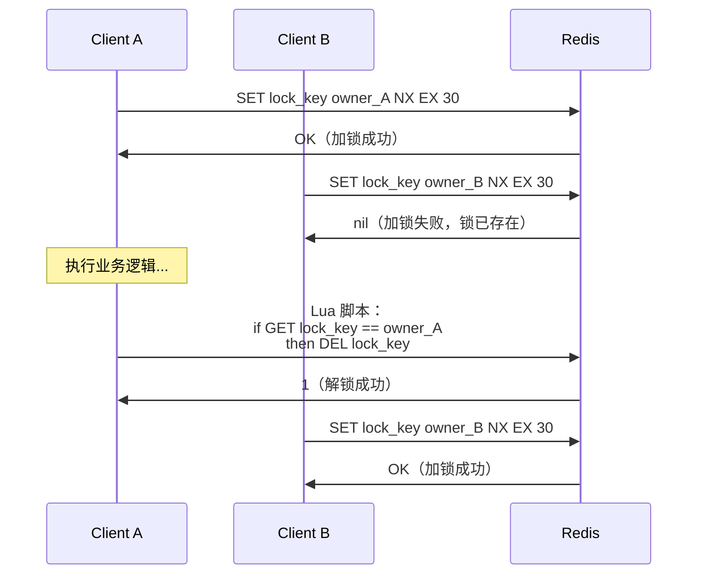
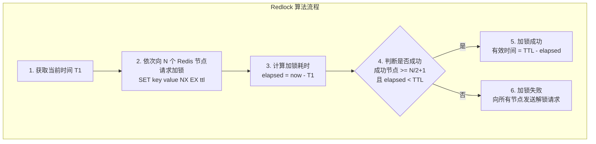
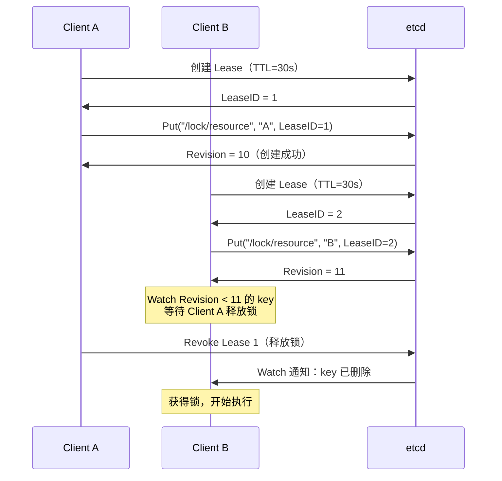

# 分布式锁

## 概念说明

分布式锁是分布式系统中最常见的协调机制，用于保证在分布式环境下同一时刻只有一个进程/节点能访问共享资源。与单机环境下的 `sync.Mutex` 不同，分布式锁需要借助外部存储（如 Redis、etcd、ZooKeeper）来实现跨进程/跨机器的互斥。

典型使用场景：
- **库存扣减**：防止超卖，同一商品同一时刻只能有一个请求扣减库存
- **定时任务**：多个服务实例中只有一个执行定时任务
- **幂等控制**：防止重复提交订单
- **缓存重建**：缓存失效时只有一个请求回源查询数据库

## 核心原理

### 分布式锁的核心要求

| 要求 | 说明 |
|------|------|
| **互斥性** | 同一时刻只有一个客户端持有锁 |
| **无死锁** | 即使持锁客户端崩溃，锁也能最终释放（TTL 机制） |
| **容错性** | 锁服务部分节点故障时仍能正常工作 |
| **可重入性** | 同一客户端可以重复获取同一把锁（可选） |
| **公平性** | 按请求顺序获取锁（可选） |

### Redis 分布式锁

#### 单节点 Redis 锁



**关键命令**：`SET key value NX EX seconds`
- `NX`：只在 key 不存在时设置（互斥性）
- `EX`：设置过期时间（防死锁）
- `value`：锁持有者标识（安全释放）

**解锁必须用 Lua 脚本**（原子操作）：
```lua
if redis.call("GET", KEYS[1]) == ARGV[1] then
    return redis.call("DEL", KEYS[1])
else
    return 0
end
```

#### Redlock 算法

Redlock 是 Redis 作者 Antirez 提出的分布式锁算法，解决单节点 Redis 锁的可靠性问题：



**Redlock 规则**：
1. 使用 N 个独立的 Redis 节点（推荐 5 个）
2. 客户端依次向所有节点请求加锁，每个请求设置较短的超时时间
3. 如果在多数节点（N/2+1）上加锁成功，且总耗时小于锁的 TTL，则加锁成功
4. 加锁失败时，向所有节点发送解锁请求

### etcd 分布式锁

etcd 基于 Raft 一致性算法，天然支持强一致性，其分布式锁实现更加可靠：



**etcd 锁的优势**：
- 基于 Raft 强一致性，不存在 Redis 异步复制导致的锁丢失问题
- Lease 机制自动续约，防止锁过期
- Watch 机制实现公平锁（按 Revision 排队）
- 支持可重入锁

### 方案对比

| 维度 | Redis 单节点锁 | Redis Redlock | etcd 分布式锁 |
|------|---------------|---------------|---------------|
| **一致性** | 弱（异步复制可能丢锁） | 较强（多数节点确认） | 强（Raft 一致性） |
| **性能** | 极高（单节点操作） | 高（多节点并行） | 中等（Raft 共识） |
| **可靠性** | 低（单点故障） | 高（容忍少数节点故障） | 高（Raft 容错） |
| **公平性** | 不保证 | 不保证 | 保证（Revision 排序） |
| **复杂度** | 简单 | 中等 | 简单（官方 SDK 支持） |
| **适用场景** | 非关键业务、高性能要求 | 关键业务、Redis 生态 | 关键业务、强一致性要求 |

## 标准库方案

Go 标准库提供了单机锁（`sync.Mutex`），但不支持分布式锁。分布式锁需要借助外部存储实现。

```go
// 单机锁 — sync.Mutex
var mu sync.Mutex
mu.Lock()
defer mu.Unlock()
// 临界区操作...

// 分布式锁需要外部存储（Redis/etcd）
```

## 第三方库方案

| 方案 | Go 客户端 | 说明 |
|------|----------|------|
| Redis 单节点锁 | `github.com/redis/go-redis/v9` | SET NX EX + Lua 解锁 |
| Redis Redlock | `github.com/go-redsync/redsync/v4` | Redlock 算法 Go 实现 |
| etcd 分布式锁 | `go.etcd.io/etcd/client/v3/concurrency` | 官方 SDK 内置锁支持 |

## 代码示例

> 💻 完整可运行代码：[code-examples/04-distributed/distributed/distributed-lock/](https://github.com/skyhe58/guide-go/tree/main/code-examples/04-distributed/distributed/distributed-lock/)
> 🏷️ Demo 模式：混合（Part A 内存模拟 + Part B 连接真实 Redis）

## 常见面试题

### Q1: Redis 分布式锁怎么实现？有什么问题？

**难度**：⭐⭐⭐ | **频率**：🔥🔥🔥

**答题思路**：

1. 说明 SET NX EX 命令
2. 解释为什么解锁要用 Lua 脚本
3. 分析单节点锁的问题
4. 引出 Redlock 方案

**标准答案**：

Redis 分布式锁通过 `SET key value NX EX seconds` 实现：NX 保证互斥性，EX 设置过期时间防死锁，value 存储持有者标识用于安全释放。解锁必须用 Lua 脚本保证"检查+删除"的原子性，防止误删其他客户端的锁。单节点 Redis 锁的问题是：主从切换时可能丢锁（异步复制），锁过期时间难以精确设置。Redlock 通过在多个独立 Redis 节点上加锁，多数节点确认后才算成功，提高了可靠性。

**深入追问**：

- 锁过期了但业务还没执行完怎么办？（看门狗机制/续约）
- Redlock 算法有什么争议？（Martin Kleppmann 的批评）
- Redis 主从切换导致锁丢失的具体场景是什么？

### Q2: etcd 分布式锁和 Redis 分布式锁有什么区别？

**难度**：⭐⭐⭐ | **频率**：🔥🔥🔥

**答题思路**：

1. 从一致性角度对比
2. 从性能角度对比
3. 从使用场景角度对比

**标准答案**：

etcd 基于 Raft 强一致性算法，锁的可靠性更高，不存在 Redis 异步复制导致的锁丢失问题；etcd 的 Lease 机制支持自动续约，Watch 机制支持公平锁。Redis 锁性能更高（单节点操作），适合高并发场景。选择建议：对一致性要求高的场景（如金融交易）用 etcd，对性能要求高且可以容忍极端情况下锁丢失的场景用 Redis。

**深入追问**：

- etcd 的 Lease 续约机制是怎么工作的？
- 如果 etcd 集群 Leader 切换，锁会丢失吗？
- 实际项目中你用的是哪种分布式锁？为什么？

### Q3: 分布式锁的过期时间怎么设置？

**难度**：⭐⭐⭐ | **频率**：🔥🔥

**答题思路**：

1. 过期时间太短和太长的问题
2. 看门狗（Watchdog）续约机制
3. etcd Lease 的自动续约

**标准答案**：

过期时间太短会导致业务未完成锁就释放，太长会导致故障恢复慢。推荐方案是设置一个合理的初始过期时间（如 30s），然后通过"看门狗"机制定期续约——后台 goroutine 每隔 TTL/3 时间检查业务是否完成，未完成则续约。etcd 的 Lease 机制天然支持 KeepAlive 续约。Redisson（Java）的看门狗机制是这种方案的典型实现，Go 中可以自行实现。

**深入追问**：

- 看门狗 goroutine 如果挂了怎么办？
- 续约失败（网络问题）怎么处理？

## 常见陷阱

1. **解锁不用 Lua 脚本**：先 GET 再 DEL 不是原子操作，可能误删其他客户端的锁
2. **锁过期时间设置不当**：太短导致业务未完成锁就释放，太长导致故障恢复慢
3. **忽视 Redis 主从切换**：主节点加锁成功后宕机，从节点提升为主但没有锁数据
4. **不设置锁持有者标识**：解锁时无法判断是否是自己的锁，可能误删
5. **重试策略不当**：加锁失败后立即重试会导致大量无效请求，应使用退避策略

## 参考资料

- [Redis 分布式锁官方文档](https://redis.io/docs/manual/patterns/distributed-locks/)
- [Redlock 算法](https://redis.io/docs/manual/patterns/distributed-locks/#the-redlock-algorithm)
- [Martin Kleppmann: How to do distributed locking](https://martin.kleppmann.com/2016/02/08/how-to-do-distributed-locking.html)
- [etcd concurrency 包文档](https://pkg.go.dev/go.etcd.io/etcd/client/v3/concurrency)
- [Go 官方文档](https://go.dev/doc/)
