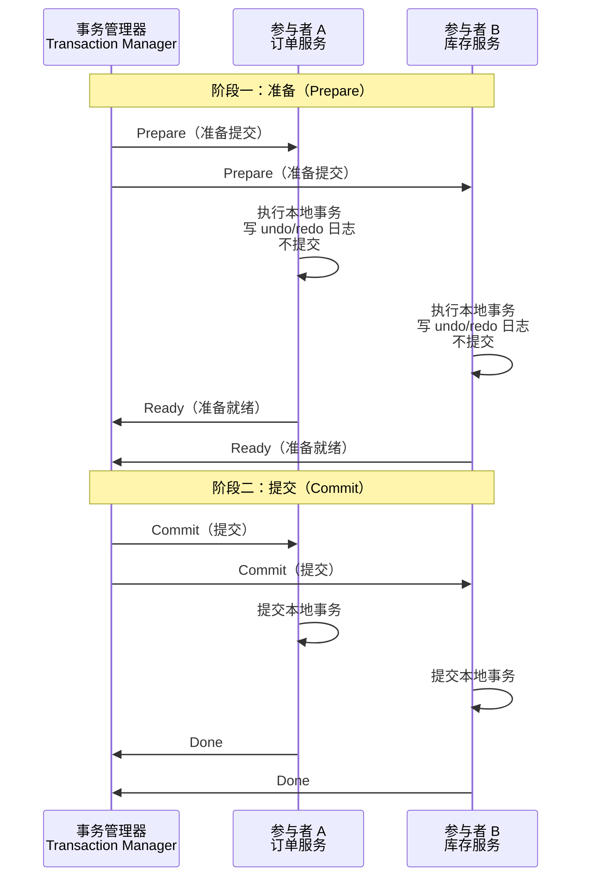
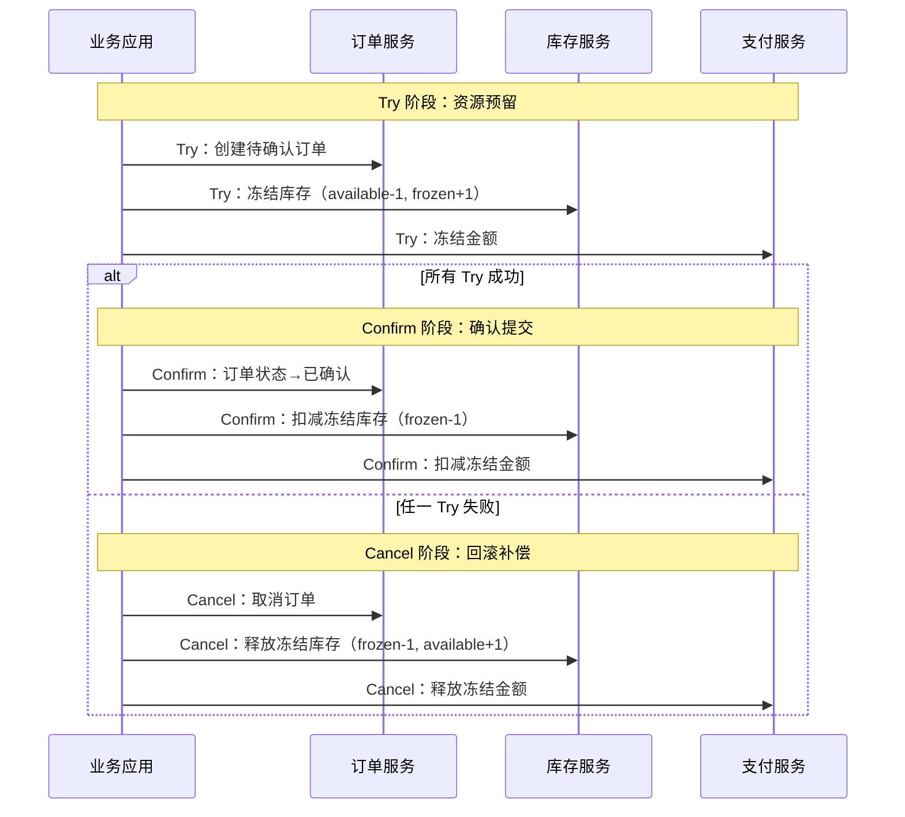
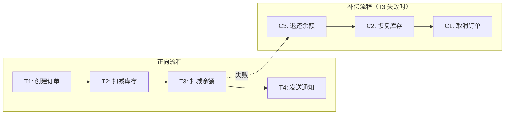
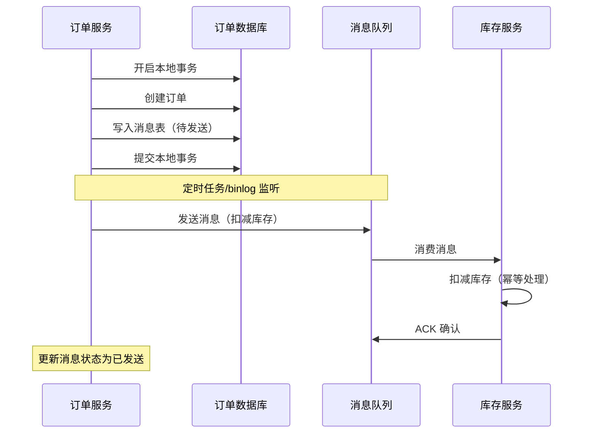

# 分布式事务

## 概念说明

分布式事务是指跨多个服务或数据库的事务操作，需要保证所有参与者要么全部成功，要么全部回滚。在微服务架构下，一个业务操作可能涉及多个服务（如订单服务、库存服务、支付服务），传统的单机事务（ACID）无法跨服务保证一致性，需要分布式事务方案。

分布式事务是分布式系统中最复杂的问题之一，没有银弹方案。不同方案在一致性、性能、复杂度之间做出不同取舍，选择取决于业务场景。

## 核心原理

### 四种主流方案对比

| 方案 | 一致性 | 性能 | 复杂度 | 适用场景 |
|------|--------|------|--------|----------|
| **2PC** | 强一致性 | 低（同步阻塞） | 中 | 数据库层面、金融交易 |
| **TCC** | 强一致性 | 中 | 高（需实现三个接口） | 资金操作、库存扣减 |
| **Saga** | 最终一致性 | 高 | 中 | 长事务、跨服务业务流程 |
| **消息最终一致性** | 最终一致性 | 高 | 低 | 异步业务、通知类场景 |

### 2PC（两阶段提交）

2PC（Two-Phase Commit）是最经典的分布式事务协议，分为准备阶段和提交阶段：



**2PC 的问题**：
- **同步阻塞**：所有参与者在准备阶段锁定资源，等待协调者指令
- **单点故障**：协调者宕机，参与者一直阻塞
- **数据不一致**：提交阶段部分参与者收到 Commit、部分未收到

### TCC（Try-Confirm-Cancel）

TCC 是业务层面的分布式事务方案，每个参与者需要实现三个接口：



| 阶段 | 说明 | 示例（库存扣减） |
|------|------|-----------------|
| **Try** | 资源预留/检查 | 冻结库存：available-1, frozen+1 |
| **Confirm** | 确认提交 | 扣减冻结库存：frozen-1 |
| **Cancel** | 回滚补偿 | 释放冻结库存：frozen-1, available+1 |

**TCC 的优势**：不依赖数据库事务，业务灵活性高
**TCC 的问题**：每个服务需要实现三个接口，开发成本高；需要处理幂等、空回滚、悬挂等问题

### Saga 模式

Saga 将长事务拆分为多个本地事务，每个本地事务有对应的补偿操作。如果某个步骤失败，按逆序执行补偿操作：



**Saga 两种实现方式**：

| 方式 | 说明 | 优缺点 |
|------|------|--------|
| **编排式（Choreography）** | 每个服务监听事件，自行决定下一步 | 简单，但服务间耦合，难以追踪流程 |
| **协调式（Orchestration）** | 中央协调器控制整个流程 | 流程清晰，但协调器是单点 |

### 消息最终一致性

基于消息队列实现最终一致性，是最常用的分布式事务方案：



**关键设计**：
- **本地消息表**：将消息写入与业务操作放在同一个本地事务中
- **定时补偿**：定时扫描未发送的消息，重新发送
- **幂等消费**：消费者必须支持幂等，防止重复消费

## 标准库方案

Go 标准库 `database/sql` 支持单机事务，但不支持分布式事务：

```go
tx, err := db.Begin()
if err != nil {
    return err
}
defer tx.Rollback()

// 执行多个 SQL 操作
_, err = tx.Exec("UPDATE orders SET status = ? WHERE id = ?", "confirmed", orderID)
_, err = tx.Exec("UPDATE inventory SET stock = stock - 1 WHERE product_id = ?", productID)

return tx.Commit()
```

## 第三方库方案

| 方案 | Go 实现 | 说明 |
|------|---------|------|
| DTM | `github.com/dtm-labs/dtm` | Go 原生分布式事务框架，支持 2PC/TCC/Saga/消息 |
| Seata-Go | `github.com/seata/seata-go` | Seata 的 Go 版本 |

## 代码示例

> 💻 完整可运行代码：[code-examples/04-distributed/distributed/](https://github.com/your-repo/code-examples/04-distributed/distributed/)
> 🏷️ 分布式事务是架构层面的知识，代码示例体现在架构设计场景模块中

## 常见面试题

### Q1: 分布式事务有哪些方案？各自的优缺点？

**难度**：⭐⭐⭐ | **频率**：🔥🔥🔥

**答题思路**：

1. 列举四种主流方案
2. 从一致性、性能、复杂度三个维度对比
3. 说明各自的适用场景

**标准答案**：

分布式事务主要有四种方案：2PC 提供强一致性但同步阻塞性能差，适合数据库层面；TCC 业务灵活但开发成本高（需实现 Try/Confirm/Cancel 三个接口），适合资金操作；Saga 将长事务拆分为多个本地事务加补偿操作，适合跨服务业务流程；消息最终一致性通过本地消息表+消息队列实现，性能最好复杂度最低，适合异步业务。实际项目中，消息最终一致性是最常用的方案。

**深入追问**：

- TCC 的空回滚和悬挂问题是什么？怎么解决？
- Saga 的编排式和协调式有什么区别？
- 消息最终一致性如何保证消息一定能发出去？

### Q2: 如何保证消息最终一致性？

**难度**：⭐⭐⭐ | **频率**：🔥🔥🔥

**答题思路**：

1. 本地消息表方案
2. 定时补偿机制
3. 幂等消费

**标准答案**：

消息最终一致性的核心是"本地消息表"方案：将消息写入与业务操作放在同一个本地事务中，保证"业务成功则消息一定写入"。然后通过定时任务扫描未发送的消息，发送到消息队列。消费者必须支持幂等处理，防止重复消费。如果消费失败，通过重试机制保证最终消费成功。整个流程保证了"业务操作和消息发送"的原子性，以及"消息最终被消费"的可靠性。

**深入追问**：

- 本地消息表会不会成为性能瓶颈？
- 如果消费者一直失败怎么办？
- 有没有不用本地消息表的方案？（RocketMQ 事务消息）

## 常见陷阱

1. **过度追求强一致性**：大多数业务场景最终一致性就够了，强一致性的代价是性能和可用性
2. **TCC 忘记处理幂等**：Confirm 和 Cancel 可能被重复调用，必须支持幂等
3. **Saga 补偿操作不完整**：每个正向操作都必须有对应的补偿操作，且补偿操作也要幂等
4. **消息丢失**：消息队列本身可能丢消息，需要配合定时补偿机制

## 参考资料

- [DTM 分布式事务框架](https://github.com/dtm-labs/dtm)
- [Saga Pattern](https://microservices.io/patterns/data/saga.html)
- [Go 官方文档](https://go.dev/doc/)
