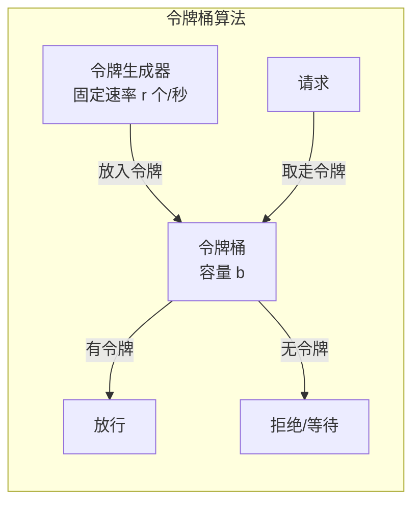
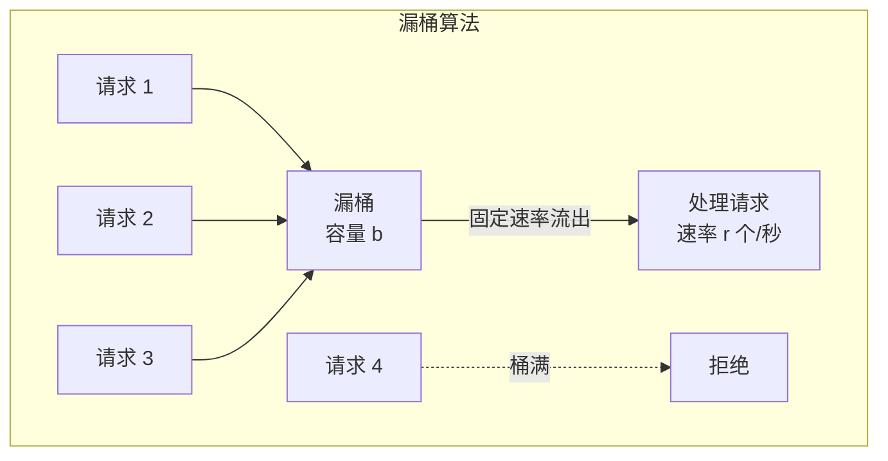
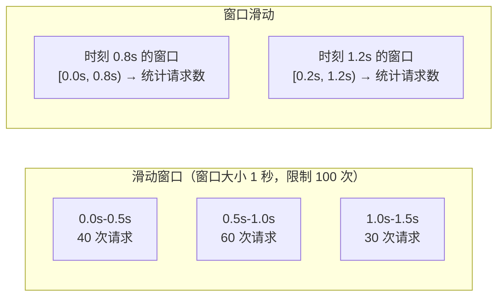

# 限流算法

## 概念说明

限流（Rate Limiting）是保护系统稳定性的核心手段，通过控制请求速率防止系统过载。在高并发场景下，如果不做限流，突发流量可能导致服务雪崩——CPU 飙高、内存溢出、数据库连接耗尽。

限流的本质是"在单位时间内限制请求数量"，常见的限流算法有：令牌桶（Token Bucket）、漏桶（Leaky Bucket）、滑动窗口（Sliding Window）。Go 官方扩展库 `golang.org/x/time/rate` 提供了令牌桶算法的标准实现。

## 核心原理

### 三种限流算法对比

| 算法 | 原理 | 突发流量 | 平滑度 | 适用场景 |
|------|------|---------|--------|----------|
| **令牌桶** | 固定速率生成令牌，请求消耗令牌 | 允许（桶中有令牌时） | 中等 | API 限流、通用场景 |
| **漏桶** | 请求进入桶中，固定速率流出 | 不允许（严格匀速） | 高 | 流量整形、消息队列消费 |
| **滑动窗口** | 统计滑动时间窗口内的请求数 | 允许 | 低 | 接口调用频率限制 |

### 令牌桶算法（Token Bucket）



**工作原理**：
1. 系统以固定速率 r 向桶中放入令牌
2. 桶的容量为 b（最大令牌数）
3. 请求到来时，从桶中取走一个令牌
4. 桶中有令牌则放行，无令牌则拒绝或等待
5. 桶满时，新生成的令牌被丢弃

**特点**：允许突发流量（桶中积累的令牌可以一次性消耗），长期速率不超过 r。

### 漏桶算法（Leaky Bucket）



**工作原理**：
1. 请求到来时放入桶中
2. 桶以固定速率 r 流出请求进行处理
3. 桶满时，新请求被拒绝
4. 无论请求到达速率如何，处理速率始终为 r

**特点**：严格匀速处理，不允许突发流量，适合流量整形。

### 滑动窗口算法（Sliding Window）



**工作原理**：
1. 将时间划分为多个小窗口（如每 100ms 一个）
2. 统计当前时间往前一个完整窗口内的请求总数
3. 如果总数超过阈值，拒绝请求
4. 窗口随时间滑动，过期的小窗口被丢弃

**特点**：比固定窗口更精确（避免窗口边界突发），实现相对简单。

## 标准库方案

Go 官方扩展库 `golang.org/x/time/rate` 提供了令牌桶算法的标准实现：

```go
import "golang.org/x/time/rate"

// 创建限流器：每秒 10 个令牌，桶容量 20
limiter := rate.NewLimiter(rate.Limit(10), 20)

// 方式一：Allow — 非阻塞，返回是否允许
if limiter.Allow() {
    // 处理请求
}

// 方式二：Wait — 阻塞等待直到获取令牌
err := limiter.Wait(ctx)

// 方式三：Reserve — 返回需要等待的时间
reservation := limiter.Reserve()
time.Sleep(reservation.Delay())
```

## 第三方库方案

| 库 | 说明 |
|------|------|
| `golang.org/x/time/rate` | Go 官方令牌桶实现（推荐） |
| `github.com/uber-go/ratelimit` | Uber 开源的漏桶限流器 |
| `github.com/juju/ratelimit` | 令牌桶实现 |

## 代码示例

> 💻 完整可运行代码：[code-examples/04-distributed/distributed/rate-limiter/](https://github.com/your-repo/code-examples/04-distributed/distributed/rate-limiter/)
> 🏷️ Demo 模式：纯 Go（三种限流算法的完整实现 + 并发测试）

## 常见面试题

### Q1: 令牌桶和漏桶的区别？

**难度**：⭐⭐⭐ | **频率**：🔥🔥🔥

**答题思路**：

1. 分别说明两种算法的原理
2. 从突发流量处理角度对比
3. 说明各自的适用场景

**标准答案**：

令牌桶以固定速率生成令牌，请求消耗令牌，桶中有积累的令牌时允许突发流量；漏桶以固定速率处理请求，严格匀速，不允许突发流量。令牌桶适合大多数 API 限流场景（允许短时间突发），漏桶适合需要严格匀速的场景（如消息队列消费速率控制）。Go 官方库 `golang.org/x/time/rate` 实现的是令牌桶算法。

**深入追问**：

- golang.org/x/time/rate 的 Allow、Wait、Reserve 三种方法有什么区别？
- 如何实现分布式限流？（Redis + Lua）
- 滑动窗口和令牌桶哪个更适合 API 网关？

### Q2: 如何实现分布式限流？

**难度**：⭐⭐⭐ | **频率**：🔥🔥

**答题思路**：

1. 单机限流 vs 分布式限流
2. Redis + Lua 方案
3. 令牌桶的分布式实现

**标准答案**：

单机限流只能控制单个实例的请求速率，分布式限流需要控制整个集群的总请求速率。常见方案是使用 Redis + Lua 脚本实现：将令牌桶或滑动窗口的状态存储在 Redis 中，通过 Lua 脚本保证原子性。另一种方案是使用 API 网关（如 Kong、Envoy）的内置限流功能。分布式限流的挑战是 Redis 的网络延迟和单点问题。

**深入追问**：

- Redis 限流的 Lua 脚本怎么写？
- 如果 Redis 挂了，限流怎么降级？

## 常见陷阱

1. **固定窗口的边界突发**：固定窗口在窗口切换时可能出现 2 倍突发（前一窗口末尾 + 后一窗口开头），滑动窗口可以解决
2. **限流粒度不当**：全局限流可能导致正常用户被误限，应按用户/IP/接口等维度限流
3. **忽视限流后的处理**：被限流的请求应返回友好的错误信息（HTTP 429），而不是直接断开连接
4. **令牌桶初始状态**：新创建的令牌桶是满的还是空的？`golang.org/x/time/rate` 默认是满的

## 参考资料

- [golang.org/x/time/rate 文档](https://pkg.go.dev/golang.org/x/time/rate)
- [Token Bucket Algorithm](https://en.wikipedia.org/wiki/Token_bucket)
- [Go 官方文档](https://go.dev/doc/)
