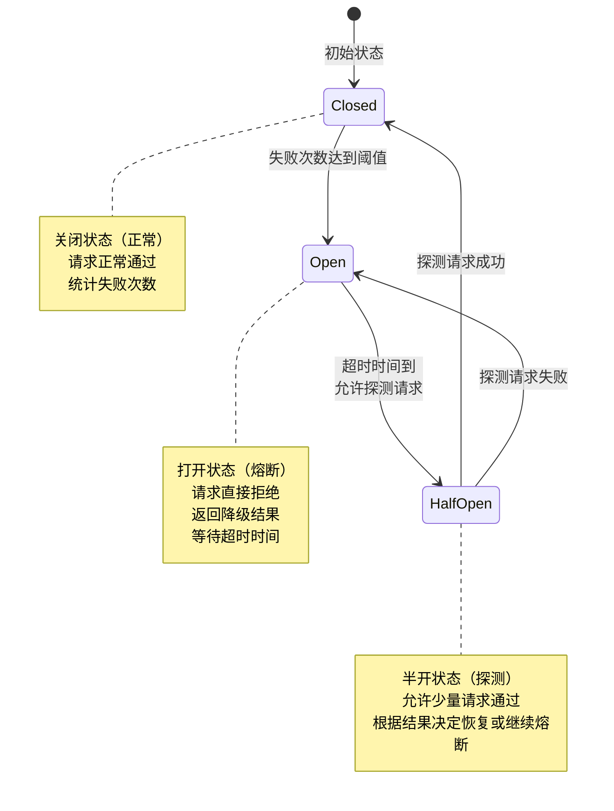
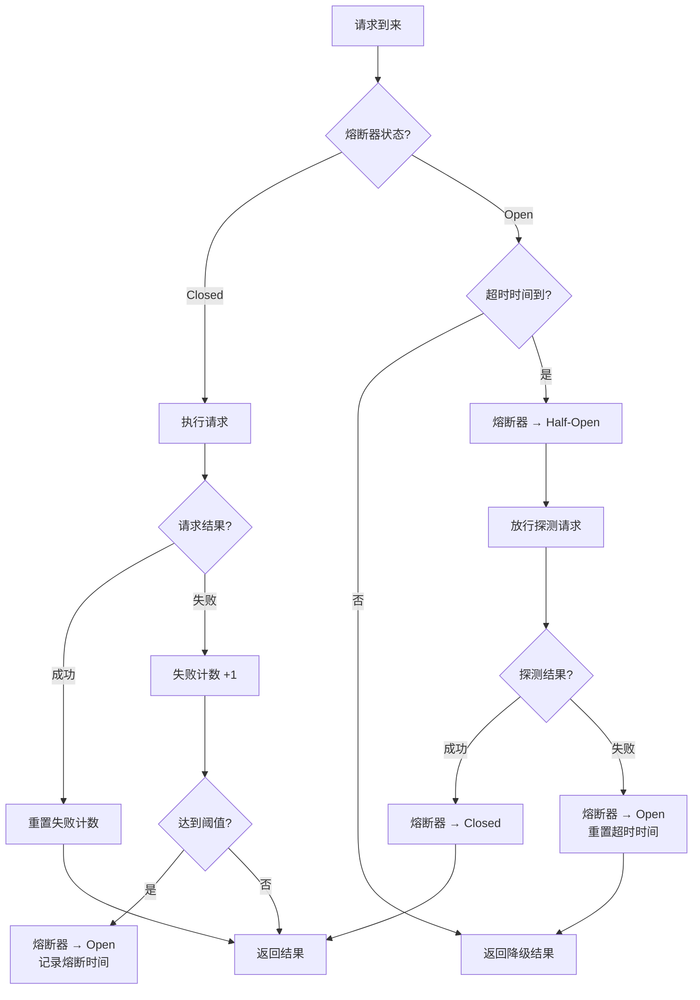

# 熔断与降级

## 概念说明

熔断（Circuit Breaker）是分布式系统中防止故障扩散的核心机制，灵感来源于电路中的断路器——当下游服务故障时，熔断器自动"断开"，快速返回错误或降级结果，避免大量请求堆积导致上游服务也崩溃（雪崩效应）。

**降级（Degradation）** 是熔断的配套策略——当服务不可用时，返回预设的降级结果（如缓存数据、默认值、友好提示），保证核心功能可用。

**为什么需要熔断？**
- 下游服务超时，上游线程/goroutine 被阻塞，资源耗尽
- 故障在服务链路中级联传播（A → B → C，C 故障导致 A 也不可用）
- 大量重试请求加重下游负担，形成恶性循环

## 核心原理

### 熔断器状态机

熔断器有三种状态，状态之间的转换构成一个状态机：



| 状态 | 说明 | 行为 |
|------|------|------|
| **Closed（关闭）** | 正常状态 | 请求正常通过，统计失败次数 |
| **Open（打开）** | 熔断状态 | 请求直接拒绝，返回降级结果 |
| **Half-Open（半开）** | 探测状态 | 允许少量请求通过，根据结果决定恢复或继续熔断 |

### 熔断器工作流程



### 关键参数

| 参数 | 说明 | 推荐值 |
|------|------|--------|
| **失败阈值** | 连续失败多少次触发熔断 | 5~10 次 |
| **超时时间** | 熔断后多久进入半开状态 | 10~60 秒 |
| **探测请求数** | 半开状态允许通过的请求数 | 1~3 个 |
| **统计窗口** | 统计失败次数的时间窗口 | 10~60 秒 |
| **失败率阈值** | 失败率超过多少触发熔断 | 50%~80% |

## 标准库方案

Go 标准库没有熔断器实现，但可以用基础组件构建：

```go
// 使用 sync.Mutex + time.Timer 构建简单熔断器
type CircuitBreaker struct {
    mu           sync.Mutex
    state        State
    failures     int
    threshold    int
    timeout      time.Duration
    lastFailTime time.Time
}
```

## 第三方库方案

| 库 | 说明 | 状态 |
|------|------|------|
| `github.com/sony/gobreaker` | Sony 开源的熔断器，API 简洁 | 活跃维护 |
| `github.com/afex/hystrix-go` | Netflix Hystrix 的 Go 移植版 | 维护较少 |
| `github.com/go-kratos/aegis` | Kratos 框架的流量治理组件 | 活跃维护 |

### sony/gobreaker 使用示例

```go
import "github.com/sony/gobreaker"

cb := gobreaker.NewCircuitBreaker(gobreaker.Settings{
    Name:        "my-service",
    MaxRequests: 3,                    // 半开状态允许的请求数
    Interval:    10 * time.Second,     // 统计窗口
    Timeout:     30 * time.Second,     // 熔断超时时间
    ReadyToTrip: func(counts gobreaker.Counts) bool {
        return counts.ConsecutiveFailures > 5 // 连续失败 5 次触发熔断
    },
})

result, err := cb.Execute(func() (interface{}, error) {
    return callDownstreamService()
})
```

## 代码示例

> 💻 完整可运行代码：[code-examples/04-distributed/distributed/circuit-breaker/](https://github.com/your-repo/code-examples/04-distributed/distributed/circuit-breaker/)
> 🏷️ Demo 模式：纯 Go（完整的熔断器状态机实现 + 模拟服务调用）

## 常见面试题

### Q1: 熔断器的三种状态是什么？状态如何转换？

**难度**：⭐⭐⭐ | **频率**：🔥🔥🔥

**答题思路**：

1. 描述三种状态的含义
2. 说明状态转换条件
3. 解释半开状态的作用

**标准答案**：

熔断器有三种状态：Closed（关闭/正常）、Open（打开/熔断）、Half-Open（半开/探测）。正常情况下处于 Closed 状态，请求正常通过并统计失败次数；当失败次数达到阈值时转为 Open 状态，所有请求直接拒绝返回降级结果；经过一段超时时间后转为 Half-Open 状态，允许少量探测请求通过——如果探测成功则恢复为 Closed，失败则重新回到 Open。半开状态的作用是自动探测下游服务是否恢复，避免人工干预。

**深入追问**：

- 熔断器的失败阈值和超时时间怎么设置？
- 如何区分"服务故障"和"网络抖动"？
- 熔断和限流有什么区别？

### Q2: 熔断和降级的区别是什么？

**难度**：⭐⭐ | **频率**：🔥🔥🔥

**答题思路**：

1. 分别定义熔断和降级
2. 说明两者的关系
3. 举例说明

**标准答案**：

熔断是一种保护机制，当下游服务故障时自动"断开"请求，防止故障扩散；降级是熔断的配套策略，当服务不可用时返回预设的降级结果。熔断是"发现问题"，降级是"解决问题"。例如：商品详情页调用推荐服务超时，熔断器触发后，降级策略返回热门商品列表（缓存数据），保证页面可用。

**深入追问**：

- 降级结果从哪里来？（缓存/默认值/静态数据）
- 如何设计多级降级策略？

## 常见陷阱

1. **熔断阈值设置不当**：阈值太低导致正常波动就触发熔断，太高导致故障扩散后才熔断
2. **忽视半开状态的探测策略**：半开状态放行太多请求可能再次压垮下游
3. **降级结果不合理**：降级结果应该是业务可接受的，而不是空数据或错误
4. **熔断器粒度不当**：应该按服务/接口粒度设置熔断器，而不是全局一个

## 参考资料

- [Circuit Breaker Pattern (Martin Fowler)](https://martinfowler.com/bliki/CircuitBreaker.html)
- [sony/gobreaker GitHub](https://github.com/sony/gobreaker)
- [Netflix Hystrix](https://github.com/Netflix/Hystrix)
- [Go 官方文档](https://go.dev/doc/)
