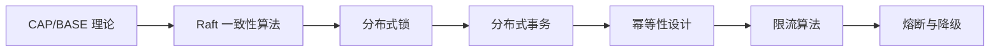
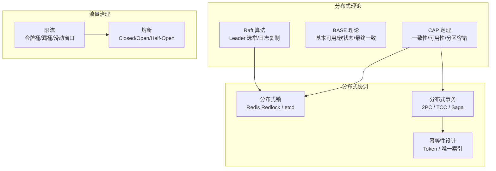

# 分布式系统

> **前置依赖：** [Go 基础语法](/1-go-core/1.1-go-basics/) | [并发编程](/1-go-core/1.3-concurrent/)

## 模块概述

分布式系统是现代后端架构的核心，解决的是"多个节点如何协同工作"这一根本问题。在微服务架构下，服务拆分带来了数据一致性、网络分区、故障容错等一系列挑战，理解分布式系统的核心理论和实践方案是高级 Go 开发者的必备技能。

Go 语言在分布式系统领域有着天然优势——etcd、CockroachDB、TiDB、NATS 等知名分布式系统均使用 Go 编写。Go 的 goroutine 并发模型、channel 通信机制和优秀的网络库，使其成为构建分布式中间件的首选语言。

本模块系统讲解分布式系统的核心理论（CAP/BASE/Raft）和关键实践方案（分布式锁、分布式事务、幂等性、限流、熔断），每个知识点都配有 Go 实现的可运行代码示例。

## 知识点索引

### 分布式理论基础

| 序号 | 知识点 | 难度 | 面试频率 | 预计时间 |
|------|--------|------|---------|---------|
| 01 | [CAP 理论与 BASE 理论](./01-cap-base.md) | ⭐⭐⭐ | 🔥🔥🔥 | 40min |
| 02 | [Raft 一致性算法](./02-raft.md) | ⭐⭐⭐ | 🔥🔥🔥 | 60min |

### 分布式协调与事务

| 序号 | 知识点 | 难度 | 面试频率 | 预计时间 |
|------|--------|------|---------|---------|
| 03 | [分布式锁](./03-distributed-lock.md) | ⭐⭐⭐ | 🔥🔥🔥 | 50min |
| 04 | [分布式事务](./04-distributed-transaction.md) | ⭐⭐⭐ | 🔥🔥🔥 | 60min |
| 05 | [幂等性设计](./05-idempotent.md) | ⭐⭐⭐ | 🔥🔥🔥 | 40min |

### 流量治理

| 序号 | 知识点 | 难度 | 面试频率 | 预计时间 |
|------|--------|------|---------|---------|
| 06 | [限流算法](./06-rate-limiting.md) | ⭐⭐⭐ | 🔥🔥🔥 | 50min |
| 07 | [熔断与降级](./07-circuit-breaker.md) | ⭐⭐⭐ | 🔥🔥🔥 | 50min |

### 面试指南

| 📝 | [面试指南](./interview.md) | - | 🔥🔥🔥 | 60min |
|------|--------|------|---------|---------|

## 代码示例

> 💻 完整可运行代码：[code-examples/04-distributed/distributed/](https://github.com/your-repo/code-examples/04-distributed/distributed/)

| 示例目录 | 对应知识点 | 运行方式 | Demo 模式 |
|---------|-----------|---------|----------|
| `distributed-lock/` | 分布式锁（Redis + etcd） | `go run ./distributed-lock/` | 混合（Part A + Part B） |
| `rate-limiter/` | 限流算法（令牌桶/漏桶/滑动窗口） | `go run ./rate-limiter/` | 纯 Go |
| `circuit-breaker/` | 熔断器状态机 | `go run ./circuit-breaker/` | 纯 Go |
| `raft-example/` | Raft 一致性算法模拟 | `go run ./raft-example/` | 纯 Go |

### Docker 启动命令

```bash
# Redis（分布式锁 Part B）
docker compose -f docker/docker-compose.yml up -d redis

# etcd（分布式锁 Part B）
docker compose -f docker/docker-compose.etcd.yml up -d
```

## 学习路径建议



1. **先学理论基础**：理解 CAP 定理和 BASE 理论，这是所有分布式方案的理论根基
2. **深入 Raft 算法**：理解一致性算法的核心思想，etcd/Consul 等系统的基石
3. **掌握分布式锁**：最常见的分布式协调场景，Redis 和 etcd 两种方案对比
4. **学习分布式事务**：2PC/TCC/Saga 三种方案的取舍，消息最终一致性
5. **理解幂等性**：接口幂等性设计是分布式系统的基本要求
6. **限流与熔断**：流量治理的两大核心手段，保护系统稳定性

## 分布式系统全景图


