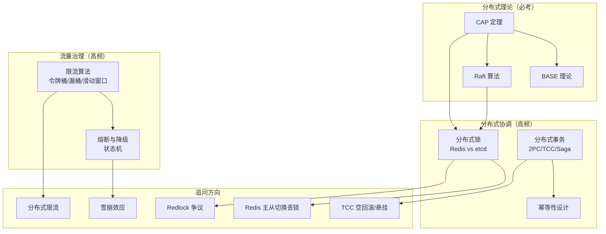

# 分布式系统面试指南

> 分布式系统是高级 Go 开发者面试的核心考察领域，几乎每次面试都会涉及。本指南按面试频率排序，覆盖高频考点。

## 面试知识图谱

## 高频面试题集

### 第一梯队：必考题（出现率 > 80%）

#### Q1: 请解释 CAP 定理

**难度**：⭐⭐⭐ | **频率**：🔥🔥🔥 | **关联知识点**：[CAP 理论与 BASE 理论](./01-cap-base.md)

**答题思路**：
1. C/A/P 三个属性的含义
2. 为什么三者不可兼得（P 是必选项）
3. CP vs AP 的实际选择
4. 举例：etcd（CP）、Eureka（AP）

**标准答案**：

CAP 定理指出分布式系统中一致性（C）、可用性（A）、分区容错性（P）三者最多满足两个。由于网络分区不可避免，P 是必选项，实际选择是 CP 或 AP。CP 系统（如 etcd、ZooKeeper）在网络分区时优先保证数据一致性，可能拒绝部分请求；AP 系统（如 Eureka、Cassandra）优先保证可用性，可能返回旧数据。

**深入追问**：
- CAP 的 C 和 ACID 的 C 有什么区别？
- 什么是最终一致性？如何实现？

---

#### Q2: Redis 分布式锁怎么实现？有什么问题？

**难度**：⭐⭐⭐ | **频率**：🔥🔥🔥 | **关联知识点**：[分布式锁](./03-distributed-lock.md)

**答题思路**：
1. SET NX EX 命令
2. Lua 脚本解锁
3. 单节点锁的问题
4. Redlock 方案

**标准答案**：

Redis 分布式锁通过 `SET key value NX EX seconds` 实现，NX 保证互斥，EX 防死锁，value 标识持有者。解锁用 Lua 脚本保证原子性。问题：主从切换可能丢锁（异步复制）、锁过期时间难以精确设置。Redlock 通过多个独立 Redis 节点加锁，多数确认后成功，提高可靠性。

**深入追问**：
- 锁过期了业务没执行完怎么办？（看门狗续约）
- Redlock 有什么争议？（Martin Kleppmann 的批评）
- etcd 分布式锁和 Redis 锁的区别？

---

#### Q3: 令牌桶和漏桶的区别？

**难度**：⭐⭐⭐ | **频率**：🔥🔥🔥 | **关联知识点**：[限流算法](./06-rate-limiting.md)

**答题思路**：
1. 两种算法的原理
2. 突发流量处理的差异
3. 各自适用场景

**标准答案**：

令牌桶以固定速率生成令牌，请求消耗令牌，桶中有积累令牌时允许突发流量；漏桶以固定速率处理请求，严格匀速，不允许突发。令牌桶适合 API 限流（允许短时突发），漏桶适合流量整形（严格匀速）。Go 官方 `golang.org/x/time/rate` 实现的是令牌桶。

---

#### Q4: 熔断器的三种状态是什么？

**难度**：⭐⭐⭐ | **频率**：🔥🔥🔥 | **关联知识点**：[熔断与降级](./07-circuit-breaker.md)

**答题思路**：
1. 三种状态的含义
2. 状态转换条件
3. 半开状态的作用

**标准答案**：

Closed（正常，请求通过并统计失败）→ Open（熔断，请求直接拒绝）→ Half-Open（探测，允许少量请求通过）。失败达到阈值触发 Closed→Open，超时后 Open→Half-Open，探测成功 Half-Open→Closed，探测失败 Half-Open→Open。

---

#### Q5: 分布式事务有哪些方案？

**难度**：⭐⭐⭐ | **频率**：🔥🔥🔥 | **关联知识点**：[分布式事务](./04-distributed-transaction.md)

**答题思路**：
1. 四种方案及其特点
2. 一致性/性能/复杂度对比
3. 实际项目中的选择

**标准答案**：

2PC（强一致，同步阻塞）、TCC（强一致，需实现 Try/Confirm/Cancel）、Saga（最终一致，补偿操作）、消息最终一致性（最终一致，本地消息表+MQ）。实际项目中消息最终一致性最常用，因为性能好、复杂度低、适合大多数业务场景。

---

### 第二梯队：高频题（出现率 50%~80%）

#### Q6: Raft 算法的核心思想是什么？

**难度**：⭐⭐⭐ | **频率**：🔥🔥🔥 | **关联知识点**：[Raft 一致性算法](./02-raft.md)

**标准答案**：

Raft 将一致性问题分解为 Leader 选举、日志复制、安全性三个子问题。通过选举唯一 Leader 协调写操作，日志复制到多数节点后提交，选举限制保证已提交数据不丢失。

---

#### Q7: 如何保证接口幂等性？

**难度**：⭐⭐⭐ | **频率**：🔥🔥🔥 | **关联知识点**：[幂等性设计](./05-idempotent.md)

**标准答案**：

常见方案：Token 机制（请求前获取 Token，提交时校验删除）、数据库唯一索引（防重复插入）、状态机（状态单向流转）、乐观锁（版本号 CAS）、去重表（记录已处理请求 ID）。选择取决于业务场景。

---

#### Q8: 什么是服务雪崩？如何防止？

**难度**：⭐⭐⭐ | **频率**：🔥🔥

**标准答案**：

服务雪崩是指一个服务故障导致调用链上的所有服务级联崩溃。防止方案：熔断（快速失败，防止故障扩散）、限流（控制请求速率，防止过载）、降级（返回降级结果，保证核心功能）、超时控制（设置合理超时，防止线程阻塞）、隔离（线程池/信号量隔离，限制故障影响范围）。

---

#### Q9: 如何实现分布式限流？

**难度**：⭐⭐⭐ | **频率**：🔥🔥

**标准答案**：

单机限流用 `golang.org/x/time/rate`，分布式限流用 Redis + Lua 脚本（将令牌桶/滑动窗口状态存储在 Redis 中）。也可以使用 API 网关（Kong、Envoy）的内置限流功能。挑战是 Redis 网络延迟和单点问题。

---

### 第三梯队：进阶题（出现率 < 50%）

#### Q10: Redlock 算法有什么争议？

**难度**：⭐⭐⭐⭐ | **频率**：🔥

**标准答案**：

Martin Kleppmann 指出 Redlock 在以下场景可能失败：客户端 GC 暂停导致锁过期、时钟跳跃导致 TTL 计算错误。他认为如果需要强一致性的锁，应该使用基于共识算法的方案（如 etcd/ZooKeeper），而不是 Redis。Antirez 回应认为这些场景在实践中极少发生。

---

#### Q11: TCC 的空回滚和悬挂问题是什么？

**难度**：⭐⭐⭐⭐ | **频率**：🔥

**标准答案**：

空回滚：Try 请求因网络超时未到达参与者，但协调者已发起 Cancel，参与者收到 Cancel 时没有对应的 Try 记录。解决：Cancel 时检查是否有 Try 记录，没有则直接返回成功。悬挂：Cancel 先于 Try 到达参与者（网络延迟），Cancel 执行后 Try 才到达。解决：Try 时检查是否已有 Cancel 记录，有则拒绝执行。

---

## 面试技巧

### 答题框架

1. **先说概念**：用一句话定义核心概念
2. **再说原理**：用简洁的语言描述工作原理
3. **然后对比**：与相关方案做对比，展示知识广度
4. **最后举例**：结合实际项目或知名开源项目举例

### 常见追问方向

| 知识点 | 常见追问 |
|--------|---------|
| CAP | 最终一致性如何实现？一致性级别有哪些？ |
| 分布式锁 | 锁续约、主从切换丢锁、Redlock 争议 |
| 分布式事务 | TCC 空回滚/悬挂、Saga 补偿失败怎么办 |
| 限流 | 分布式限流、限流后的处理策略 |
| 熔断 | 参数设置、与限流的区别、雪崩效应 |

## 参考资料

- [Designing Data-Intensive Applications (DERTA)](https://dataintensive.net/)
- [Go 官方文档](https://go.dev/doc/)
