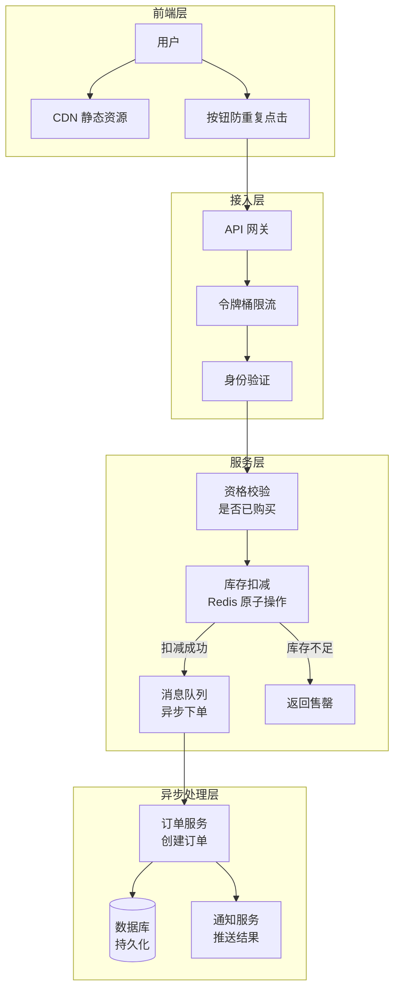
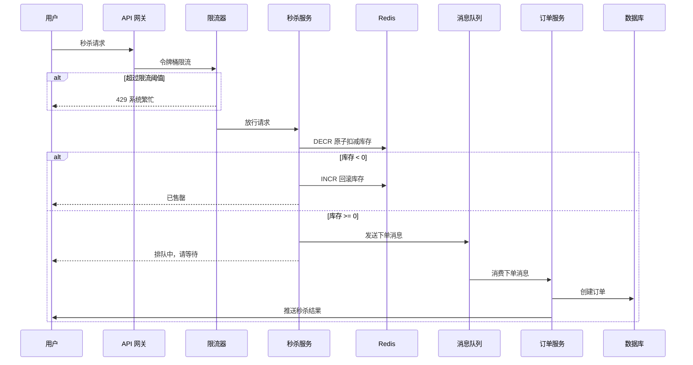

# 秒杀系统设计

## 概念说明

秒杀（Flash Sale / Seckill）是电商领域最典型的高并发场景：在极短时间内（通常几秒），大量用户同时抢购少量商品。秒杀系统的核心挑战是**高并发读写冲突**——百万级请求争抢几百件库存，如何保证不超卖、不重复购买、系统不崩溃。

秒杀系统的三大核心问题：
1. **流量洪峰**：瞬时 QPS 可达百万级，远超日常流量
2. **库存一致性**：不能超卖（卖出数量 > 实际库存）
3. **用户体验**：快速响应，避免长时间等待

## 核心原理

### 秒杀系统架构全景



### 秒杀请求处理流程



## 方案对比

### 库存扣减方案对比

| 方案 | 原理 | 优点 | 缺点 | 适用场景 |
|------|------|------|------|----------|
| **数据库悲观锁** | `SELECT ... FOR UPDATE` | 强一致性 | 性能差，锁竞争严重 | 低并发场景 |
| **数据库乐观锁** | `UPDATE ... WHERE stock > 0` | 无锁，性能较好 | 高并发下大量重试 | 中等并发 |
| **Redis 原子操作** | `DECR` + Lua 脚本 | 高性能，原子性保证 | 需要缓存预热 | 高并发秒杀（推荐） |
| **Redis + MQ 异步** | Redis 扣减 + MQ 异步下单 | 削峰填谷，系统稳定 | 架构复杂度高 | 超高并发（推荐） |

### 限流方案对比

| 方案 | 突发流量 | 实现复杂度 | 适用场景 |
|------|---------|-----------|----------|
| **令牌桶** | 允许突发 | 中等 | 秒杀入口限流（推荐） |
| **漏桶** | 严格匀速 | 简单 | 消息消费限速 |
| **滑动窗口** | 允许突发 | 较高 | 接口频率限制 |

## 推荐方案详解

### 推荐架构：令牌桶限流 → Redis 原子扣减 → 异步下单

**核心思路**：
1. **令牌桶限流**：在入口层拦截大部分请求，只放行与库存量级相当的请求
2. **Redis 原子扣减**：使用 `DECR` 命令原子扣减库存，保证不超卖
3. **异步下单**：扣减成功后发送消息到队列，异步创建订单，削峰填谷

### 令牌桶限流器

令牌桶以固定速率生成令牌，请求到来时消耗令牌。桶满时丢弃新令牌，桶空时拒绝请求。这种方式允许一定程度的突发流量（桶中积累的令牌），同时保证长期速率不超过设定值。

```go
// 令牌桶限流器核心实现
type TokenBucket struct {
    rate       float64    // 令牌生成速率（个/秒）
    capacity   int64      // 桶容量
    tokens     float64    // 当前令牌数
    lastRefill time.Time  // 上次补充时间
    mu         sync.Mutex
}

func (tb *TokenBucket) Allow() bool {
    tb.mu.Lock()
    defer tb.mu.Unlock()
    
    // 计算应补充的令牌数
    now := time.Now()
    elapsed := now.Sub(tb.lastRefill).Seconds()
    tb.tokens += elapsed * tb.rate
    if tb.tokens > float64(tb.capacity) {
        tb.tokens = float64(tb.capacity)
    }
    tb.lastRefill = now
    
    // 尝试消耗一个令牌
    if tb.tokens >= 1 {
        tb.tokens--
        return true
    }
    return false
}
```

### Redis 原子库存扣减

使用 Redis 的 `DECR` 命令实现原子扣减。`DECR` 是原子操作，即使在高并发下也不会出现竞态条件。扣减后检查结果，如果库存变为负数则回滚。

```go
// Redis 原子库存扣减（模拟实现）
func DeductStock(stockKey string, store *sync.Map) (bool, int64) {
    // 模拟 Redis DECR 原子操作
    val, _ := store.Load(stockKey)
    current := atomic.AddInt64(val.(*int64), -1)
    
    if current < 0 {
        // 库存不足，回滚
        atomic.AddInt64(val.(*int64), 1)
        return false, 0
    }
    return true, current
}
```

### 异步下单队列

扣减库存成功后，将下单请求发送到消息队列。订单服务异步消费消息，创建订单并持久化到数据库。这种方式将瞬时的写压力分散到一段时间内处理。

```go
// 异步下单队列
type OrderQueue struct {
    ch chan OrderRequest
}

func (q *OrderQueue) Enqueue(req OrderRequest) bool {
    select {
    case q.ch <- req:
        return true
    default:
        return false // 队列满，拒绝
    }
}

func (q *OrderQueue) StartConsumer(handler func(OrderRequest)) {
    go func() {
        for req := range q.ch {
            handler(req) // 异步处理订单
        }
    }()
}
```

## 代码示例

> 💻 完整可运行代码：[code-examples/04-distributed/architecture/seckill/](https://github.com/your-repo/code-examples/04-distributed/architecture/seckill/)
> 🏷️ Demo 模式：纯 Go（直接运行）

代码示例实现了完整的秒杀核心链路：
- 令牌桶限流器（控制请求速率）
- 原子库存扣减（防止超卖）
- 异步下单队列（削峰填谷）
- 并发模拟（多个 goroutine 模拟用户抢购）

```bash
cd code-examples && go run ./04-distributed/architecture/seckill/
```

## 常见面试题

### Q1: 秒杀系统如何防止超卖？

**难度**：⭐⭐⭐ | **频率**：🔥🔥🔥

**答题思路**：

1. 将库存预热到 Redis
2. 使用 Redis `DECR` 原子操作扣减库存
3. 扣减后检查结果，负数则回滚
4. 扣减成功后异步创建订单

**标准答案**：

超卖的根本原因是"先查后改"的非原子操作。解决方案是使用 Redis 的 `DECR` 命令，它是原子操作，在高并发下也能保证库存扣减的正确性。具体流程：秒杀开始前将库存加载到 Redis；请求到来时执行 `DECR stock_key`；如果返回值 >= 0，说明扣减成功，发送下单消息；如果返回值 < 0，说明库存不足，执行 `INCR` 回滚并返回售罄。

**深入追问**：

- 如果 Redis 宕机了怎么办？（主从 + 哨兵，或 Redis Cluster）
- 如何防止同一用户重复购买？（用户维度的分布式锁或幂等校验）
- 库存预热时如何保证 Redis 和数据库一致？（秒杀开始前锁定库存，加载到 Redis）

### Q2: 秒杀系统的限流策略如何设计？

**难度**：⭐⭐⭐ | **频率**：🔥🔥🔥

**答题思路**：

1. 多层限流：前端 → 网关 → 服务
2. 令牌桶算法允许突发流量
3. 限流阈值与库存量级匹配

**标准答案**：

秒杀限流采用多层防御策略：前端层通过按钮置灰、验证码、倒计时拦截无效请求；网关层使用令牌桶算法，将 QPS 限制在系统承载能力内（通常是库存的 3-5 倍）；服务层通过用户维度限流防止刷单。令牌桶算法是首选，因为它允许一定程度的突发流量（秒杀开始瞬间），同时保证长期速率可控。

**深入追问**：

- 令牌桶和漏桶的区别？（令牌桶允许突发，漏桶严格匀速）
- 分布式环境下如何做全局限流？（Redis + Lua 脚本实现分布式令牌桶）
- 限流被拒绝的请求如何处理？（返回友好提示，前端展示排队页面）

### Q3: 为什么要用异步下单？

**难度**：⭐⭐ | **频率**：🔥🔥🔥

**答题思路**：

1. 同步下单的瓶颈：数据库写入慢
2. 异步下单的优势：削峰填谷
3. 用户体验：快速返回排队状态

**标准答案**：

同步下单意味着每个请求都要等待数据库写入完成才能返回，数据库的写入 TPS 通常只有几千，无法承受秒杀的瞬时流量。异步下单将"扣减库存"和"创建订单"解耦：Redis 扣减库存后立即返回"排队中"，将下单请求发送到消息队列；订单服务按自身处理能力消费消息，匀速创建订单。这样既保证了用户快速得到响应，又保护了数据库不被打垮。

**深入追问**：

- 异步下单如何保证消息不丢失？（消息持久化 + 消费确认 + 重试机制）
- 用户如何知道秒杀结果？（轮询接口或 WebSocket 推送）

## 常见陷阱

1. **先查后改导致超卖**：`if stock > 0 { stock-- }` 在并发下不安全，必须使用原子操作
2. **限流阈值设置不当**：阈值太高系统崩溃，太低用户体验差，应根据压测结果设定
3. **忽略幂等性**：网络重试可能导致重复扣减，需要在用户维度做幂等校验
4. **Redis 单点故障**：秒杀期间 Redis 宕机会导致整个系统不可用，需要主从 + 哨兵保障高可用

## 参考资料

- [Go 官方文档 - sync/atomic](https://pkg.go.dev/sync/atomic)
- [Redis DECR 命令文档](https://redis.io/commands/decr/)
- [golang.org/x/time/rate 令牌桶实现](https://pkg.go.dev/golang.org/x/time/rate)
