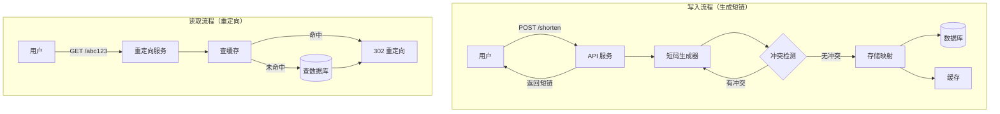
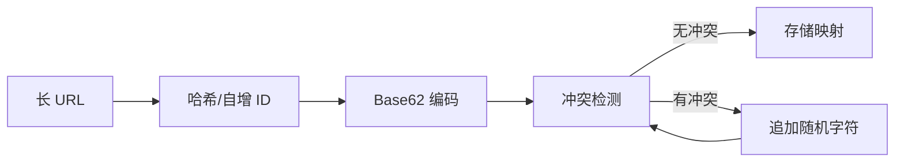

# 短链接系统设计

## 概念说明

短链接（Short URL）系统将长 URL 转换为短 URL（如 `https://t.cn/abc123`），用户访问短链接时自动重定向到原始长 URL。短链接广泛应用于社交媒体分享、短信营销、二维码生成等场景。

短链接系统的核心挑战：
1. **短码生成**：如何将长 URL 映射为唯一的短码
2. **高并发读取**：短链接的读写比极高（通常 100:1），需要高效的读取性能
3. **冲突处理**：不同长 URL 生成相同短码时如何处理

## 核心原理

### 短链接系统架构



### 短码生成流程



## 方案对比

### 短码生成方案对比

| 方案 | 原理 | 优点 | 缺点 | 适用场景 |
|------|------|------|------|----------|
| **自增 ID + Base62** | 数据库自增 ID 转 Base62 | 无冲突，短码最短 | 可预测，有安全风险 | 内部系统 |
| **哈希截取** | MD5/SHA256 取前 N 位 | 分布式友好，无中心依赖 | 可能冲突，需冲突处理 | 分布式系统（推荐） |
| **雪花算法** | Snowflake ID + Base62 | 分布式唯一，有序 | 短码较长 | 需要有序 ID 的场景 |
| **随机生成** | 随机字符串 | 实现简单 | 冲突概率高 | 低流量场景 |

### Base62 编码说明

Base62 使用 `0-9a-zA-Z` 共 62 个字符编码。6 位 Base62 短码可表示 62^6 ≈ 568 亿个不同的 URL，足以满足绝大多数场景。

| 短码长度 | 可表示数量 | 适用场景 |
|---------|-----------|----------|
| 6 位 | 56.8 亿 | 中大型系统 |
| 7 位 | 3521 亿 | 超大型系统 |
| 8 位 | 2.18 万亿 | 极端场景 |

## 推荐方案详解

### 推荐方案：哈希截取 + Base62 + 冲突检测

**核心思路**：
1. 对长 URL 计算 MD5/SHA256 哈希值
2. 取哈希值的前 N 个字节，转换为 Base62 编码
3. 检查短码是否已存在（冲突检测）
4. 如果冲突，追加随机字符重新生成

### Base62 编码实现

```go
const base62Chars = "0123456789abcdefghijklmnopqrstuvwxyzABCDEFGHIJKLMNOPQRSTUVWXYZ"

// Base62Encode 将数字编码为 Base62 字符串
func Base62Encode(num uint64) string {
    if num == 0 {
        return string(base62Chars[0])
    }
    var result []byte
    for num > 0 {
        result = append([]byte{base62Chars[num%62]}, result...)
        num /= 62
    }
    return string(result)
}
```

### 哈希生成短码

```go
// GenerateShortCode 基于哈希生成短码
func GenerateShortCode(longURL string) string {
    hash := md5.Sum([]byte(longURL))
    // 取前 8 字节转为 uint64
    num := binary.BigEndian.Uint64(hash[:8])
    // Base62 编码，取前 6 位
    code := Base62Encode(num)
    if len(code) > 6 {
        code = code[:6]
    }
    return code
}
```

### 冲突检测与处理

```go
// CreateShortURL 创建短链接，含冲突检测
func (s *URLStore) CreateShortURL(longURL string) string {
    code := GenerateShortCode(longURL)
    
    for i := 0; i < maxRetries; i++ {
        if existing, ok := s.Load(code); !ok {
            s.Store(code, longURL)
            return code
        } else if existing == longURL {
            return code // 相同 URL，返回已有短码
        }
        // 冲突：追加随机字符重新生成
        code = GenerateShortCode(longURL + randomSuffix())
    }
    return code
}
```

## 代码示例

> 💻 完整可运行代码：[code-examples/04-distributed/architecture/short-url/](https://github.com/your-repo/code-examples/04-distributed/architecture/short-url/)
> 🏷️ Demo 模式：纯 Go（直接运行）

代码示例实现了完整的短链接系统：
- Base62 编码/解码
- 基于哈希的短码生成
- 冲突检测与处理
- 内存 URL 映射存储
- 重定向模拟

```bash
cd code-examples && go run ./04-distributed/architecture/short-url/
```

## 常见面试题

### Q1: 短链接系统如何生成短码？

**难度**：⭐⭐⭐ | **频率**：🔥🔥🔥

**答题思路**：

1. 介绍 Base62 编码原理
2. 对比自增 ID 和哈希两种方案
3. 说明冲突处理策略

**标准答案**：

短码生成有两种主流方案：一是自增 ID + Base62 编码，数据库生成自增 ID 后转为 Base62 字符串，优点是无冲突、短码最短，缺点是依赖中心化 ID 生成器且短码可预测；二是哈希截取 + Base62，对长 URL 计算 MD5 哈希后取前几个字节转 Base62，优点是分布式友好、无中心依赖，缺点是可能冲突需要检测处理。推荐哈希方案，冲突时追加随机字符重新生成。

**深入追问**：

- 6 位 Base62 短码能支持多少 URL？（62^6 ≈ 568 亿）
- 如何保证短码的唯一性？（数据库唯一索引 + 冲突重试）
- 相同长 URL 是否应该生成相同短码？（看业务需求，可以做去重）

### Q2: 短链接系统如何处理高并发读取？

**难度**：⭐⭐⭐ | **频率**：🔥🔥🔥

**答题思路**：

1. 读写比分析（100:1）
2. 多级缓存策略
3. 数据库读写分离

**标准答案**：

短链接系统的读写比极高（通常 100:1 以上），优化重点在读取性能。方案：第一层使用本地缓存（如 sync.Map 或 bigcache），热点短链直接从内存返回；第二层使用 Redis 分布式缓存，缓存所有活跃短链映射；第三层是数据库，缓存未命中时查询数据库并回填缓存。同时可以使用 CDN 缓存 302 重定向响应，进一步减少服务端压力。

**深入追问**：

- 短链接应该用 301 还是 302 重定向？（302 临时重定向，便于统计点击量）
- 如何统计短链接的点击量？（异步写入，不影响重定向性能）

### Q3: 如何设计短链接的过期机制？

**难度**：⭐⭐ | **频率**：🔥🔥

**答题思路**：

1. 数据库存储过期时间
2. 懒删除 + 定期清理
3. 缓存 TTL 配合

**标准答案**：

短链接过期机制采用"懒删除 + 定期清理"双重策略。创建短链时在数据库记录过期时间；访问短链时检查是否过期，过期则返回 404 并删除缓存（懒删除）；后台定时任务扫描过期短链并批量删除（定期清理）。Redis 缓存设置 TTL 与短链过期时间一致，自动淘汰过期数据。

**深入追问**：

- 过期短码是否可以回收复用？（可以，但需要注意缓存残留问题）

## 常见陷阱

1. **哈希冲突未处理**：不同长 URL 可能生成相同短码，必须做冲突检测
2. **短码可预测**：自增 ID 方案的短码是连续的，可能被恶意遍历，需要加混淆
3. **缓存穿透**：大量访问不存在的短码，需要布隆过滤器或空值缓存防护
4. **301 vs 302 选择错误**：301 永久重定向会被浏览器缓存，无法统计点击量

## 参考资料

- [Go 官方文档 - crypto/md5](https://pkg.go.dev/crypto/md5)
- [Go 官方文档 - encoding/binary](https://pkg.go.dev/encoding/binary)
- [Base62 编码原理](https://en.wikipedia.org/wiki/Base62)
