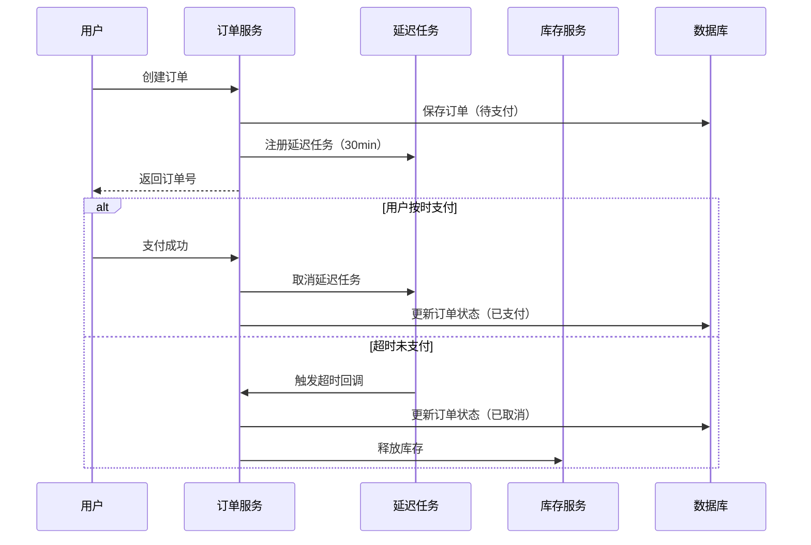
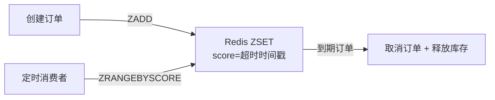
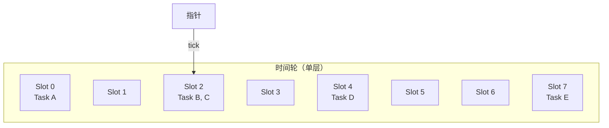

# 订单超时取消方案

## 概念说明

订单超时取消是电商系统中的经典问题：用户下单后未在规定时间内支付（通常 15-30 分钟），系统需要自动取消订单并释放库存。这个问题的本质是**延迟任务调度**——在未来某个时间点执行特定操作。

核心挑战：
1. **精确性**：超时时间要准确，不能提前或大幅延迟
2. **可靠性**：服务重启后未处理的超时任务不能丢失
3. **性能**：大量订单同时超时时不能影响系统性能

## 核心原理

### 延迟任务处理流程



## 方案对比

| 方案 | 原理 | 精确度 | 可靠性 | 性能 | 适用场景 |
|------|------|--------|--------|------|----------|
| **定时轮询** | 定时扫描数据库 | 低（取决于轮询间隔） | 高 | 差（全表扫描） | 小规模系统 |
| **延迟队列** | RabbitMQ 死信队列 / Redis ZSET | 高 | 高 | 好 | 中大型系统（推荐） |
| **时间轮** | 分层时间轮算法 | 高 | 中（内存） | 极好 | 高性能场景（推荐） |
| **Redis 过期通知** | Key 过期事件 | 中 | 低（不可靠） | 好 | 不推荐生产使用 |

### 各方案详细分析

#### 1. 定时轮询

```sql
-- 每分钟扫描一次超时订单
SELECT * FROM orders 
WHERE status = 'pending' AND created_at < NOW() - INTERVAL 30 MINUTE;
```

**问题**：轮询间隔决定精确度，间隔太短数据库压力大，间隔太长超时不及时。

#### 2. 延迟队列（Redis ZSET）

使用 Redis 有序集合（Sorted Set），以超时时间戳作为 score，定期取出已到期的元素。



#### 3. 时间轮（Timing Wheel）

时间轮是一种高效的定时器数据结构，类似钟表的表盘。指针每 tick 移动一格，执行当前格中的所有任务。



**时间轮核心参数**：
- **tick**：指针移动间隔（如 1 秒）
- **wheelSize**：槽位数量（如 60）
- **一圈时间**：tick × wheelSize（如 60 秒）

## 推荐方案详解

### 方案一：延迟队列（适合分布式系统）

基于 Redis ZSET 实现延迟队列，适合分布式部署场景。

```go
// Redis ZSET 延迟队列核心逻辑
type DelayQueue struct {
    key string
}

// 添加延迟任务
func (q *DelayQueue) Add(taskID string, delay time.Duration) {
    score := float64(time.Now().Add(delay).Unix())
    // ZADD key score member
    redis.ZAdd(q.key, score, taskID)
}

// 消费到期任务
func (q *DelayQueue) Poll() []string {
    now := float64(time.Now().Unix())
    // ZRANGEBYSCORE key 0 now LIMIT 0 100
    tasks := redis.ZRangeByScore(q.key, 0, now, 100)
    // ZREM 移除已消费的任务
    for _, task := range tasks {
        redis.ZRem(q.key, task)
    }
    return tasks
}
```

### 方案二：时间轮（适合单机高性能场景）

Go 实现的简单时间轮，适合单机内存场景。

```go
// 时间轮核心结构
type TimingWheel struct {
    tick      time.Duration     // 每格时间间隔
    wheelSize int               // 槽位数量
    slots     [][]Task          // 槽位数组
    current   int               // 当前指针位置
    mu        sync.Mutex
}

// 添加延迟任务
func (tw *TimingWheel) Add(task Task, delay time.Duration) {
    ticks := int(delay / tw.tick)
    slot := (tw.current + ticks) % tw.wheelSize
    tw.slots[slot] = append(tw.slots[slot], task)
}

// 推进时间轮
func (tw *TimingWheel) advance() {
    tw.current = (tw.current + 1) % tw.wheelSize
    tasks := tw.slots[tw.current]
    tw.slots[tw.current] = nil
    for _, task := range tasks {
        go task.Execute() // 异步执行到期任务
    }
}
```

## 代码示例

> 💻 本场景的代码实现融入在秒杀系统和其他架构场景中
> 🏷️ 核心思路可参考上述伪代码实现

## 常见面试题

### Q1: 订单超时取消有哪些方案？各自优缺点？

**难度**：⭐⭐⭐ | **频率**：🔥🔥🔥

**答题思路**：

1. 列举四种方案
2. 从精确度、可靠性、性能三个维度对比
3. 给出推荐方案

**标准答案**：

四种主流方案：（1）定时轮询数据库，实现简单但性能差、精确度低；（2）延迟队列（Redis ZSET 或 RabbitMQ 死信队列），精确度高、可靠性好，推荐分布式场景使用；（3）时间轮算法，性能极好，适合单机高性能场景；（4）Redis Key 过期通知，实现简单但不可靠（Redis 不保证过期事件一定触发），不推荐生产使用。推荐方案是 Redis ZSET 延迟队列，兼顾精确度、可靠性和性能。

**深入追问**：

- 时间轮如何处理超过一圈的延迟？（分层时间轮，类似时钟的时/分/秒）
- 延迟队列如何保证消息不丢失？（Redis 持久化 + 消费确认 + 补偿机制）
- 服务重启后如何恢复未处理的超时任务？（从 Redis/数据库重新加载）

### Q2: 时间轮算法的原理是什么？

**难度**：⭐⭐⭐ | **频率**：🔥🔥🔥

**答题思路**：

1. 类比钟表解释时间轮结构
2. 说明 tick 和 wheelSize 参数
3. 解释分层时间轮

**标准答案**：

时间轮类似钟表的表盘，由固定数量的槽位（slot）组成环形数组。指针每隔一个 tick（如 1 秒）移动一格，执行当前格中的所有到期任务。添加任务时，根据延迟时间计算应放入的槽位：`slot = (current + delay/tick) % wheelSize`。单层时间轮的最大延迟为 `tick × wheelSize`，超过这个范围需要使用分层时间轮（类似时钟的时针、分针、秒针），高层时间轮到期后将任务降级到低层时间轮。Go 标准库的 `time.Timer` 底层就使用了时间轮的变体实现。

**深入追问**：

- 时间轮的时间复杂度？（添加 O(1)，到期执行 O(1)）
- Kafka 的延迟消息是如何实现的？（分层时间轮 + 磁盘持久化）

## 常见陷阱

1. **Redis Key 过期通知不可靠**：Redis 的 keyspace notification 不保证一定触发，不适合做订单超时
2. **定时轮询间隔过大**：轮询间隔 5 分钟意味着最大延迟 5 分钟，用户体验差
3. **忽略幂等性**：超时取消操作必须幂等，防止重复取消导致库存多次释放
4. **时间轮内存泄漏**：任务取消后未从时间轮中移除，导致内存持续增长

## 参考资料

- [Go 官方文档 - time.Timer](https://pkg.go.dev/time#Timer)
- [Kafka 时间轮实现](https://www.confluent.io/blog/apache-kafka-purgatory-hierarchical-timing-wheels/)
- [Redis Sorted Set 文档](https://redis.io/docs/data-types/sorted-sets/)
