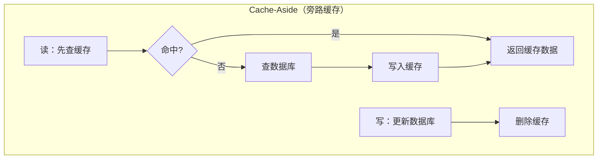
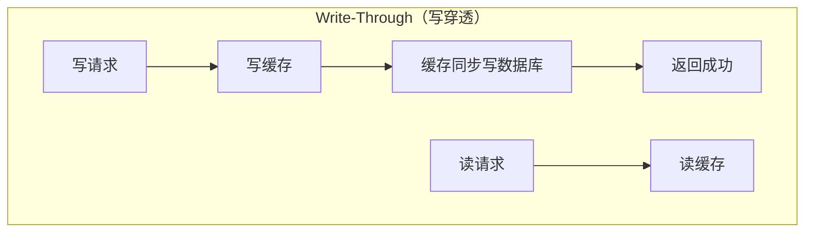
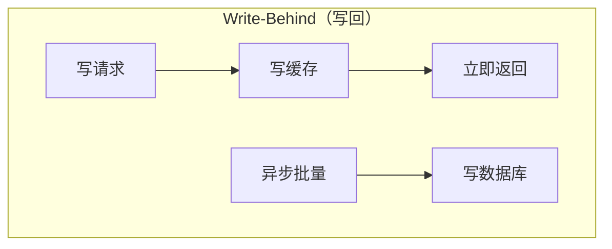
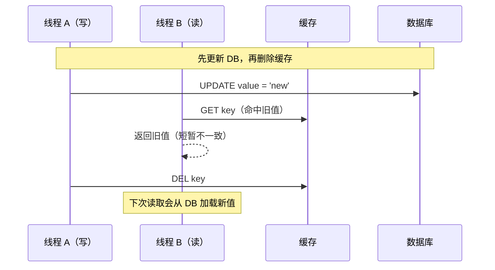
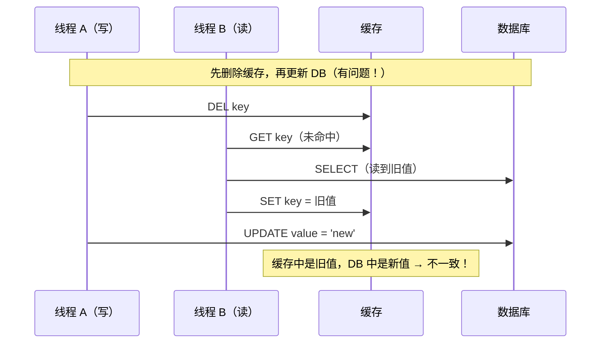

# 缓存与数据库双写一致性方案

## 概念说明

在高并发系统中，缓存（如 Redis）是提升读取性能的关键手段。但引入缓存后，数据同时存在于缓存和数据库中，如何保证两者的数据一致性成为核心挑战。这就是经典的"缓存与数据库双写一致性"问题。

核心矛盾：缓存和数据库是两个独立的存储系统，无法通过单一事务保证原子性。任何更新操作都涉及两步写入，中间可能因网络故障、服务宕机等原因导致数据不一致。

## 核心原理

### 三种缓存策略对比







### 策略对比表

| 策略 | 读性能 | 写性能 | 一致性 | 复杂度 | 适用场景 |
|------|--------|--------|--------|--------|----------|
| **Cache-Aside** | 高（缓存命中） | 中 | 最终一致 | 低 | 通用场景（推荐） |
| **Write-Through** | 高 | 低（同步写 DB） | 强一致 | 中 | 一致性要求高 |
| **Write-Behind** | 高 | 极高 | 弱一致 | 高 | 写密集场景 |

## 方案对比

### Cache-Aside 的更新策略对比

| 策略 | 操作顺序 | 一致性风险 | 推荐度 |
|------|---------|-----------|--------|
| **先更新 DB，再删除缓存** | UPDATE → DEL | 极小窗口不一致 | ⭐⭐⭐⭐⭐ 推荐 |
| **先删除缓存，再更新 DB** | DEL → UPDATE | 并发读导致脏数据 | ⭐⭐ 不推荐 |
| **先更新 DB，再更新缓存** | UPDATE → SET | 并发写导致数据覆盖 | ⭐⭐ 不推荐 |

### 为什么推荐"先更新 DB，再删除缓存"？



这种方案的不一致窗口极小（仅在 UPDATE 和 DEL 之间），且下次读取会自动从数据库加载最新数据。

### "先删除缓存，再更新 DB"的问题



## 推荐方案详解

### Cache-Aside 模式（推荐）

```go
// Cache-Aside 读取流程
func (s *CacheAsideStore) Get(key string) (string, bool) {
    // 1. 先查缓存
    if val, ok := s.cache.Get(key); ok {
        return val, true // 缓存命中
    }
    // 2. 缓存未命中，查数据库
    val, ok := s.db.Get(key)
    if !ok {
        return "", false
    }
    // 3. 回填缓存
    s.cache.Set(key, val)
    return val, true
}

// Cache-Aside 写入流程
func (s *CacheAsideStore) Set(key, value string) {
    // 1. 先更新数据库
    s.db.Set(key, value)
    // 2. 再删除缓存（而非更新缓存）
    s.cache.Delete(key)
}
```

### Write-Through 模式

```go
// Write-Through 写入流程
func (s *WriteThroughStore) Set(key, value string) {
    // 1. 写缓存
    s.cache.Set(key, value)
    // 2. 同步写数据库
    s.db.Set(key, value)
}
```

### Write-Behind 模式

```go
// Write-Behind 写入流程（异步批量写 DB）
func (s *WriteBehindStore) Set(key, value string) {
    // 1. 写缓存
    s.cache.Set(key, value)
    // 2. 加入异步写队列
    s.writeQueue <- WriteOp{Key: key, Value: value}
}

// 后台异步刷盘
func (s *WriteBehindStore) flushLoop() {
    ticker := time.NewTicker(s.flushInterval)
    for range ticker.C {
        s.flushToDB()
    }
}
```

### 延迟双删策略

对于"先删除缓存，再更新 DB"方案的改进：在更新 DB 后延迟一段时间再次删除缓存，消除并发读写导致的不一致。

```go
// 延迟双删
func (s *Store) SetWithDoubleDelete(key, value string) {
    s.cache.Delete(key)          // 第一次删除
    s.db.Set(key, value)         // 更新数据库
    go func() {
        time.Sleep(500 * time.Millisecond) // 延迟
        s.cache.Delete(key)      // 第二次删除
    }()
}
```

## 代码示例

> 💻 完整可运行代码：[code-examples/04-distributed/architecture/cache-consistency/](https://github.com/your-repo/code-examples/04-distributed/architecture/cache-consistency/)
> 🏷️ Demo 模式：纯 Go（直接运行）

代码示例实现并对比了三种缓存策略：
- Cache-Aside（旁路缓存）
- Write-Through（写穿透）
- Write-Behind（异步写回）
- 并发场景下的一致性问题演示

```bash
cd code-examples && go run ./04-distributed/architecture/cache-consistency/
```

## 常见面试题

### Q1: 缓存和数据库双写不一致怎么办？

**难度**：⭐⭐⭐ | **频率**：🔥🔥🔥

**答题思路**：

1. 说明不一致的根本原因
2. 对比三种更新策略
3. 推荐"先更新 DB，再删除缓存"

**标准答案**：

不一致的根本原因是缓存和数据库是两个独立存储，无法原子更新。推荐使用 Cache-Aside 模式，采用"先更新数据库，再删除缓存"的策略。这种方案的不一致窗口极小，且是自愈的——下次读取会从数据库加载最新数据并回填缓存。不推荐"先删除缓存，再更新数据库"，因为并发读写会导致缓存中写入旧数据。如果对一致性要求极高，可以使用延迟双删或基于 binlog 的缓存更新方案。

**深入追问**：

- 删除缓存失败怎么办？（重试机制 + 消息队列保证最终删除）
- 如何实现强一致性？（分布式锁或串行化，但会牺牲性能）
- binlog 方案是怎么做的？（Canal 监听 MySQL binlog，异步更新缓存）

### Q2: Cache-Aside、Write-Through、Write-Behind 的区别？

**难度**：⭐⭐⭐ | **频率**：🔥🔥🔥

**答题思路**：

1. 分别解释三种策略的读写流程
2. 从一致性、性能、复杂度三个维度对比
3. 说明各自适用场景

**标准答案**：

Cache-Aside（旁路缓存）：应用层负责缓存管理，读时先查缓存再查 DB，写时先更新 DB 再删缓存，是最常用的方案。Write-Through（写穿透）：写操作同时写缓存和 DB，由缓存层负责同步写 DB，一致性好但写性能低。Write-Behind（写回）：写操作只写缓存，异步批量刷盘到 DB，写性能极高但可能丢数据。通用场景推荐 Cache-Aside，写密集场景考虑 Write-Behind，强一致性场景使用 Write-Through。

**深入追问**：

- CPU 缓存用的是哪种策略？（Write-Back，类似 Write-Behind）
- Redis 的持久化是哪种模式？（AOF 类似 Write-Behind）

## 常见陷阱

1. **更新缓存而非删除缓存**：并发写时可能导致缓存中的数据是旧值，应该删除缓存让下次读取重新加载
2. **先删缓存再更新 DB**：并发读写会导致缓存写入旧数据，形成长期不一致
3. **忽略缓存穿透**：大量请求查询不存在的 key，缓存未命中直接打到数据库
4. **Write-Behind 数据丢失**：异步写 DB 期间服务宕机，缓存中的数据会丢失

## 参考资料

- [Facebook 缓存一致性实践](https://www.usenix.org/system/files/conference/nsdi13/nsdi13-final170_update.pdf)
- [Go 官方文档 - sync.Map](https://pkg.go.dev/sync#Map)
- [Redis 缓存模式](https://redis.io/docs/manual/patterns/)
