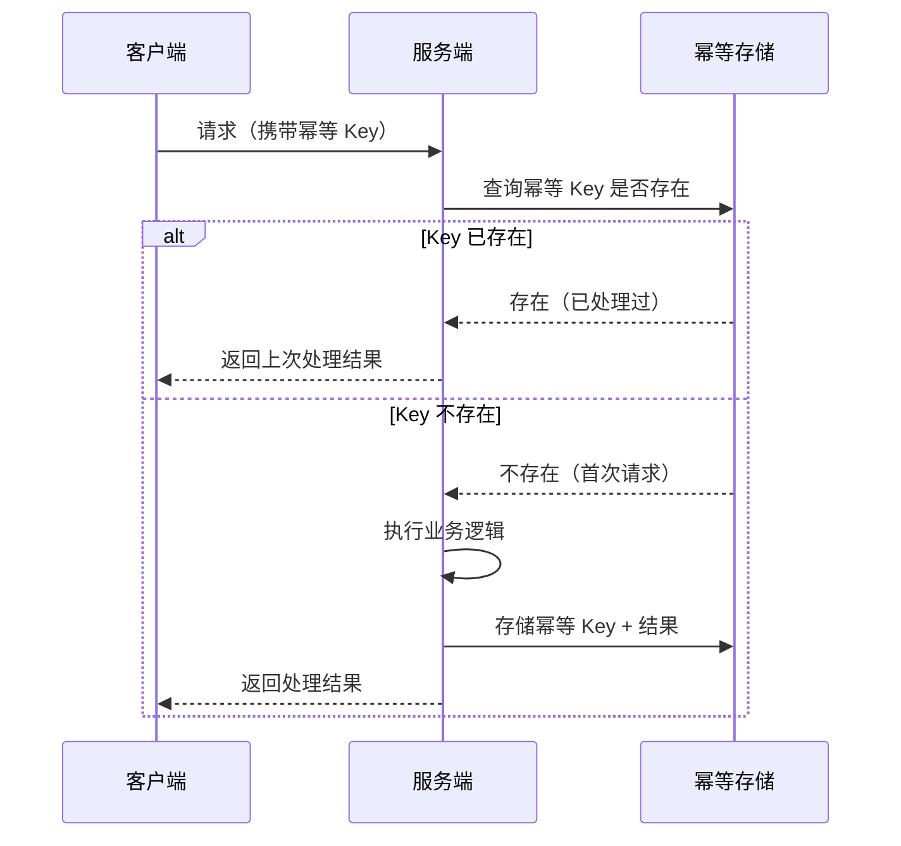
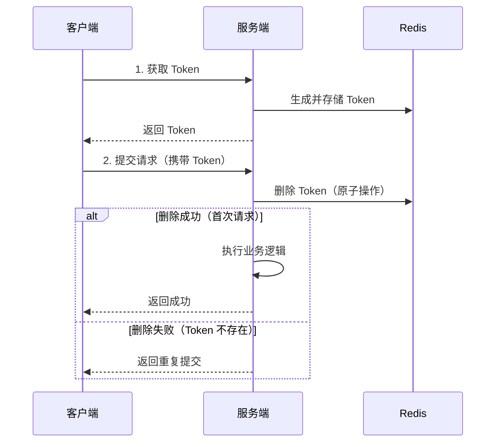

# 接口幂等性设计方案

## 概念说明

幂等性（Idempotency）是指同一操作执行一次和执行多次的效果相同。在分布式系统中，由于网络超时、重试机制、消息重复消费等原因，同一请求可能被执行多次。如果接口不具备幂等性，就会导致数据重复、金额多扣等严重问题。

幂等性是分布式系统的基本要求，尤其在以下场景中至关重要：
1. **支付接口**：重复扣款是不可接受的
2. **订单创建**：重复下单会导致库存多扣
3. **消息消费**：MQ 消息可能重复投递

### HTTP 方法的幂等性

| 方法 | 幂等 | 说明 |
|------|------|------|
| GET | ✅ | 查询操作，天然幂等 |
| PUT | ✅ | 全量更新，多次执行结果相同 |
| DELETE | ✅ | 删除操作，多次删除结果相同 |
| POST | ❌ | 创建操作，多次执行会创建多条记录 |
| PATCH | ❌ | 部分更新，取决于具体实现 |

## 核心原理

### 幂等性实现流程



## 方案对比

| 方案 | 原理 | 优点 | 缺点 | 适用场景 |
|------|------|------|------|----------|
| **Token 机制** | 预先获取 Token，请求时携带 | 通用性强 | 需要额外请求获取 Token | 表单提交防重复 |
| **唯一索引** | 数据库唯一约束 | 实现简单，强一致 | 依赖数据库 | 订单号/流水号去重 |
| **Redis SETNX** | 分布式锁思想 | 高性能，支持 TTL | 需要 Redis | 高并发接口（推荐） |
| **状态机** | 状态流转控制 | 业务语义清晰 | 仅适用有状态业务 | 订单状态变更 |
| **乐观锁** | 版本号控制 | 无锁，性能好 | 需要版本字段 | 更新操作 |

## 推荐方案详解

### 方案一：Token 机制



```go
// Token 机制核心实现
func GetToken() string {
    token := uuid.New().String()
    redis.Set("idempotent:"+token, "1", 30*time.Minute)
    return token
}

func CheckAndConsumeToken(token string) bool {
    // DEL 是原子操作，返回删除的 key 数量
    result := redis.Del("idempotent:" + token)
    return result > 0 // 删除成功说明是首次请求
}
```

### 方案二：Redis SETNX（推荐）

```go
// Redis SETNX 幂等控制
func IsFirstRequest(idempotentKey string) bool {
    // SETNX：key 不存在时设置成功返回 true
    ok := redis.SetNX(idempotentKey, "processing", 30*time.Minute)
    return ok
}

// 业务处理完成后更新结果
func SaveResult(idempotentKey string, result interface{}) {
    redis.Set(idempotentKey, marshal(result), 24*time.Hour)
}
```

### 方案三：数据库唯一索引

```go
// 数据库唯一索引幂等
func CreateOrder(orderNo string, order Order) error {
    err := db.Create(&order).Error
    if isDuplicateKeyError(err) {
        return nil // 重复请求，幂等返回
    }
    return err
}
```

### 方案四：状态机

```go
// 状态机幂等：只允许合法的状态流转
func UpdateOrderStatus(orderID string, from, to Status) error {
    result := db.Model(&Order{}).
        Where("id = ? AND status = ?", orderID, from).
        Update("status", to)
    if result.RowsAffected == 0 {
        return ErrInvalidStateTransition
    }
    return nil
}
```

## 代码示例

> 💻 幂等性设计的核心思路已在上述代码片段中展示
> 🏷️ 完整的分布式幂等实现可参考 [分布式系统模块](/4-distributed/4.1-distributed/05-idempotent)

## 常见面试题

### Q1: 如何保证接口的幂等性？

**难度**：⭐⭐⭐ | **频率**：🔥🔥🔥

**答题思路**：

1. 解释幂等性的概念
2. 列举常见方案
3. 根据场景推荐方案

**标准答案**：

保证接口幂等性的常见方案：（1）Token 机制：客户端先获取 Token，提交时携带 Token，服务端通过原子删除 Token 判断是否首次请求；（2）唯一索引：利用数据库唯一约束，重复插入会报错；（3）Redis SETNX：利用 Redis 的 SETNX 命令，key 不存在时设置成功，已存在时设置失败；（4）状态机：通过状态流转控制，只允许合法的状态变更；（5）乐观锁：通过版本号控制并发更新。高并发场景推荐 Redis SETNX，数据库场景推荐唯一索引。

**深入追问**：

- 幂等 Key 如何设计？（业务唯一标识，如 用户ID + 订单号 + 时间戳）
- 幂等 Key 的过期时间如何设定？（根据业务场景，通常 15-30 分钟）
- 如何处理幂等 Key 设置成功但业务执行失败的情况？（需要清理幂等 Key 或记录失败状态）

### Q2: Token 机制和 Redis SETNX 方案的区别？

**难度**：⭐⭐ | **频率**：🔥🔥

**答题思路**：

1. Token 需要两次请求
2. SETNX 只需一次请求
3. 各自适用场景

**标准答案**：

Token 机制需要两次请求（获取 Token + 提交请求），适合表单提交等前端场景，Token 由服务端生成保证唯一性。Redis SETNX 只需一次请求，幂等 Key 由客户端生成（如请求 ID），适合 API 接口和消息消费场景。SETNX 方案更简洁高效，但要求客户端能生成全局唯一的幂等 Key。

**深入追问**：

- 如果 Redis 不可用怎么办？（降级到数据库唯一索引方案）

## 常见陷阱

1. **幂等 Key 设计不合理**：Key 粒度太粗会误判不同请求为重复，太细则无法去重
2. **忽略并发问题**：查询和设置幂等 Key 必须是原子操作（SETNX），否则并发下仍会重复
3. **幂等 Key 永不过期**：导致存储无限增长，必须设置合理的 TTL
4. **业务失败未清理幂等 Key**：首次请求失败后，后续重试被误判为重复请求

## 参考资料

- [Go 官方文档 - sync.Map](https://pkg.go.dev/sync#Map)
- [Redis SETNX 命令文档](https://redis.io/commands/setnx/)
- [HTTP 幂等性规范 RFC 7231](https://tools.ietf.org/html/rfc7231#section-4.2.2)
