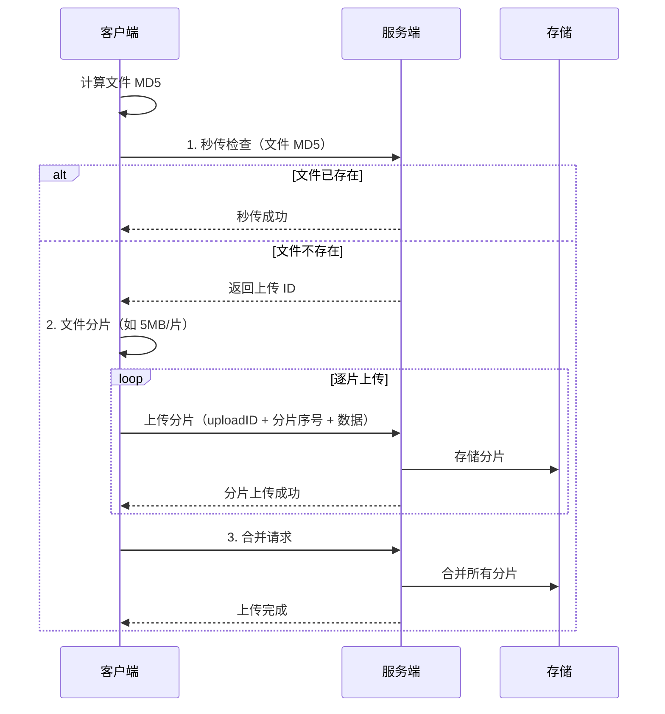
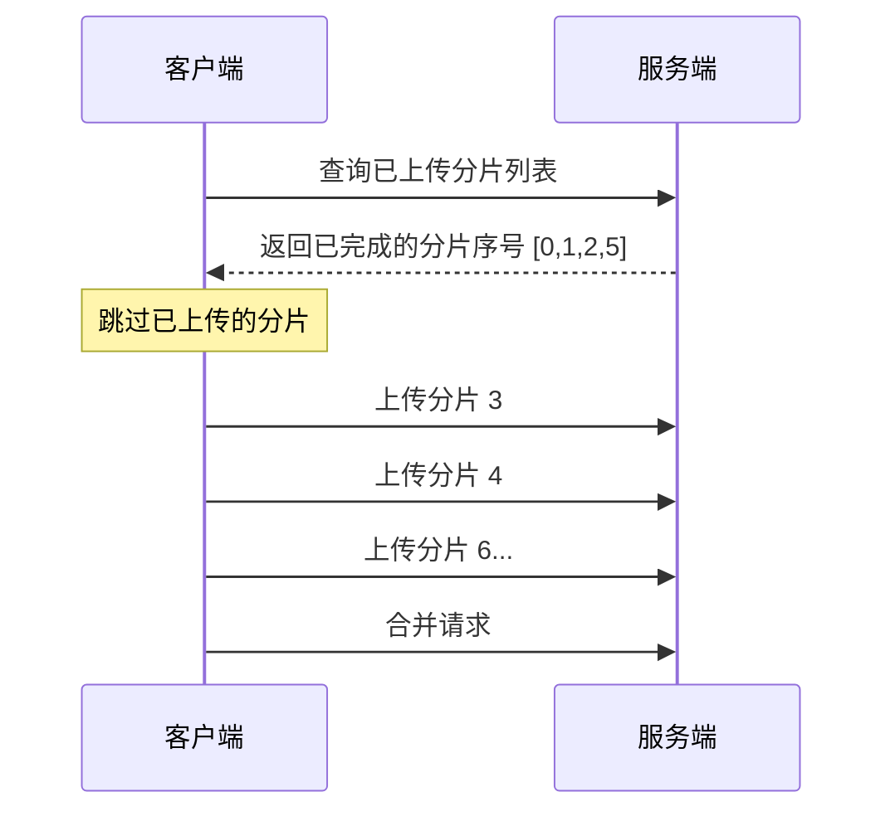

# 大文件上传方案

## 概念说明

大文件上传（如视频、安装包、数据备份）是 Web 应用中的常见需求。直接上传大文件面临多个问题：网络中断导致上传失败需要重新开始、单次上传超时、服务端内存溢出、无法显示上传进度。

解决方案的核心思路是**分而治之**——将大文件切分为多个小分片，逐个上传后在服务端合并。配合断点续传和秒传机制，可以大幅提升上传体验。

核心技术点：
1. **分片上传**：将文件切分为固定大小的分片，并行或串行上传
2. **断点续传**：记录已上传的分片，中断后从断点继续
3. **秒传**：通过文件哈希判断服务端是否已存在相同文件

## 核心原理

### 分片上传流程



### 断点续传流程



## 方案对比

| 方案 | 原理 | 优点 | 缺点 | 适用场景 |
|------|------|------|------|----------|
| **直接上传** | 单次 HTTP 请求 | 实现简单 | 大文件易失败 | 小文件（<10MB） |
| **分片上传** | 文件切片逐个上传 | 支持大文件，可并行 | 实现复杂 | 大文件（推荐） |
| **分片 + 断点续传** | 记录进度，中断恢复 | 用户体验好 | 需要状态管理 | 大文件 + 弱网（推荐） |
| **分片 + 秒传** | 哈希去重 | 避免重复上传 | 哈希计算耗时 | 重复文件多的场景 |

## 推荐方案详解

### 完整方案：分片上传 + 断点续传 + 秒传

#### 1. 文件分片

```go
// 文件分片
const ChunkSize = 5 * 1024 * 1024 // 5MB

type Chunk struct {
    Index int    // 分片序号
    Data  []byte // 分片数据
    MD5   string // 分片 MD5（校验完整性）
}

func SplitFile(data []byte) []Chunk {
    var chunks []Chunk
    for i := 0; i < len(data); i += ChunkSize {
        end := i + ChunkSize
        if end > len(data) {
            end = len(data)
        }
        chunk := Chunk{
            Index: i / ChunkSize,
            Data:  data[i:end],
            MD5:   md5sum(data[i:end]),
        }
        chunks = append(chunks, chunk)
    }
    return chunks
}
```

#### 2. 秒传检查

```go
// 秒传：通过文件 MD5 判断是否已存在
func (s *UploadService) QuickUpload(fileMD5 string) (bool, string) {
    if url, ok := s.fileIndex[fileMD5]; ok {
        return true, url // 文件已存在，秒传成功
    }
    return false, ""
}
```

#### 3. 断点续传

```go
// 查询已上传的分片
func (s *UploadService) GetUploadedChunks(uploadID string) []int {
    session := s.sessions[uploadID]
    var uploaded []int
    for i, done := range session.ChunkStatus {
        if done {
            uploaded = append(uploaded, i)
        }
    }
    return uploaded
}
```

#### 4. 分片合并

```go
// 合并所有分片
func (s *UploadService) MergeChunks(uploadID string) ([]byte, error) {
    session := s.sessions[uploadID]
    
    // 检查所有分片是否已上传
    for i, done := range session.ChunkStatus {
        if !done {
            return nil, fmt.Errorf("分片 %d 未上传", i)
        }
    }
    
    // 按序号合并
    var result []byte
    for i := 0; i < session.TotalChunks; i++ {
        result = append(result, session.Chunks[i]...)
    }
    
    // 校验文件完整性
    if md5sum(result) != session.FileMD5 {
        return nil, fmt.Errorf("文件 MD5 校验失败")
    }
    return result, nil
}
```

## 代码示例

> 💻 大文件上传的核心逻辑已在上述代码片段中展示
> 🏷️ 完整的文件上传实现可参考 [对象存储模块](/2-web-data/2.5-object-storage/)（MinIO 分片上传）

## 常见面试题

### Q1: 大文件上传如何实现断点续传？

**难度**：⭐⭐⭐ | **频率**：🔥🔥

**答题思路**：

1. 文件分片的基本思路
2. 服务端记录已上传分片
3. 客户端查询进度后续传

**标准答案**：

断点续传的核心是"分片 + 状态记录"。上传前将文件按固定大小（如 5MB）切分为多个分片，每个分片独立上传。服务端为每次上传分配唯一的 uploadID，记录每个分片的上传状态。上传中断后，客户端通过 uploadID 查询已上传的分片列表，跳过已完成的分片，只上传未完成的部分。所有分片上传完成后，客户端发送合并请求，服务端按序号合并分片并校验文件 MD5。

**深入追问**：

- 分片大小如何选择？（通常 1-10MB，根据网络环境调整）
- 如何保证分片数据完整性？（每个分片计算 MD5，上传时校验）
- 并行上传多个分片如何控制并发数？（使用 semaphore 或 worker pool）

### Q2: 秒传是如何实现的？

**难度**：⭐⭐ | **频率**：🔥🔥

**答题思路**：

1. 文件哈希去重原理
2. MD5 vs SHA256 选择
3. 哈希冲突处理

**标准答案**：

秒传的原理是文件内容去重。上传前客户端计算文件的 MD5（或 SHA256）哈希值，发送给服务端查询。如果服务端已存在相同哈希的文件，直接返回已有文件的 URL，无需实际上传——这就是"秒传"。实现要点：使用 MD5 或 SHA256 计算文件指纹；服务端维护哈希到文件路径的映射表；哈希冲突概率极低（MD5 为 2^128 分之一），但对安全性要求高的场景建议使用 SHA256。

**深入追问**：

- 大文件计算 MD5 很慢怎么办？（分块计算，边读边算，不需要全部加载到内存）
- 秒传有安全风险吗？（理论上可以通过哈希碰撞伪造文件，但概率极低）

## 常见陷阱

1. **分片序号错乱**：合并时必须按序号排序，否则文件损坏
2. **内存溢出**：不要将整个大文件加载到内存，应使用流式读取
3. **分片状态丢失**：服务端重启后分片状态丢失，需要持久化到 Redis 或数据库
4. **并发上传冲突**：同一文件的多个分片并发上传时，需要保证状态更新的原子性

## 参考资料

- [Go 官方文档 - crypto/md5](https://pkg.go.dev/crypto/md5)
- [Go 官方文档 - io](https://pkg.go.dev/io)
- [AWS S3 分片上传文档](https://docs.aws.amazon.com/AmazonS3/latest/userguide/mpuoverview.html)
