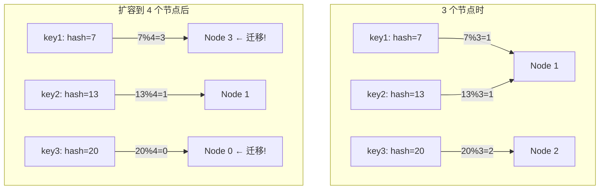
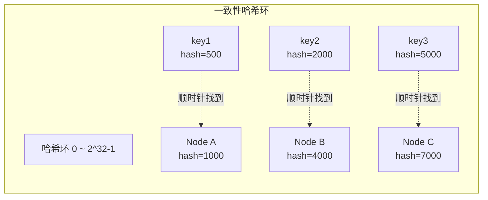
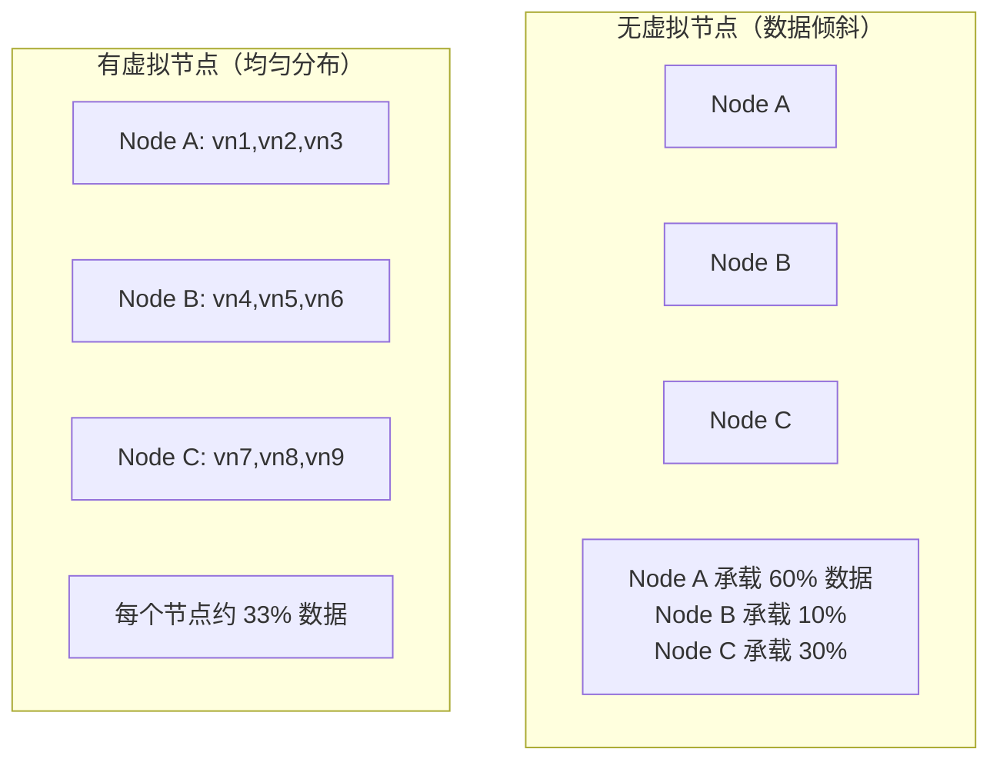

# 分布式缓存方案设计（一致性哈希）

## 概念说明

当单台缓存服务器无法承载所有数据时，需要将数据分散到多台缓存节点上——这就是分布式缓存。核心问题是**数据路由**：给定一个 key，如何决定它应该存储在哪台节点上？

最简单的方案是取模哈希（`hash(key) % N`），但当节点数量 N 变化时（扩容或缩容），几乎所有 key 的映射都会改变，导致缓存大面积失效（缓存雪崩）。一致性哈希（Consistent Hashing）正是为了解决这个问题而设计的。

## 核心原理

### 普通取模哈希的问题



扩容一个节点，2/3 的 key 需要迁移！

### 一致性哈希原理



**核心思想**：
1. 将哈希值空间组织成一个环（0 ~ 2^32-1）
2. 节点和 key 都映射到环上
3. key 沿顺时针方向找到的第一个节点就是它的归属节点
4. 增删节点时，只影响相邻节点之间的 key

### 虚拟节点解决数据倾斜



虚拟节点：每个物理节点在哈希环上映射多个虚拟节点（如 150 个），使数据分布更均匀。

## 方案对比

| 方案 | 扩容影响 | 数据均匀性 | 实现复杂度 | 适用场景 |
|------|---------|-----------|-----------|----------|
| **取模哈希** | 全量迁移 | 均匀 | 简单 | 节点固定不变 |
| **一致性哈希** | 仅影响相邻节点 | 可能倾斜 | 中等 | 节点动态变化 |
| **一致性哈希 + 虚拟节点** | 仅影响相邻节点 | 均匀 | 中等 | 生产环境（推荐） |
| **哈希槽** | 槽迁移 | 均匀 | 较高 | Redis Cluster |

## 推荐方案详解

### 一致性哈希 + 虚拟节点

```go
// 一致性哈希环
type ConsistentHash struct {
    ring     map[uint32]string // 哈希值 → 节点名
    sorted   []uint32          // 排序的哈希值
    replicas int               // 每个节点的虚拟节点数
    mu       sync.RWMutex
}

// 添加节点
func (ch *ConsistentHash) AddNode(node string) {
    ch.mu.Lock()
    defer ch.mu.Unlock()
    
    for i := 0; i < ch.replicas; i++ {
        key := fmt.Sprintf("%s#%d", node, i)
        hash := ch.hash(key)
        ch.ring[hash] = node
        ch.sorted = append(ch.sorted, hash)
    }
    sort.Slice(ch.sorted, func(i, j int) bool {
        return ch.sorted[i] < ch.sorted[j]
    })
}

// 查找 key 对应的节点
func (ch *ConsistentHash) GetNode(key string) string {
    ch.mu.RLock()
    defer ch.mu.RUnlock()
    
    hash := ch.hash(key)
    // 二分查找第一个 >= hash 的节点
    idx := sort.Search(len(ch.sorted), func(i int) bool {
        return ch.sorted[i] >= hash
    })
    if idx >= len(ch.sorted) {
        idx = 0 // 环形，回到起点
    }
    return ch.ring[ch.sorted[idx]]
}
```

### 节点增删的影响分析

```go
// 删除节点：只影响该节点负责的 key，迁移到下一个节点
func (ch *ConsistentHash) RemoveNode(node string) {
    ch.mu.Lock()
    defer ch.mu.Unlock()
    
    for i := 0; i < ch.replicas; i++ {
        key := fmt.Sprintf("%s#%d", node, i)
        hash := ch.hash(key)
        delete(ch.ring, hash)
    }
    // 重建排序数组
    ch.sorted = ch.sorted[:0]
    for hash := range ch.ring {
        ch.sorted = append(ch.sorted, hash)
    }
    sort.Slice(ch.sorted, func(i, j int) bool {
        return ch.sorted[i] < ch.sorted[j]
    })
}
```

## 代码示例

> 💻 一致性哈希的核心实现已在上述代码片段中展示
> 🏷️ 完整的分布式缓存方案可参考 [缓存与搜索模块](/2-web-data/2.3-cache-search/)

## 常见面试题

### Q1: 一致性哈希的原理是什么？

**难度**：⭐⭐⭐ | **频率**：🔥🔥🔥

**答题思路**：

1. 先说普通取模哈希的问题
2. 解释哈希环的概念
3. 说明虚拟节点的作用

**标准答案**：

一致性哈希将哈希值空间组织成一个环（0 ~ 2^32-1），节点和 key 都映射到环上。key 沿顺时针方向找到的第一个节点就是它的归属节点。相比普通取模哈希（`hash(key) % N`），一致性哈希在节点增删时只影响相邻节点之间的 key，而非全量迁移。为了解决节点少时数据分布不均的问题，引入虚拟节点——每个物理节点在环上映射多个虚拟节点（通常 100-200 个），使数据分布更均匀。

**深入追问**：

- 虚拟节点数量如何选择？（通常 100-200 个，越多越均匀但内存开销越大）
- Redis Cluster 用的是一致性哈希吗？（不是，用的是哈希槽，16384 个固定槽位）
- 一致性哈希如何处理节点权重？（权重高的节点分配更多虚拟节点）

### Q2: 一致性哈希和哈希槽的区别？

**难度**：⭐⭐⭐ | **频率**：🔥🔥🔥

**答题思路**：

1. 一致性哈希：环形空间 + 虚拟节点
2. 哈希槽：固定数量的槽位分配给节点
3. Redis Cluster 选择哈希槽的原因

**标准答案**：

一致性哈希使用连续的哈希环空间，通过虚拟节点实现均匀分布，节点增删时自动重新映射。哈希槽（如 Redis Cluster）将哈希空间划分为固定数量的槽位（16384 个），每个槽位分配给一个节点，key 通过 `CRC16(key) % 16384` 确定所属槽位。哈希槽的优势是槽位分配可以精确控制，迁移粒度是槽而非 key，管理更简单。Redis Cluster 选择哈希槽是因为 16384 个槽位的元数据（bitmap）只需 2KB，节点间心跳包传输开销小。

**深入追问**：

- 为什么 Redis Cluster 选择 16384 个槽位？（心跳包大小和集群规模的平衡）

## 常见陷阱

1. **虚拟节点数量不足**：虚拟节点太少会导致数据倾斜，建议至少 100 个
2. **哈希函数选择不当**：应使用分布均匀的哈希函数（如 CRC32、FNV），避免使用简单取模
3. **忽略节点故障**：节点宕机后其数据会自动迁移到下一个节点，但需要考虑数据恢复
4. **热点 key 问题**：即使数据分布均匀，热点 key 仍会导致单节点压力过大

## 参考资料

- [一致性哈希论文](https://www.cs.princeton.edu/courses/archive/fall09/cos518/papers/chash.pdf)
- [Go 官方文档 - hash/crc32](https://pkg.go.dev/hash/crc32)
- [Redis Cluster 规范](https://redis.io/docs/reference/cluster-spec/)
