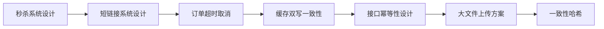
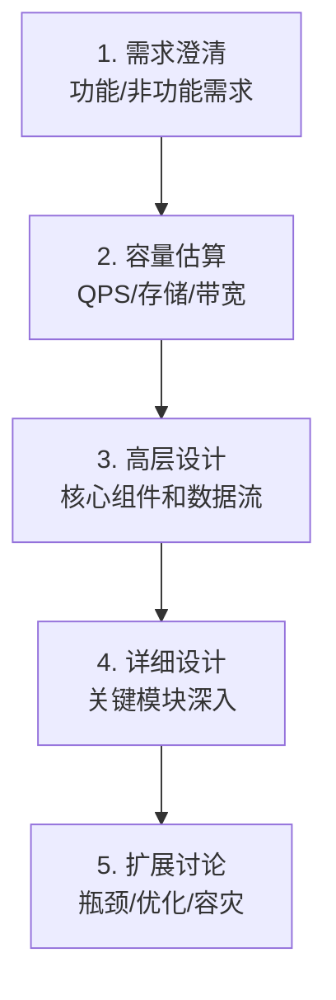

# 架构设计场景

> **前置依赖：** 建议完成前三层所有模块 | [分布式系统](/4-distributed/4.1-distributed/)

## 模块概述

架构设计场景是面试中最具综合性的考察环节，也是区分中级和高级工程师的关键。面试官通过系统设计题考察候选人的全局思维、技术选型能力和工程落地经验。

本模块精选 7 个高频架构设计场景，每个场景都遵循统一的分析框架：**问题分析 → 方案对比 → 推荐方案详解 → 核心 Go 代码实现 → 常见追问**。这些场景覆盖了限流、缓存、异步处理、分布式协调等核心技术点，是前面所有模块知识的综合运用。

Go 语言在这些场景中有天然优势——goroutine 轻量并发、channel 异步通信、原子操作高效无锁，使得 Go 实现的系统设计方案既简洁又高性能。

## 知识点索引

### 高并发与流量场景

| 序号 | 知识点 | 难度 | 面试频率 | 预计时间 |
|------|--------|------|---------|---------|
| 01 | [秒杀系统设计](./01-seckill.md) | ⭐⭐⭐ | 🔥🔥🔥 | 60min |
| 02 | [短链接系统设计](./02-short-url.md) | ⭐⭐⭐ | 🔥🔥🔥 | 45min |

### 异步与延迟处理

| 序号 | 知识点 | 难度 | 面试频率 | 预计时间 |
|------|--------|------|---------|---------|
| 03 | [订单超时取消方案](./03-order-timeout.md) | ⭐⭐⭐ | 🔥🔥🔥 | 50min |

### 缓存与数据一致性

| 序号 | 知识点 | 难度 | 面试频率 | 预计时间 |
|------|--------|------|---------|---------|
| 04 | [缓存与数据库双写一致性](./04-cache-consistency.md) | ⭐⭐⭐ | 🔥🔥🔥 | 50min |
| 07 | [分布式缓存方案设计（一致性哈希）](./07-consistent-hash.md) | ⭐⭐⭐ | 🔥🔥🔥 | 50min |

### 接口设计与工程实践

| 序号 | 知识点 | 难度 | 面试频率 | 预计时间 |
|------|--------|------|---------|---------|
| 05 | [接口幂等性设计](./05-idempotent-design.md) | ⭐⭐⭐ | 🔥🔥🔥 | 45min |
| 06 | [大文件上传方案](./06-file-upload.md) | ⭐⭐⭐ | 🔥🔥 | 50min |

### 面试指南

| 📝 | [面试指南](./interview.md) | - | 🔥🔥🔥 | 60min |
|------|--------|------|---------|---------|

## 代码示例

> 💻 完整可运行代码：[code-examples/04-distributed/architecture/](https://github.com/your-repo/code-examples/04-distributed/architecture/)

| 示例目录 | 对应知识点 | 运行方式 | Demo 模式 |
|---------|-----------|---------|----------|
| `seckill/` | 秒杀系统核心链路 | `go run ./seckill/` | 纯 Go |
| `short-url/` | 短链接生成与解析 | `go run ./short-url/` | 纯 Go |
| `cache-consistency/` | 缓存一致性方案对比 | `go run ./cache-consistency/` | 纯 Go |

## 学习路径建议

1. **先学秒杀系统**：综合性最强，涵盖限流、库存扣减、异步下单，是架构设计的经典入门题
2. **短链接系统**：相对简单但考察全面，涉及哈希算法、存储设计、高并发读取
3. **订单超时取消**：延迟队列和时间轮是异步处理的核心方案
4. **缓存双写一致性**：缓存是高并发系统的基石，一致性问题是最常见的追问
5. **接口幂等性**：分布式系统的基本要求，方案选型是面试高频考点
6. **大文件上传**：分片上传和断点续传是工程实践中的常见需求
7. **一致性哈希**：分布式缓存的核心算法，理解虚拟节点的设计思想

## 架构设计面试答题框架

面试中回答系统设计题，建议遵循以下框架：

1. **需求澄清**：明确功能需求和非功能需求（QPS、延迟、可用性）
2. **容量估算**：估算 QPS、存储量、带宽需求
3. **高层设计**：画出核心组件和数据流
4. **详细设计**：深入关键模块（如秒杀的库存扣减、短链的哈希算法）
5. **扩展讨论**：讨论瓶颈、优化方案、容灾策略

