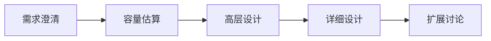
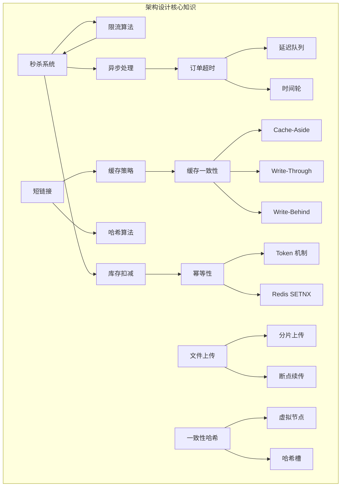

# 架构设计场景 - 面试指南

## 面试概述

架构设计（System Design）是中高级 Go 开发者面试的必考环节，通常占面试时间的 30-50%。面试官通过系统设计题考察候选人的**全局思维、技术选型能力、工程落地经验和沟通表达能力**。

### 面试答题框架

1. **需求澄清**（2-3 分钟）：明确功能需求和非功能需求
2. **容量估算**（2-3 分钟）：估算 QPS、存储量、带宽
3. **高层设计**（5-8 分钟）：画出核心组件和数据流
4. **详细设计**（10-15 分钟）：深入关键模块
5. **扩展讨论**（5 分钟）：瓶颈分析、优化方案、容灾策略

## 高频面试题

### Q1: 设计一个秒杀系统

**难度**：⭐⭐⭐ | **频率**：🔥🔥🔥 | **考察点**：限流、库存一致性、异步处理

**答题思路**：

1. 需求澄清：商品数量、预期 QPS、超时时间
2. 多层限流：前端防重 → 网关令牌桶 → 服务层用户限流
3. 库存扣减：Redis DECR 原子操作，防止超卖
4. 异步下单：MQ 削峰填谷，订单服务异步消费
5. 扩展：Redis 集群、数据库分库分表、CDN 静态化

**标准答案**：

秒杀系统的核心是"三级防御 + 异步处理"。第一级：前端层通过按钮置灰、验证码拦截无效请求。第二级：网关层使用令牌桶限流，将 QPS 控制在系统承载范围内。第三级：服务层使用 Redis DECR 原子扣减库存，扣减成功后发送消息到 MQ，异步创建订单。这样将瞬时的百万级请求层层过滤，最终只有与库存量级相当的请求进入订单创建流程。

**常见追问**：

- 如何防止超卖？→ Redis DECR 原子操作 + 负数回滚
- 如何防止同一用户重复购买？→ 用户维度分布式锁或幂等校验
- Redis 宕机怎么办？→ 主从 + 哨兵，或降级到数据库乐观锁
- 如何保证消息不丢失？→ MQ 持久化 + 消费确认 + 补偿机制

> 📖 详细内容：[秒杀系统设计](./01-seckill.md)

---

### Q2: 设计一个短链接系统

**难度**：⭐⭐⭐ | **频率**：🔥🔥🔥 | **考察点**：哈希算法、存储设计、高并发读取

**答题思路**：

1. 短码生成：哈希截取 + Base62 编码
2. 冲突处理：唯一索引 + 重试
3. 高并发读取：多级缓存（本地缓存 → Redis → DB）
4. 扩展：过期机制、点击统计、防滥用

**标准答案**：

短链接系统的核心是"短码生成 + 高效读取"。短码生成采用 MD5 哈希截取 + Base62 编码，6 位短码可支持 568 亿个 URL。冲突通过数据库唯一索引检测，冲突时追加随机字符重新生成。读取采用多级缓存：本地缓存（sync.Map）→ Redis → 数据库，热点短链直接从内存返回。重定向使用 302（临时重定向），便于统计点击量。

**常见追问**：

- 6 位短码能支持多少 URL？→ 62^6 ≈ 568 亿
- 用 301 还是 302 重定向？→ 302，便于统计和控制
- 如何防止恶意生成大量短链？→ 用户维度限流 + 验证码
- 相同长 URL 是否生成相同短码？→ 看业务需求，可以做去重

> 📖 详细内容：[短链接系统设计](./02-short-url.md)

---

### Q3: 订单超时取消有哪些方案？

**难度**：⭐⭐⭐ | **频率**：🔥🔥🔥 | **考察点**：延迟任务、时间轮、消息队列

**答题思路**：

1. 列举四种方案并对比
2. 推荐 Redis ZSET 延迟队列
3. 说明时间轮的原理和适用场景

**标准答案**：

四种方案：（1）定时轮询数据库，简单但性能差；（2）Redis ZSET 延迟队列，以超时时间戳为 score，定期取出到期元素，推荐分布式场景；（3）时间轮算法，O(1) 时间复杂度，适合单机高性能场景；（4）Redis Key 过期通知，不可靠不推荐。生产环境推荐 Redis ZSET 方案，兼顾精确度、可靠性和性能。

**常见追问**：

- 时间轮如何处理超过一圈的延迟？→ 分层时间轮
- 服务重启后如何恢复？→ 从 Redis/数据库重新加载
- Redis Key 过期通知为什么不可靠？→ Redis 不保证过期事件一定触发

> 📖 详细内容：[订单超时取消方案](./03-order-timeout.md)

---

### Q4: 缓存和数据库双写不一致怎么办？

**难度**：⭐⭐⭐ | **频率**：🔥🔥🔥 | **考察点**：缓存策略、一致性、并发控制

**答题思路**：

1. 说明不一致的根本原因
2. 对比三种缓存策略
3. 推荐 Cache-Aside + 先更新 DB 再删缓存

**标准答案**：

推荐 Cache-Aside 模式，采用"先更新数据库，再删除缓存"策略。不一致窗口极小且自愈——下次读取会从数据库加载最新数据。不推荐"先删缓存再更新 DB"，因为并发读写会导致缓存写入旧数据。如果对一致性要求极高，可以使用延迟双删或基于 binlog 的缓存更新方案（Canal 监听 MySQL binlog）。

**常见追问**：

- 删除缓存失败怎么办？→ 重试机制 + 消息队列
- Cache-Aside 和 Write-Through 的区别？→ 前者应用层管理缓存，后者缓存层管理
- 什么是延迟双删？→ 删缓存 → 更新 DB → 延迟再删缓存

> 📖 详细内容：[缓存与数据库双写一致性](./04-cache-consistency.md)

---

### Q5: 如何保证接口的幂等性？

**难度**：⭐⭐⭐ | **频率**：🔥🔥🔥 | **考察点**：幂等设计、分布式锁、状态机

**答题思路**：

1. 解释幂等性概念
2. 列举五种方案
3. 根据场景推荐

**标准答案**：

五种方案：（1）Token 机制：预获取 Token，提交时原子删除判断首次；（2）唯一索引：数据库唯一约束防重复插入；（3）Redis SETNX：高性能分布式幂等控制；（4）状态机：通过状态流转控制合法操作；（5）乐观锁：版本号控制并发更新。高并发 API 推荐 Redis SETNX，数据库操作推荐唯一索引，订单状态变更推荐状态机。

**常见追问**：

- 幂等 Key 如何设计？→ 业务唯一标识组合
- 业务失败后幂等 Key 要清理吗？→ 需要，否则重试会被误判

> 📖 详细内容：[接口幂等性设计](./05-idempotent-design.md)

---

### Q6: 大文件上传如何实现？

**难度**：⭐⭐⭐ | **频率**：🔥🔥 | **考察点**：分片上传、断点续传、文件处理

**答题思路**：

1. 分片上传的基本思路
2. 断点续传的实现
3. 秒传的原理

**标准答案**：

大文件上传采用"分片 + 断点续传 + 秒传"三合一方案。分片：将文件按固定大小（5MB）切分，逐片上传。断点续传：服务端记录已上传分片，中断后查询进度续传。秒传：上传前计算文件 MD5，服务端已存在则直接返回。所有分片上传完成后发送合并请求，服务端按序号合并并校验 MD5。

**常见追问**：

- 分片大小如何选择？→ 1-10MB，根据网络环境
- 如何保证分片完整性？→ 每片计算 MD5 校验
- 并行上传如何控制并发？→ semaphore 或 worker pool

> 📖 详细内容：[大文件上传方案](./06-file-upload.md)

---

### Q7: 一致性哈希的原理和应用？

**难度**：⭐⭐⭐ | **频率**：🔥🔥🔥 | **考察点**：分布式缓存、哈希算法、负载均衡

**答题思路**：

1. 普通取模哈希的问题
2. 一致性哈希环的原理
3. 虚拟节点解决数据倾斜

**标准答案**：

一致性哈希将哈希空间组织成环，节点和 key 都映射到环上，key 顺时针找到的第一个节点就是归属节点。相比取模哈希，节点增删时只影响相邻节点的 key。虚拟节点解决数据倾斜——每个物理节点映射 100-200 个虚拟节点，使数据分布均匀。Redis Cluster 没有使用一致性哈希，而是使用 16384 个固定哈希槽。

**常见追问**：

- 虚拟节点数量如何选择？→ 100-200 个
- Redis Cluster 为什么用哈希槽？→ 管理简单，心跳包小
- 一致性哈希如何处理节点权重？→ 权重高的节点分配更多虚拟节点

> 📖 详细内容：[一致性哈希](./07-consistent-hash.md)

---

## 面试知识图谱

## 按公司类型的面试重点

### 大厂（字节/阿里/腾讯）

- 秒杀系统设计（必考）
- 缓存一致性方案（高频）
- 一致性哈希原理（高频）
- 要求画架构图，讨论容量估算

### 中厂（B 站/滴滴/美团）

- 短链接系统设计（高频）
- 订单超时取消方案（高频）
- 接口幂等性设计（高频）
- 侧重工程落地经验

### 创业公司

- 缓存策略选型（常见）
- 大文件上传方案（常见）
- 侧重快速实现和技术选型理由

## 复习建议

1. **每个场景都要能画出架构图**：面试中通常需要在白板上画图
2. **掌握方案对比**：面试官喜欢问"为什么选这个方案而不是那个"
3. **准备容量估算**：QPS、存储量、带宽的快速估算能力
4. **结合 Go 特性**：用 goroutine、channel、atomic 等 Go 特性回答
5. **准备追问**：每个方案都要想好 2-3 个可能的追问和回答
