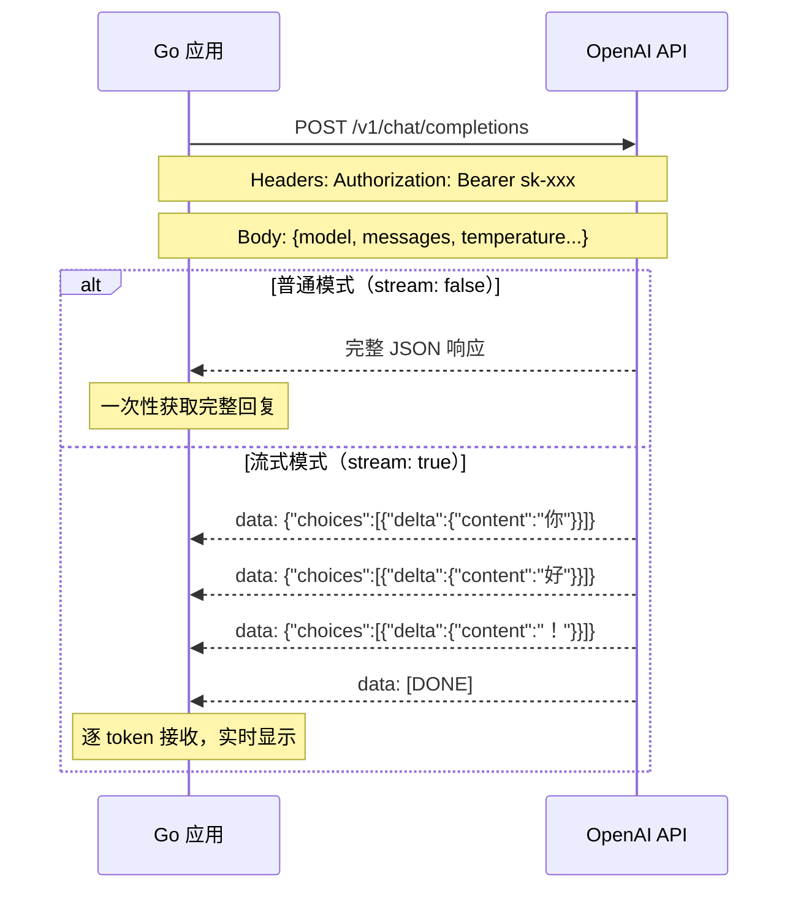

# OpenAI API 调用

## 概念说明

OpenAI API 是目前最主流的大语言模型（LLM）接口，提供 Chat Completions、Embeddings、Image Generation 等能力。对于 Go 开发者来说，调用 LLM API 是构建 AI 应用的第一步。

Go 生态中调用 OpenAI API 有两种方式：
1. **go-openai 库**：社区维护的官方 API 封装，类型安全，支持流式响应
2. **纯 HTTP 客户端**：直接使用 `net/http` 调用 REST API，更灵活，无额外依赖

本节重点讲解纯 Go 实现方式（使用 `net/http`），帮助你理解 API 的底层通信机制。

### 免费替代方案：Ollama

如果没有 OpenAI API Key，可以使用 [Ollama](https://ollama.ai/) 在本地运行开源模型。Ollama 提供与 OpenAI 兼容的 API 接口：

```bash
# 安装并启动
ollama serve
ollama pull qwen2.5:7b

# API 地址：http://localhost:11434/v1/chat/completions
# 无需 API Key（设置为任意值即可）
```

## 核心原理

### Chat Completions API 流程



### 请求/响应结构

```
请求体（Request）:
{
  "model": "gpt-4o-mini",
  "messages": [
    {"role": "system", "content": "你是一个 Go 语言专家"},
    {"role": "user", "content": "什么是 goroutine？"}
  ],
  "temperature": 0.7,
  "max_tokens": 1000,
  "stream": false
}

响应体（Response）:
{
  "id": "chatcmpl-xxx",
  "choices": [{
    "index": 0,
    "message": {"role": "assistant", "content": "Goroutine 是..."},
    "finish_reason": "stop"
  }],
  "usage": {"prompt_tokens": 20, "completion_tokens": 100, "total_tokens": 120}
}
```

### 关键参数说明

| 参数 | 类型 | 说明 |
|------|------|------|
| `model` | string | 模型名称，如 `gpt-4o-mini`、`gpt-4o`、`qwen2.5:7b`（Ollama） |
| `messages` | array | 对话历史，包含 system/user/assistant 角色消息 |
| `temperature` | float | 随机性控制，0~2，越高越随机，推荐 0.7 |
| `max_tokens` | int | 最大生成 token 数 |
| `stream` | bool | 是否启用流式响应（SSE） |

## 标准库方案

Go 标准库 `net/http` 完全可以直接调用 OpenAI API，无需第三方依赖：

```go
// 使用 net/http 调用 OpenAI Chat Completions API
func chatCompletion(apiKey, prompt string) (string, error) {
    reqBody := ChatRequest{
        Model: "gpt-4o-mini",
        Messages: []Message{
            {Role: "system", Content: "你是一个 Go 语言专家"},
            {Role: "user", Content: prompt},
        },
        Temperature: 0.7,
    }
    
    data, _ := json.Marshal(reqBody)
    req, _ := http.NewRequest("POST", "https://api.openai.com/v1/chat/completions", bytes.NewReader(data))
    req.Header.Set("Content-Type", "application/json")
    req.Header.Set("Authorization", "Bearer "+apiKey)
    
    resp, err := http.DefaultClient.Do(req)
    if err != nil {
        return "", fmt.Errorf("请求失败: %w", err)
    }
    defer resp.Body.Close()
    
    var chatResp ChatResponse
    json.NewDecoder(resp.Body).Decode(&chatResp)
    return chatResp.Choices[0].Message.Content, nil
}
```

### 流式响应（SSE）处理

流式响应使用 Server-Sent Events（SSE）协议，每个事件以 `data: ` 前缀开头：

```go
// 流式读取 SSE 响应
scanner := bufio.NewScanner(resp.Body)
for scanner.Scan() {
    line := scanner.Text()
    if !strings.HasPrefix(line, "data: ") {
        continue
    }
    data := strings.TrimPrefix(line, "data: ")
    if data == "[DONE]" {
        break
    }
    var chunk StreamChunk
    json.Unmarshal([]byte(data), &chunk)
    fmt.Print(chunk.Choices[0].Delta.Content) // 实时输出
}
```

## 第三方库方案

### go-openai

[go-openai](https://github.com/sashabaranov/go-openai) 是社区最流行的 OpenAI Go 客户端，提供类型安全的 API 封装：

```go
import openai "github.com/sashabaranov/go-openai"

client := openai.NewClient("sk-your-key")
resp, err := client.CreateChatCompletion(
    context.Background(),
    openai.ChatCompletionRequest{
        Model: openai.GPT4oMini,
        Messages: []openai.ChatCompletionMessage{
            {Role: openai.ChatMessageRoleUser, Content: "什么是 goroutine？"},
        },
    },
)
```

**选型建议**：
- 快速原型 / 简单调用 → go-openai（开箱即用）
- 需要自定义 HTTP 行为 / 兼容多个 LLM 提供商 → 纯 net/http（更灵活）
- 复杂 AI 应用（RAG/Agent） → langchaingo（框架级支持）

## 代码示例

> 💻 完整可运行代码：[code-examples/04-distributed/ai/openai-chat/](https://github.com/skyhe58/guide-go/tree/main/code-examples/04-distributed/ai/openai-chat/)
> 🏷️ Demo 模式：Part A（模拟 API 响应，直接运行）

代码示例包含：
1. Chat Completions 请求/响应结构体定义
2. 普通模式调用（完整响应）
3. 流式模式调用（SSE 解析，逐 token 输出）
4. 可配置 API 端点（支持 Ollama 本地模型）

## 常见面试题

### Q1: Go 中如何调用 OpenAI API？流式响应怎么处理？

**难度**：⭐⭐ | **频率**：🔥🔥

**答题思路**：
1. 使用 net/http 发送 POST 请求到 Chat Completions 端点
2. 设置 Authorization Header 和 JSON Body
3. 流式响应设置 `stream: true`，使用 SSE 协议逐行读取
4. 每行以 `data: ` 前缀，解析 JSON 获取增量内容

**标准答案**：

Go 调用 OpenAI API 可以使用标准库 `net/http` 或第三方库 `go-openai`。流式响应通过 SSE（Server-Sent Events）实现，设置 `stream: true` 后，服务端逐 token 推送数据，客户端用 `bufio.Scanner` 逐行读取，解析 `data: ` 前缀的 JSON 数据，遇到 `data: [DONE]` 表示结束。

**深入追问**：
- SSE 和 WebSocket 有什么区别？
- 如何处理流式响应中的错误？
- 如何实现请求超时和重试？

## 常见陷阱

1. **忘记设置超时**：OpenAI API 响应可能很慢（特别是长文本生成），务必设置 `http.Client.Timeout` 或使用 `context.WithTimeout`
2. **流式响应未正确关闭 Body**：`resp.Body` 必须在读取完成后关闭，否则会导致连接泄漏
3. **API Key 硬编码**：永远不要在代码中硬编码 API Key，使用环境变量 `os.Getenv("OPENAI_API_KEY")`
4. **忽略 HTTP 状态码**：API 返回 429（限流）、401（认证失败）等错误码时需要正确处理

## 参考资料

- [OpenAI API 官方文档](https://platform.openai.com/docs/api-reference/chat)
- [go-openai GitHub](https://github.com/sashabaranov/go-openai)
- [Ollama 官方文档](https://ollama.ai/)
- [Server-Sent Events 规范](https://html.spec.whatwg.org/multipage/server-sent-events.html)
