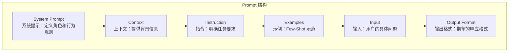

# Prompt Engineering 基础技巧

## 概念说明

Prompt Engineering（提示工程）是指通过精心设计输入提示（Prompt），引导大语言模型（LLM）生成高质量、准确的输出。对于 Go 开发者来说，掌握 Prompt Engineering 是构建可靠 AI 应用的关键——同样的模型，不同的 Prompt 可能产生天壤之别的结果。

Prompt Engineering 不是"玄学"，而是有明确方法论的工程实践。核心原则：**清晰、具体、结构化**。

## 核心原理

### Prompt 的组成结构



### 六大核心技巧

| 技巧 | 说明 | 适用场景 |
|------|------|----------|
| **角色设定** | 通过 System Prompt 定义 AI 的角色和专业领域 | 所有场景 |
| **Few-Shot** | 提供 2-3 个输入输出示例，让模型学习模式 | 格式化输出、分类任务 |
| **Chain of Thought（CoT）** | 要求模型"一步步思考"，展示推理过程 | 复杂推理、数学计算 |
| **输出格式约束** | 明确要求 JSON/Markdown/表格等输出格式 | API 集成、结构化数据 |
| **分步指令** | 将复杂任务拆解为多个步骤 | 多步骤任务 |
| **负面约束** | 明确告诉模型"不要做什么" | 避免常见错误 |

## 标准库方案

在 Go 中，Prompt 本质上就是字符串拼接。使用 `fmt.Sprintf` 或 `text/template` 构建 Prompt：

::: v-pre
```go
// 方式一：fmt.Sprintf 简单拼接
func buildPrompt(language, code string) string {
    return fmt.Sprintf(`请作为一名资深 %s 开发者，审查以下代码：

代码：
%s

请从以下维度分析：
1. 代码质量
2. 潜在 bug
3. 性能优化建议

输出格式：JSON`, language, code)
}

// 方式二：text/template 模板化（推荐复杂场景）
var reviewTemplate = template.Must(template.New("review").Parse(`
你是一名资深 {{.Language}} 开发者。

## 任务
审查以下代码并给出改进建议。

## 代码
{{.Code}}

## 输出要求
以 JSON 格式输出，包含 issues 数组，每个 issue 包含 severity、description、suggestion 字段。
`))
```
:::

### 在 Go 中管理多轮对话

```go
// 对话历史管理
type Conversation struct {
    Messages []Message
}

func (c *Conversation) AddSystemPrompt(content string) {
    c.Messages = append(c.Messages, Message{Role: "system", Content: content})
}

func (c *Conversation) AddUserMessage(content string) {
    c.Messages = append(c.Messages, Message{Role: "user", Content: content})
}

func (c *Conversation) AddAssistantMessage(content string) {
    c.Messages = append(c.Messages, Message{Role: "assistant", Content: content})
}
```

## 技巧详解

### 1. 角色设定（System Prompt）

```go
// ✅ 好的 System Prompt：具体、有约束
systemPrompt := `你是一名资深 Go 后端开发者，专注于微服务架构和高并发系统。
回答要求：
- 优先使用 Go 标准库方案
- 代码示例使用 Go 1.22+ 语法
- 回答简洁，避免冗余`

// ❌ 差的 System Prompt：模糊、无约束
systemPrompt := `你是一个助手`
```

### 2. Few-Shot 示例

```go
// Few-Shot：提供示例让模型学习输出格式
prompt := `将以下 Go 错误信息分类为 bug/config/network 之一。

示例：
输入：dial tcp 127.0.0.1:6379: connect: connection refused
输出：network

输入：invalid memory address or nil pointer dereference
输出：bug

输入：missing required field "database_url" in config
输出：config

输入：%s
输出：`
```

### 3. Chain of Thought（CoT）

```go
// CoT：要求模型展示推理过程
prompt := `分析以下 Go 代码的时间复杂度。

请一步步思考：
1. 识别循环结构
2. 分析每层循环的迭代次数
3. 计算总的时间复杂度

代码：
` + code
```

### 4. 输出格式约束

```go
// 约束 JSON 输出格式
prompt := `分析以下 Go 函数的潜在问题。

输出严格按照以下 JSON 格式：
{
  "function_name": "函数名",
  "issues": [
    {
      "severity": "high|medium|low",
      "line": 行号,
      "description": "问题描述",
      "fix": "修复建议"
    }
  ]
}

不要输出任何 JSON 以外的内容。`
```

## 代码示例

> 💻 完整可运行代码：[code-examples/04-distributed/ai/openai-chat/](https://github.com/skyhe58/guide-go/tree/main/code-examples/04-distributed/ai/openai-chat/)
> 🏷️ Demo 模式：Part A（模拟 API 响应，直接运行）

## 常见面试题

### Q1: 什么是 Prompt Engineering？有哪些常用技巧？

**难度**：⭐⭐ | **频率**：🔥🔥

**答题思路**：
1. 定义：通过设计输入提示引导 LLM 生成高质量输出
2. 核心技巧：角色设定、Few-Shot、CoT、输出格式约束
3. 在 Go 中的实践：使用 text/template 管理 Prompt 模板

**标准答案**：

Prompt Engineering 是通过精心设计输入提示来引导 LLM 生成准确输出的工程实践。常用技巧包括：角色设定（System Prompt 定义专业领域）、Few-Shot（提供示例让模型学习模式）、Chain of Thought（要求逐步推理）、输出格式约束（指定 JSON/Markdown 格式）。在 Go 中，可以使用 `text/template` 管理 Prompt 模板，结合结构体实现类型安全的参数注入。

**深入追问**：
- Few-Shot 和 Fine-Tuning 有什么区别？
- 如何评估 Prompt 的效果？
- Temperature 参数如何影响输出？

## 常见陷阱

1. **Prompt 过于模糊**：模糊的指令导致不确定的输出，要尽量具体和结构化
2. **忽略 System Prompt**：System Prompt 是控制模型行为的最有效手段，不要只用 User Message
3. **示例数量不当**：Few-Shot 通常 2-3 个示例最佳，过多会浪费 token，过少可能不够
4. **未处理输出解析失败**：即使约束了 JSON 格式，模型仍可能输出非法 JSON，必须做错误处理

## 参考资料

- [OpenAI Prompt Engineering Guide](https://platform.openai.com/docs/guides/prompt-engineering)
- [Anthropic Prompt Engineering](https://docs.anthropic.com/en/docs/build-with-claude/prompt-engineering)
- [Go text/template 文档](https://pkg.go.dev/text/template)
