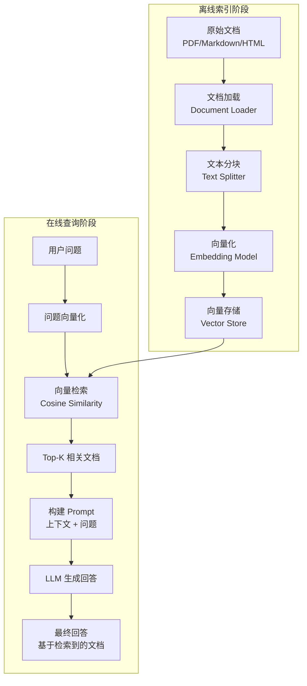
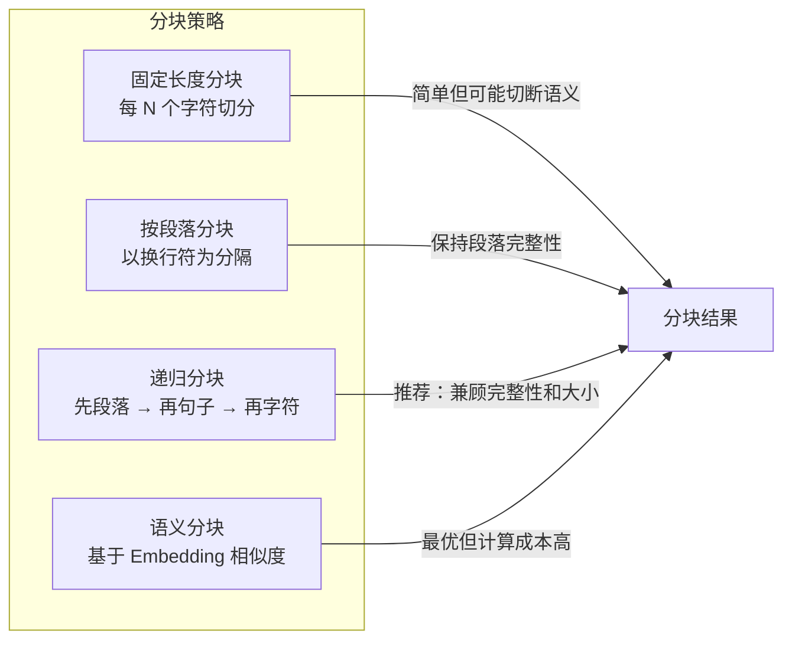

# RAG 检索增强生成

## 概念说明

RAG（Retrieval-Augmented Generation，检索增强生成）是当前企业级 AI 应用最核心的技术模式。它解决了 LLM 的两大痛点：

1. **知识截止**：LLM 的训练数据有截止日期，无法回答最新信息
2. **幻觉问题**：LLM 可能"编造"不存在的事实

RAG 的核心思想：**先检索，再生成**——在调用 LLM 之前，先从知识库中检索与问题相关的文档片段，将这些片段作为上下文注入 Prompt，让 LLM 基于真实数据生成回答。

## 核心原理

### RAG 完整流程



### 四个核心步骤

| 步骤 | 说明 | Go 实现 |
|------|------|---------|
| **文档加载** | 读取各种格式的文档（PDF、Markdown、HTML） | `os.ReadFile` + 格式解析 |
| **文本分块** | 将长文档切分为适合 Embedding 的小块（通常 200-500 token） | 按段落/句子/固定长度分块 |
| **向量化** | 将文本块转换为高维向量（Embedding） | 调用 Embedding API 或本地模型 |
| **检索生成** | 计算查询向量与文档向量的相似度，取 Top-K 结果注入 Prompt | 余弦相似度 + LLM 调用 |

### 余弦相似度

余弦相似度是向量检索的核心算法，衡量两个向量方向的相似程度：

```
cosine_similarity(A, B) = (A · B) / (|A| × |B|)

值域：[-1, 1]
1 = 完全相同方向（最相似）
0 = 正交（无关）
-1 = 完全相反方向
```

```go
// Go 实现余弦相似度
func cosineSimilarity(a, b []float64) float64 {
    var dotProduct, normA, normB float64
    for i := range a {
        dotProduct += a[i] * b[i]
        normA += a[i] * a[i]
        normB += b[i] * b[i]
    }
    if normA == 0 || normB == 0 {
        return 0
    }
    return dotProduct / (math.Sqrt(normA) * math.Sqrt(normB))
}
```

### 文本分块策略



| 策略 | 优点 | 缺点 | 适用场景 |
|------|------|------|----------|
| 固定长度 | 实现简单 | 可能切断语义 | 结构化文档 |
| 按段落 | 保持语义完整 | 块大小不均匀 | Markdown/文章 |
| 递归分块 | 兼顾完整性和大小 | 实现稍复杂 | 通用场景（推荐） |
| 语义分块 | 语义最优 | 计算成本高 | 高精度需求 |

## 标准库方案

Go 标准库可以实现 RAG 的核心逻辑，无需第三方向量数据库：

```go
// 内存向量存储
type VectorStore struct {
    Documents []Document
}

type Document struct {
    Content   string
    Embedding []float64
    Metadata  map[string]string
}

// 检索 Top-K 相关文档
func (vs *VectorStore) Search(queryEmbedding []float64, topK int) []Document {
    type scored struct {
        doc   Document
        score float64
    }
    
    results := make([]scored, 0, len(vs.Documents))
    for _, doc := range vs.Documents {
        score := cosineSimilarity(queryEmbedding, doc.Embedding)
        results = append(results, scored{doc: doc, score: score})
    }
    
    sort.Slice(results, func(i, j int) bool {
        return results[i].score > results[j].score
    })
    
    topDocs := make([]Document, 0, topK)
    for i := 0; i < topK && i < len(results); i++ {
        topDocs = append(topDocs, results[i].doc)
    }
    return topDocs
}
```

## 第三方库方案

### langchaingo

[langchaingo](https://github.com/tmc/langchaingo) 提供了完整的 RAG 工具链：

```go
import (
    "github.com/tmc/langchaingo/documentloaders"
    "github.com/tmc/langchaingo/textsplitter"
    "github.com/tmc/langchaingo/embeddings"
    "github.com/tmc/langchaingo/vectorstores/chroma"
)

// 文档加载 → 分块 → 向量化 → 存储
docs, _ := documentloaders.NewText(reader).Load(ctx)
chunks, _ := textsplitter.NewRecursiveCharacter().SplitDocuments(docs)
store, _ := chroma.New(chroma.WithEmbedder(embedder))
store.AddDocuments(ctx, chunks)

// 检索
results, _ := store.SimilaritySearch(ctx, "什么是 goroutine？", 3)
```

### 向量数据库选型

| 数据库 | 特点 | Go 客户端 |
|--------|------|----------|
| Chroma | 轻量级，适合开发测试 | langchaingo 内置 |
| Milvus | 高性能，支持十亿级向量 | `github.com/milvus-io/milvus-sdk-go` |
| Weaviate | 内置向量化，GraphQL API | `github.com/weaviate/weaviate-go-client` |
| pgvector | PostgreSQL 扩展，无需额外部署 | `github.com/pgvector/pgvector-go` |

## 代码示例

> 💻 完整可运行代码：[code-examples/04-distributed/ai/rag-example/](https://github.com/your-repo/code-examples/04-distributed/ai/rag-example/)
> 🏷️ Demo 模式：Part A（内存向量存储 + 模拟 Embedding，直接运行）

代码示例包含完整的 RAG 流程：
1. 文档加载（从字符串/文件加载）
2. 文本分块（按段落 + 固定长度）
3. 向量化（模拟 Embedding + 真实 API 调用）
4. 余弦相似度计算
5. Top-K 检索
6. Prompt 构建与 LLM 生成

## 常见面试题

### Q1: 什么是 RAG？为什么需要 RAG？

**难度**：⭐⭐⭐ | **频率**：🔥🔥🔥

**答题思路**：
1. RAG 的定义和核心思想
2. 解决 LLM 的什么问题（知识截止、幻觉）
3. RAG 的完整流程
4. 与 Fine-Tuning 的对比

**标准答案**：

RAG（检索增强生成）是在调用 LLM 之前，先从知识库中检索相关文档，将检索结果作为上下文注入 Prompt，让 LLM 基于真实数据生成回答。RAG 解决了 LLM 的知识截止和幻觉问题，无需重新训练模型即可让 LLM 访问最新的私有数据。完整流程：文档加载 → 文本分块 → 向量化 → 存储 → 检索 → 生成。

**深入追问**：
- RAG 和 Fine-Tuning 各自适用什么场景？
- 如何评估 RAG 系统的效果？
- 文本分块的大小如何选择？

### Q2: 余弦相似度的原理是什么？为什么用它做向量检索？

**难度**：⭐⭐⭐ | **频率**：🔥🔥

**标准答案**：

余弦相似度衡量两个向量方向的相似程度，值域 [-1, 1]，1 表示方向完全相同。用于向量检索是因为：文本 Embedding 后的向量，语义相似的文本在高维空间中方向接近。余弦相似度只关注方向不关注大小，适合比较不同长度文本的语义相似性。

## 常见陷阱

1. **分块太大或太小**：太大导致检索不精确，太小丢失上下文。推荐 200-500 token，带 50-100 token 重叠
2. **忽略分块重叠**：相邻块之间应有重叠（overlap），避免关键信息被切断
3. **Top-K 设置不当**：K 太小可能遗漏相关信息，K 太大会引入噪声。通常 3-5 为宜
4. **未做相关性过滤**：检索结果应设置相似度阈值，低于阈值的结果不应注入 Prompt

## 参考资料

- [RAG 论文：Retrieval-Augmented Generation for Knowledge-Intensive NLP Tasks](https://arxiv.org/abs/2005.11401)
- [langchaingo GitHub](https://github.com/tmc/langchaingo)
- [OpenAI Embeddings API](https://platform.openai.com/docs/guides/embeddings)
