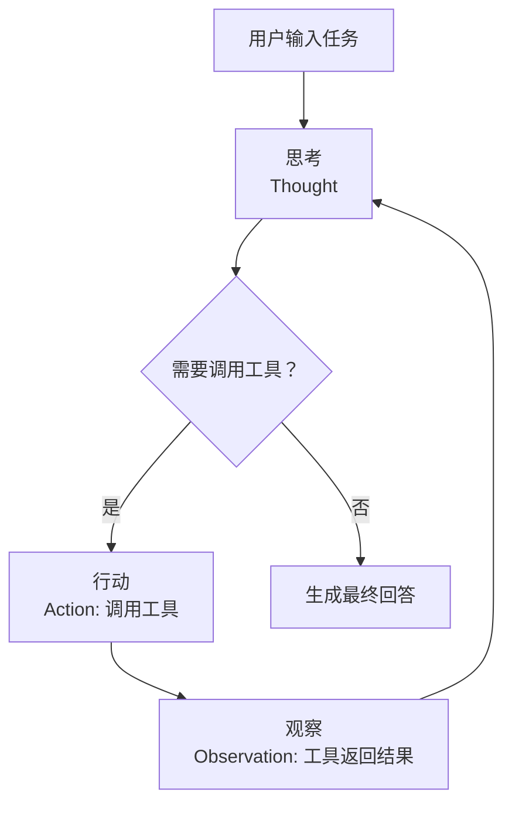
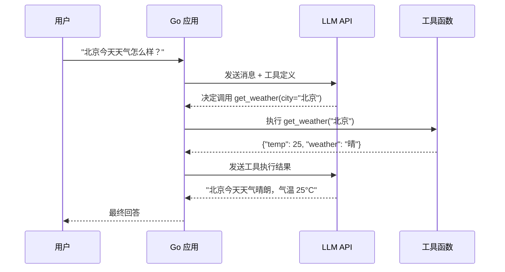

# AI Agent 开发

## 概念说明

AI Agent（智能体）是能够自主决策和执行任务的 AI 系统。与普通的 LLM 对话不同，Agent 具备"行动能力"——它可以调用外部工具（搜索、计算、数据库查询等），根据工具返回的结果继续推理，直到完成任务。

核心区别：
- **普通 LLM 对话**：输入问题 → 输出文本回答（只能"说"）
- **AI Agent**：输入任务 → 思考 → 调用工具 → 观察结果 → 继续思考 → 最终回答（能"做"）

OpenAI 的 Function Calling 是实现 Agent 的关键技术：开发者定义可用的工具（函数），LLM 决定何时调用哪个工具、传什么参数，开发者执行工具并将结果返回给 LLM。

## 核心原理

### Agent 执行循环（ReAct 模式）



ReAct（Reasoning + Acting）是最经典的 Agent 模式：
1. **Thought**（思考）：LLM 分析当前状态，决定下一步行动
2. **Action**（行动）：调用选定的工具
3. **Observation**（观察）：获取工具执行结果
4. 循环直到 LLM 认为可以给出最终回答

### Function Calling 流程



### 工具定义规范

OpenAI Function Calling 使用 JSON Schema 定义工具：

```json
{
  "type": "function",
  "function": {
    "name": "calculate",
    "description": "执行数学计算",
    "parameters": {
      "type": "object",
      "properties": {
        "expression": {
          "type": "string",
          "description": "数学表达式，如 '2 + 3 * 4'"
        }
      },
      "required": ["expression"]
    }
  }
}
```

## 标准库方案

Go 标准库可以实现完整的 Agent 框架：

```go
// 工具接口定义
type Tool struct {
    Name        string
    Description string
    Parameters  map[string]interface{} // JSON Schema
    Execute     func(args map[string]interface{}) (string, error)
}

// Agent 核心结构
type Agent struct {
    Tools    map[string]Tool
    Messages []Message
}

// Agent 执行循环
func (a *Agent) Run(userInput string) (string, error) {
    a.addMessage("user", userInput)
    
    for i := 0; i < maxIterations; i++ {
        // 1. 调用 LLM，传入工具定义
        response := a.callLLM()
        
        // 2. 检查是否需要调用工具
        if response.ToolCall != nil {
            // 3. 执行工具
            result := a.executeTool(response.ToolCall)
            // 4. 将结果加入对话历史
            a.addToolResult(result)
            continue // 继续循环
        }
        
        // 5. LLM 直接回答，结束循环
        return response.Content, nil
    }
    return "", errors.New("达到最大迭代次数")
}
```

### 工具注册与执行

```go
// 注册工具
agent.RegisterTool(Tool{
    Name:        "calculate",
    Description: "执行数学计算",
    Execute: func(args map[string]interface{}) (string, error) {
        expr := args["expression"].(string)
        result := evaluateExpression(expr)
        return fmt.Sprintf("计算结果: %v", result), nil
    },
})

agent.RegisterTool(Tool{
    Name:        "search",
    Description: "搜索信息",
    Execute: func(args map[string]interface{}) (string, error) {
        query := args["query"].(string)
        return searchWeb(query), nil
    },
})
```

## 第三方库方案

### langchaingo Agent

```go
import (
    "github.com/tmc/langchaingo/agents"
    "github.com/tmc/langchaingo/tools"
)

// 使用 langchaingo 创建 Agent
agent := agents.NewOneShotAgent(llm,
    agents.WithTools([]tools.Tool{calculator, searchTool}),
)
result, _ := agents.Run(ctx, agent, "计算 123 * 456 的结果")
```

## 代码示例

> 💻 完整可运行代码：[code-examples/04-distributed/ai/agent-example/](https://github.com/skyhe58/guide-go/tree/main/code-examples/04-distributed/ai/agent-example/)
> 🏷️ Demo 模式：Part A（模拟 LLM 决策，直接运行）

代码示例包含：
1. 工具注册表（Tool Registry）实现
2. 多个工具实现（计算器、天气查询、搜索）
3. Agent 执行循环（Observe → Think → Act → Observe）
4. 模拟 LLM 决策过程

## 常见面试题

### Q1: 什么是 AI Agent？和普通 LLM 对话有什么区别？

**难度**：⭐⭐⭐ | **频率**：🔥🔥🔥

**答题思路**：
1. Agent 的定义：能自主决策和执行任务的 AI 系统
2. 核心区别：Agent 能调用工具，不只是生成文本
3. ReAct 模式：Thought → Action → Observation 循环
4. Function Calling 的作用

**标准答案**：

AI Agent 是能够自主决策和执行任务的 AI 系统。与普通 LLM 对话只能生成文本不同，Agent 通过 Function Calling 机制调用外部工具（搜索、计算、API 调用等），根据工具返回结果继续推理，形成 Thought → Action → Observation 的循环，直到完成任务。核心组件包括：LLM（决策引擎）、工具集（执行能力）、记忆（对话历史）。

**深入追问**：
- Agent 的最大迭代次数如何设置？
- 如何处理工具调用失败？
- Multi-Agent 系统是什么？

### Q2: Function Calling 的工作原理是什么？

**难度**：⭐⭐⭐ | **频率**：🔥🔥🔥

**标准答案**：

Function Calling 是 LLM 提供的结构化输出能力。开发者用 JSON Schema 定义可用工具（函数名、描述、参数），LLM 根据用户输入决定是否调用工具、调用哪个工具、传什么参数。LLM 不直接执行函数，而是返回函数名和参数的 JSON，由应用层执行函数并将结果返回给 LLM 继续推理。

## 常见陷阱

1. **无限循环**：Agent 可能在工具调用中陷入循环，必须设置最大迭代次数
2. **工具描述不清晰**：LLM 根据工具描述决定是否调用，描述模糊会导致错误调用
3. **未处理工具执行失败**：工具可能超时或返回错误，需要将错误信息反馈给 LLM
4. **上下文窗口溢出**：多轮工具调用会积累大量消息，需要做上下文压缩或截断

## 参考资料

- [OpenAI Function Calling 文档](https://platform.openai.com/docs/guides/function-calling)
- [ReAct 论文：Synergizing Reasoning and Acting in Language Models](https://arxiv.org/abs/2210.03629)
- [langchaingo Agents](https://github.com/tmc/langchaingo)
