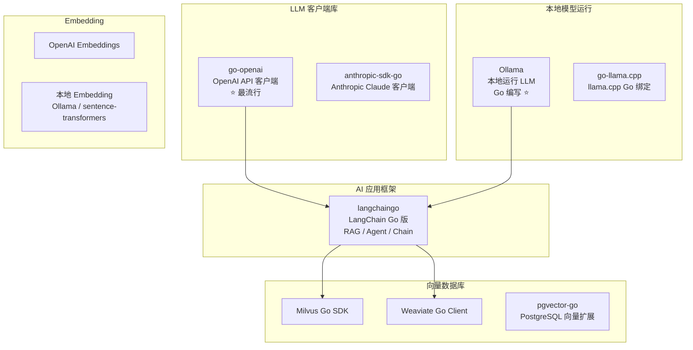
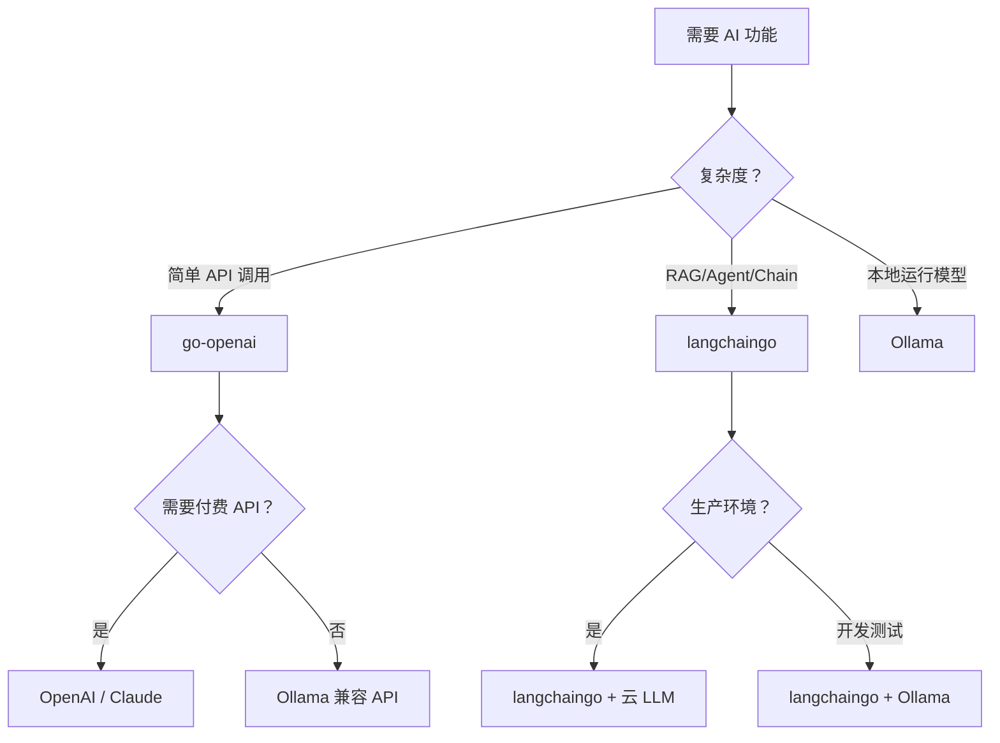

# Go LLM 生态概览

## 概念说明

Go 语言的 LLM 生态正在快速发展。虽然 Python 仍然是 AI/ML 领域的主力语言，但 Go 在 AI **基础设施层** 和 **应用集成层** 有着独特优势：高性能、低资源占用、单一二进制部署、天生并发。

Go 在 AI 领域的定位：
- ✅ **AI 服务部署**：API 网关、推理调度、负载均衡
- ✅ **AI 应用集成**：调用 LLM API、构建 RAG、开发 Agent
- ✅ **AI 基础设施**：向量数据库代理、数据管道、模型服务
- ❌ **模型训练**：仍然是 Python + PyTorch/TensorFlow 的领域

## 核心原理

### Go AI 生态全景图



## 主要库详解

### 1. go-openai

[go-openai](https://github.com/sashabaranov/go-openai) 是 Go 生态中最流行的 OpenAI API 客户端。

| 特性 | 说明 |
|------|------|
| GitHub Stars | 9k+ |
| 支持 API | Chat、Embeddings、Images、Audio、Assistants、Fine-tuning |
| 流式响应 | ✅ 支持 |
| Function Calling | ✅ 支持 |
| 兼容性 | 支持 Azure OpenAI、Ollama 等兼容 API |

```go
import openai "github.com/sashabaranov/go-openai"

// 基础用法
client := openai.NewClient("sk-your-key")
resp, _ := client.CreateChatCompletion(ctx, openai.ChatCompletionRequest{
    Model:    openai.GPT4oMini,
    Messages: []openai.ChatCompletionMessage{
        {Role: openai.ChatMessageRoleUser, Content: "Hello"},
    },
})

// 连接 Ollama
config := openai.DefaultConfig("ollama")
config.BaseURL = "http://localhost:11434/v1"
client := openai.NewClientWithConfig(config)
```

**适用场景**：直接调用 OpenAI API、快速原型开发、简单的 AI 功能集成。

### 2. langchaingo

[langchaingo](https://github.com/tmc/langchaingo) 是 LangChain 的 Go 实现，提供构建 AI 应用的完整框架。

| 特性 | 说明 |
|------|------|
| GitHub Stars | 5k+ |
| 核心功能 | LLM 调用、Prompt 模板、Chain、Agent、RAG、Memory |
| 支持 LLM | OpenAI、Anthropic、Ollama、Google AI、Cohere |
| 向量存储 | Chroma、Pinecone、Weaviate、pgvector |
| 文档加载 | PDF、HTML、CSV、Markdown |

```go
import (
    "github.com/tmc/langchaingo/llms/openai"
    "github.com/tmc/langchaingo/chains"
)

// 创建 LLM
llm, _ := openai.New(openai.WithModel("gpt-4o-mini"))

// 使用 Chain
chain := chains.NewLLMChain(llm, prompt)
result, _ := chains.Call(ctx, chain, map[string]any{"input": "什么是 Go？"})
```

**适用场景**：复杂 AI 应用（RAG、Agent、多步骤 Chain）、需要框架级支持的项目。

### 3. Ollama

[Ollama](https://ollama.ai/) 是用 Go 编写的本地 LLM 运行工具，是 Go 在 AI 基础设施领域的标杆项目。

| 特性 | 说明 |
|------|------|
| 语言 | Go 编写 |
| 功能 | 本地运行开源 LLM（Llama、Qwen、Mistral 等） |
| API | 兼容 OpenAI API 格式 |
| 平台 | macOS、Linux、Windows |
| 模型 | 支持数百个开源模型 |

```bash
# 安装
brew install ollama  # macOS
curl -fsSL https://ollama.ai/install.sh | sh  # Linux

# 运行模型
ollama pull qwen2.5:7b
ollama run qwen2.5:7b

# API 调用（兼容 OpenAI 格式）
curl http://localhost:11434/v1/chat/completions \
  -d '{"model":"qwen2.5:7b","messages":[{"role":"user","content":"Hello"}]}'
```

**Go 客户端**：

::: v-pre
```go
import "github.com/ollama/ollama/api"

client, _ := api.ClientFromEnvironment()
req := &api.ChatRequest{
    Model:    "qwen2.5:7b",
    Messages: []api.Message{{Role: "user", Content: "Hello"}},
}
client.Chat(ctx, req, func(resp api.ChatResponse) error {
    fmt.Print(resp.Message.Content)
    return nil
})
```
:::

**适用场景**：本地开发测试、隐私敏感场景、无需付费 API。

## 选型对比

| 维度 | go-openai | langchaingo | Ollama |
|------|-----------|-------------|--------|
| **定位** | API 客户端 | AI 应用框架 | 本地模型运行 |
| **复杂度** | 低 | 中 | 低 |
| **功能** | API 调用 | RAG/Agent/Chain | 模型管理+推理 |
| **依赖** | 仅 HTTP | 较多 | 独立运行 |
| **适用场景** | 简单 AI 集成 | 复杂 AI 应用 | 本地开发/隐私场景 |
| **学习曲线** | 低 | 中 | 低 |

### 选型建议



## 代码示例

> 💻 完整可运行代码：[code-examples/04-distributed/ai/](https://github.com/skyhe58/guide-go/tree/main/code-examples/04-distributed/ai/)
> 🏷️ Demo 模式：Part A（直接运行）

## 常见面试题

### Q1: Go 在 AI 领域的定位是什么？

**难度**：⭐⭐ | **频率**：🔥🔥

**答题思路**：
1. Go 不做模型训练（Python 的领域）
2. Go 做 AI 基础设施（Ollama 就是 Go 写的）
3. Go 做 AI 应用集成（API 调用、RAG、Agent）

**标准答案**：

Go 在 AI 领域的定位是基础设施层和应用集成层，而非模型训练。Go 的高性能、低资源占用和单一二进制部署使其适合构建 AI 服务的 API 网关、推理调度、向量数据库代理等基础设施。Ollama（本地运行 LLM 的工具）就是用 Go 编写的。在应用层，go-openai 和 langchaingo 提供了调用 LLM API、构建 RAG 和 Agent 的能力。

**深入追问**：
- 为什么 Ollama 选择用 Go 而不是 Python？
- langchaingo 和 Python 版 LangChain 有什么差异？

## 常见陷阱

1. **用 Go 做模型训练**：Go 的 ML 生态远不如 Python 成熟，不要用 Go 做模型训练
2. **过度依赖框架**：简单的 API 调用不需要 langchaingo，直接用 go-openai 或 net/http 即可
3. **忽略 Ollama 兼容性**：Ollama 的 OpenAI 兼容 API 并非 100% 兼容，部分高级功能可能不支持
4. **未考虑成本**：OpenAI API 按 token 计费，生产环境需要做好成本控制和缓存

## 参考资料

- [go-openai GitHub](https://github.com/sashabaranov/go-openai)
- [langchaingo GitHub](https://github.com/tmc/langchaingo)
- [Ollama 官方网站](https://ollama.ai/)
- [Ollama GitHub](https://github.com/ollama/ollama)
