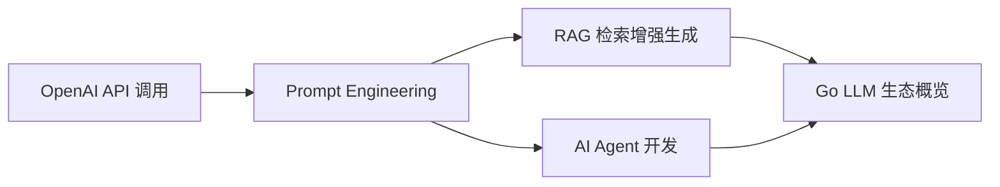
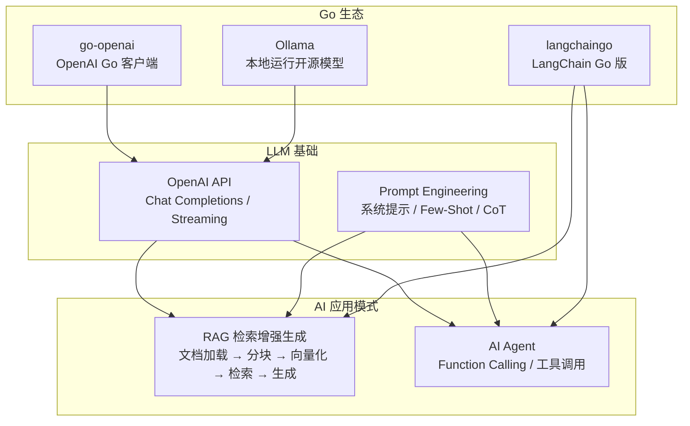

# AI 应用

> **前置依赖：** [Go 基础语法](/1-go-core/1.1-go-basics/) | [网络编程与 Web 框架](/2-web-data/2.1-web-framework/)

## 模块概述

AI 正在重塑软件开发的方方面面，Go 语言虽然不是模型训练的主力（Python 仍然是），但正在成为 **AI 基础设施层** 的默认语言。Ollama（本地运行 LLM 的工具）就是用 Go 编写的，LangChainGo 为 Go 开发者提供了 LLM 应用开发框架。

Go 在 AI 领域的定位非常清晰：
- **不做模型训练**：Python + PyTorch/TensorFlow 仍然是训练层的标准
- **做 AI 服务部署**：API 网关、推理调度、向量数据库代理、Agent 编排
- **做 AI 应用集成**：调用 LLM API、构建 RAG 系统、开发 AI Agent

本模块系统讲解如何用 Go 开发 AI 相关应用，从基础的 OpenAI API 调用到 RAG 检索增强生成，再到 AI Agent 开发，每个知识点都配有完整可运行的 Go 代码示例。

### 免费替代方案

本模块涉及的 OpenAI API 是付费服务。如果你没有 API Key，可以使用 **Ollama** 在本地免费运行开源模型：

```bash
# 安装 Ollama（macOS）
brew install ollama

# 启动 Ollama 服务
ollama serve

# 下载并运行模型
ollama pull qwen2.5:7b
ollama run qwen2.5:7b
```

Ollama 提供与 OpenAI 兼容的 API 接口（`http://localhost:11434/v1/`），本模块所有代码示例都支持切换到 Ollama 本地模型。

## 知识点索引

### AI 应用开发

| 序号 | 知识点 | 难度 | 面试频率 | 预计时间 |
|------|--------|------|---------|---------|
| 01 | [OpenAI API 调用](./01-openai.md) | ⭐⭐ | 🔥🔥 | 40min |
| 02 | [Prompt Engineering 基础技巧](./02-prompt.md) | ⭐⭐ | 🔥🔥 | 30min |
| 03 | [RAG 检索增强生成](./03-rag.md) | ⭐⭐⭐ | 🔥🔥🔥 | 60min |
| 04 | [AI Agent 开发](./04-agent.md) | ⭐⭐⭐ | 🔥🔥🔥 | 60min |
| 05 | [Go LLM 生态概览](./05-ecosystem.md) | ⭐⭐ | 🔥🔥 | 30min |

### 面试指南

| 📝 | [面试指南](./interview.md) | - | 🔥🔥🔥 | 40min |
|------|--------|------|---------|---------|

## 代码示例

> 💻 完整可运行代码：[code-examples/04-distributed/ai/](https://github.com/skyhe58/guide-go/tree/main/code-examples/04-distributed/ai/)

| 示例目录 | 对应知识点 | 运行方式 | Demo 模式 |
|---------|-----------|---------|----------|
| `openai-chat/` | OpenAI Chat API 调用 + 流式响应 | `go run ./openai-chat/` | 纯 Go |
| `rag-example/` | RAG 检索增强生成完整流程 | `go run ./rag-example/` | 纯 Go |
| `agent-example/` | AI Agent Function Calling | `go run ./agent-example/` | 纯 Go |

### 运行说明

所有示例默认使用模拟模式（Part A），无需 API Key 即可运行理解原理：

```bash
# 直接运行（模拟模式）
cd code-examples
go run ./04-distributed/ai/openai-chat/
go run ./04-distributed/ai/rag-example/
go run ./04-distributed/ai/agent-example/

# 连接真实 API（需要 API Key 或 Ollama）
# 方式一：使用 OpenAI API
export OPENAI_API_KEY="sk-your-key"
go run ./04-distributed/ai/openai-chat/ real

# 方式二：使用 Ollama 本地模型（免费）
ollama serve  # 先启动 Ollama
export OPENAI_BASE_URL="http://localhost:11434/v1"
export OPENAI_API_KEY="ollama"
export OPENAI_MODEL="qwen2.5:7b"
go run ./04-distributed/ai/openai-chat/ real
```

## 学习路径建议



1. **先学 API 调用**：掌握 OpenAI Chat Completions API 和流式响应，这是所有 AI 应用的基础
2. **学习 Prompt 技巧**：理解如何编写高质量的 Prompt，直接影响 AI 应用的效果
3. **掌握 RAG 实现**：文档加载 → 文本分块 → 向量化 → 检索 → 生成，企业级 AI 应用的核心模式
4. **开发 AI Agent**：Function Calling + 工具调用，让 LLM 具备执行能力
5. **了解 Go 生态**：go-openai、langchaingo、ollama 等库的选型和使用

## AI 应用全景图


