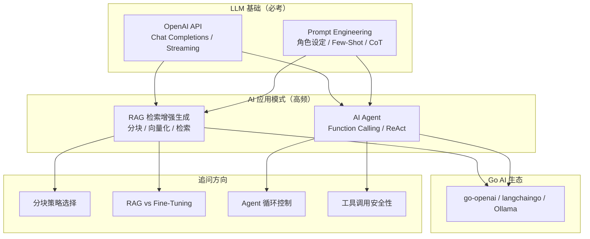

# AI 应用面试指南

> AI 应用是 Go 后端开发者面试中越来越常见的考察领域，特别是 RAG 和 Agent 相关知识。本指南按面试频率排序，覆盖高频考点。

## 面试知识图谱

## 高频面试题集

### 第一梯队：必考题（出现率 > 70%）

#### Q1: 什么是 RAG？为什么需要 RAG？

**难度**：⭐⭐⭐ | **频率**：🔥🔥🔥 | **关联知识点**：[RAG 检索增强生成](./03-rag.md)

**答题思路**：
1. RAG 的定义和核心思想
2. 解决 LLM 的什么问题
3. 完整流程
4. 与 Fine-Tuning 的对比

**标准答案**：

RAG（Retrieval-Augmented Generation）是在调用 LLM 之前，先从知识库中检索与问题相关的文档片段，将这些片段作为上下文注入 Prompt，让 LLM 基于真实数据生成回答。RAG 解决了 LLM 的两大痛点：知识截止（训练数据有截止日期）和幻觉问题（编造不存在的事实）。完整流程：文档加载 → 文本分块 → 向量化（Embedding）→ 向量存储 → 相似度检索 → Prompt 构建 → LLM 生成。

**深入追问**：
- RAG 和 Fine-Tuning 各自适用什么场景？
- 文本分块的大小如何选择？重叠（overlap）有什么作用？
- 如何评估 RAG 系统的效果？

---

#### Q2: 什么是 AI Agent？和普通 LLM 对话有什么区别？

**难度**：⭐⭐⭐ | **频率**：🔥🔥🔥 | **关联知识点**：[AI Agent 开发](./04-agent.md)

**答题思路**：
1. Agent 的定义
2. 与普通对话的核心区别
3. ReAct 模式
4. Function Calling 机制

**标准答案**：

AI Agent 是能够自主决策和执行任务的 AI 系统。与普通 LLM 对话只能生成文本不同，Agent 通过 Function Calling 机制调用外部工具（搜索、计算、数据库查询等），形成 Thought → Action → Observation 的循环（ReAct 模式），直到完成任务。核心组件：LLM（决策引擎）、工具集（执行能力）、记忆（对话历史）、规划（任务分解）。

**深入追问**：
- Function Calling 的工作原理？
- Agent 如何防止无限循环？
- Multi-Agent 系统是什么？

---

#### Q3: 余弦相似度的原理是什么？为什么用它做向量检索？

**难度**：⭐⭐⭐ | **频率**：🔥🔥🔥 | **关联知识点**：[RAG 检索增强生成](./03-rag.md)

**答题思路**：
1. 余弦相似度的数学定义
2. 值域和含义
3. 为什么适合文本向量检索

**标准答案**：

余弦相似度衡量两个向量方向的相似程度，公式为 cos(θ) = (A·B) / (|A|×|B|)，值域 [-1, 1]。1 表示方向完全相同（最相似），0 表示正交（无关），-1 表示完全相反。用于向量检索是因为文本 Embedding 后的向量，语义相似的文本在高维空间中方向接近。余弦相似度只关注方向不关注大小（模长），适合比较不同长度文本的语义相似性。

---

#### Q4: Go 在 AI 领域的定位是什么？

**难度**：⭐⭐ | **频率**：🔥🔥 | **关联知识点**：[Go LLM 生态概览](./05-ecosystem.md)

**标准答案**：

Go 在 AI 领域的定位是基础设施层和应用集成层。Go 不做模型训练（Python 的领域），而是做 AI 服务部署（API 网关、推理调度）和 AI 应用集成（调用 LLM API、构建 RAG、开发 Agent）。Ollama（本地运行 LLM 的工具）就是用 Go 编写的。Go 的高性能、低资源占用和单一二进制部署使其成为 AI 基础设施的理想选择。

---

### 第二梯队：高频题（出现率 40%~70%）

#### Q5: Prompt Engineering 有哪些常用技巧？

**难度**：⭐⭐ | **频率**：🔥🔥 | **关联知识点**：[Prompt Engineering](./02-prompt.md)

**标准答案**：

核心技巧包括：角色设定（System Prompt 定义专业领域和行为规则）、Few-Shot（提供 2-3 个示例让模型学习模式）、Chain of Thought（要求"一步步思考"展示推理过程）、输出格式约束（指定 JSON/Markdown 格式）、分步指令（将复杂任务拆解为步骤）、负面约束（明确"不要做什么"）。

---

#### Q6: RAG 中文本分块有哪些策略？如何选择？

**难度**：⭐⭐⭐ | **频率**：🔥🔥

**标准答案**：

主要策略：固定长度分块（简单但可能切断语义）、按段落分块（保持语义完整但大小不均）、递归分块（先段落再句子再字符，推荐）、语义分块（基于 Embedding 相似度，最优但成本高）。推荐使用递归分块，块大小 200-500 token，相邻块重叠 50-100 token 避免关键信息被切断。

---

#### Q7: Function Calling 的工作原理是什么？

**难度**：⭐⭐⭐ | **频率**：🔥🔥

**标准答案**：

Function Calling 是 LLM 的结构化输出能力。开发者用 JSON Schema 定义可用工具（函数名、描述、参数），LLM 根据用户输入决定是否调用工具、调用哪个、传什么参数。LLM 不直接执行函数，而是返回函数名和参数的 JSON，由应用层执行并将结果返回给 LLM 继续推理。

---

### 第三梯队：进阶题（出现率 < 40%）

#### Q8: RAG 和 Fine-Tuning 各自适用什么场景？

**难度**：⭐⭐⭐ | **频率**：🔥

**标准答案**：

RAG 适合：知识频繁更新、需要引用来源、数据量大、成本敏感的场景。Fine-Tuning 适合：需要改变模型行为/风格、特定领域术语、固定格式输出的场景。实践中通常先用 RAG（成本低、迭代快），效果不够再考虑 Fine-Tuning，两者也可以结合使用。

---

#### Q9: 如何评估 RAG 系统的效果？

**难度**：⭐⭐⭐⭐ | **频率**：🔥

**标准答案**：

评估维度：检索质量（Recall@K、MRR 衡量检索到的文档是否相关）、生成质量（Faithfulness 回答是否基于检索文档、Relevancy 回答是否切题）、端到端评估（人工评估 + 自动化评估框架如 RAGAS）。关键指标：检索召回率、答案准确率、幻觉率。

---

#### Q10: Embedding 是什么？如何理解向量空间中的语义？

**难度**：⭐⭐⭐ | **频率**：🔥

**标准答案**：

Embedding 是将文本映射到高维向量空间的过程，语义相似的文本在向量空间中距离接近。Embedding 模型（如 OpenAI text-embedding-3-small）通过大量文本训练，学习到词语和句子的语义表示。向量的每个维度捕捉文本的某个语义特征，通过余弦相似度等度量方法可以量化文本间的语义相似性。

---

## 面试技巧

### 答题框架

1. **先说概念**：用一句话定义核心概念
2. **再说流程**：描述完整的工作流程
3. **然后对比**：与相关方案做对比
4. **最后实践**：结合 Go 生态和实际项目举例

### 常见追问方向

| 知识点 | 常见追问 |
|--------|---------|
| RAG | 分块策略、向量数据库选型、评估指标 |
| Agent | 循环控制、工具安全性、Multi-Agent |
| Prompt | Temperature 影响、Few-Shot vs Fine-Tuning |
| Embedding | 维度选择、多语言支持、更新策略 |
| Go AI 生态 | Ollama 原理、langchaingo vs Python LangChain |

## 参考资料

- [OpenAI API 文档](https://platform.openai.com/docs/)
- [RAG 论文](https://arxiv.org/abs/2005.11401)
- [ReAct 论文](https://arxiv.org/abs/2210.03629)
- [langchaingo GitHub](https://github.com/tmc/langchaingo)
