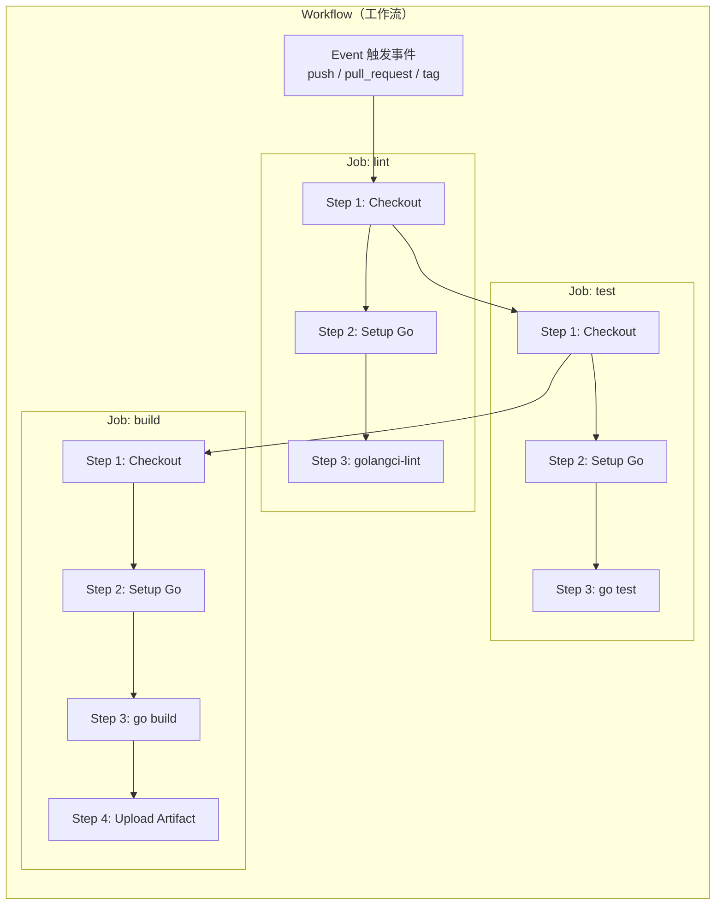
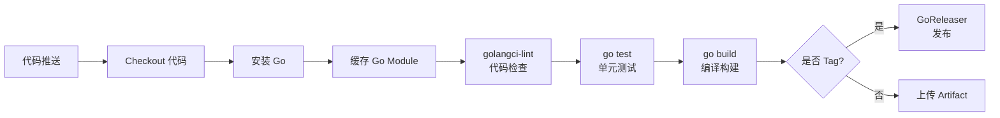

# GitHub Actions

## 概念说明

GitHub Actions 是 GitHub 原生的 CI/CD 平台，通过 YAML 文件定义自动化工作流（Workflow）。当代码推送、PR 创建、Tag 发布等事件触发时，GitHub 会自动在云端运行你定义的任务——代码检查、单元测试、编译构建、部署上线，全流程无需人工干预。

对于 Go 项目而言，GitHub Actions 的优势尤为明显：
- Go 编译速度快，CI 流水线通常 2-5 分钟完成
- Go Module 缓存机制成熟，`actions/setup-go` 内置缓存支持
- 单一二进制产物，构建和部署流程极其简洁
- 交叉编译原生支持，一次 CI 可产出多平台二进制

## 核心原理

### GitHub Actions 核心概念



| 概念 | 说明 | 类比 |
|------|------|------|
| **Workflow** | 一个完整的自动化流程，定义在 `.github/workflows/*.yml` | 流水线 |
| **Event** | 触发 Workflow 的事件（push、pull_request、schedule 等） | 触发器 |
| **Job** | Workflow 中的一个任务单元，运行在独立的虚拟机上 | 工序 |
| **Step** | Job 中的一个执行步骤，可以是 Action 或 Shell 命令 | 操作 |
| **Action** | 可复用的步骤模块（如 `actions/checkout`、`actions/setup-go`） | 插件 |
| **Runner** | 执行 Job 的虚拟机（GitHub 提供免费的 Ubuntu/macOS/Windows） | 执行器 |

### Go 项目 CI 流水线标准流程



### Go Module 缓存策略

Go Module 缓存是加速 CI 的关键。`actions/setup-go@v5` 内置了缓存支持：

```yaml
- uses: actions/setup-go@v5
  with:
    go-version: '1.22'
    cache: true  # 自动缓存 ~/go/pkg/mod 和 ~/.cache/go-build
```

缓存原理：
1. 根据 `go.sum` 文件内容生成缓存 Key
2. 首次运行时下载依赖并缓存
3. 后续运行时命中缓存，跳过下载步骤
4. `go.sum` 变化时自动更新缓存

## 标准配置方案

### 基础 CI 配置

```yaml
name: CI

on:
  push:
    branches: [main]
  pull_request:
    branches: [main]

jobs:
  lint:
    runs-on: ubuntu-latest
    steps:
      - uses: actions/checkout@v4
      - uses: actions/setup-go@v5
        with:
          go-version: '1.22'
          cache: true
      - name: Run golangci-lint
        uses: golangci/golangci-lint-action@v6
        with:
          version: latest

  test:
    runs-on: ubuntu-latest
    needs: lint
    steps:
      - uses: actions/checkout@v4
      - uses: actions/setup-go@v5
        with:
          go-version: '1.22'
          cache: true
      - name: Run tests
        run: go test -v -race -coverprofile=coverage.out ./...
      - name: Upload coverage
        uses: actions/upload-artifact@v4
        with:
          name: coverage
          path: coverage.out

  build:
    runs-on: ubuntu-latest
    needs: test
    steps:
      - uses: actions/checkout@v4
      - uses: actions/setup-go@v5
        with:
          go-version: '1.22'
          cache: true
      - name: Build
        run: CGO_ENABLED=0 go build -ldflags="-s -w" -o app ./cmd/server
```

### 多平台构建矩阵

::: v-pre
```yaml
jobs:
  build:
    strategy:
      matrix:
        os: [ubuntu-latest, macos-latest, windows-latest]
        go-version: ['1.21', '1.22']
    runs-on: ${{ matrix.os }}
    steps:
      - uses: actions/checkout@v4
      - uses: actions/setup-go@v5
        with:
          go-version: ${{ matrix.go-version }}
      - run: go test ./...
      - run: go build ./...
```
:::

### Tag 触发自动发布

::: v-pre
```yaml
on:
  push:
    tags:
      - 'v*'  # 匹配 v1.0.0、v2.1.3 等

jobs:
  release:
    runs-on: ubuntu-latest
    steps:
      - uses: actions/checkout@v4
        with:
          fetch-depth: 0  # GoReleaser 需要完整 git 历史
      - uses: actions/setup-go@v5
        with:
          go-version: '1.22'
      - uses: goreleaser/goreleaser-action@v6
        with:
          version: latest
          args: release --clean
        env:
          GITHUB_TOKEN: ${{ secrets.GITHUB_TOKEN }}
```
:::

## 代码示例

> 💻 完整配置文件：[code-examples/05-devops/cicd/.github/workflows/ci.yml](https://github.com/your-repo/code-examples/05-devops/cicd/.github/workflows/ci.yml)

## 常见面试题

### Q1: GitHub Actions 中如何缓存 Go Module 依赖？

**难度**：⭐⭐ | **频率**：🔥🔥

**答题思路**：

1. `actions/setup-go@v5` 内置 `cache: true` 选项
2. 自动缓存 `~/go/pkg/mod` 和 `~/.cache/go-build`
3. 缓存 Key 基于 `go.sum` 文件内容生成
4. 也可使用 `actions/cache` 手动配置缓存路径

### Q2: 如何在 CI 中实现 Go 项目的多平台交叉编译？

**难度**：⭐⭐ | **频率**：🔥

**标准答案**：

两种方式：
1. **构建矩阵**：使用 `strategy.matrix` 在不同 OS 的 Runner 上分别编译
2. **交叉编译**：在单个 Runner 上通过设置 `GOOS` 和 `GOARCH` 环境变量编译多平台产物（更常用，配合 GoReleaser）

```bash
# 单机交叉编译
GOOS=linux GOARCH=amd64 go build -o app-linux-amd64
GOOS=darwin GOARCH=arm64 go build -o app-darwin-arm64
GOOS=windows GOARCH=amd64 go build -o app-windows-amd64.exe
```

## 常见陷阱

1. **忘记 `fetch-depth: 0`**：GoReleaser 需要完整的 Git 历史来生成 Changelog，默认的 shallow clone 会导致失败
2. **缓存失效**：修改 `go.sum` 后缓存 Key 变化，首次运行会重新下载依赖，这是正常行为
3. **Race Condition 检测**：CI 中务必加 `-race` 标志运行测试，本地开发可能不会触发的竞态条件在 CI 环境中更容易暴露
4. **Secret 泄露**：不要在 `run` 步骤中直接 echo Secret，使用 secrets 引用语法（如代码块中所示），GitHub 会自动遮蔽日志中的 Secret 值

## 参考资料

- [GitHub Actions 官方文档](https://docs.github.com/en/actions)
- [actions/setup-go](https://github.com/actions/setup-go)
- [golangci-lint-action](https://github.com/golangci/golangci-lint-action)
- [goreleaser-action](https://github.com/goreleaser/goreleaser-action)
