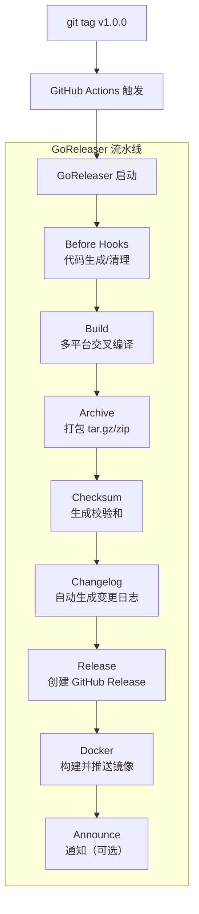

# GoReleaser

## 概念说明

GoReleaser 是 Go 生态中最流行的发布自动化工具。它解决了 Go 项目发布时的一系列痛点：多平台交叉编译、Changelog 自动生成、GitHub/GitLab Release 创建、Docker 镜像构建与推送、Homebrew Formula 发布——所有这些只需一个 `.goreleaser.yml` 配置文件和一条命令。

Go 天生支持交叉编译（`GOOS`/`GOARCH`），但手动管理多平台构建、打包、上传的流程繁琐且容易出错。GoReleaser 将这些步骤标准化，与 GitHub Actions 配合实现"打 Tag 即发布"的全自动流程。

## 核心原理

### GoReleaser 发布流程



### 核心配置模块

| 模块 | 作用 | 说明 |
|------|------|------|
| `builds` | 编译配置 | 指定入口文件、目标平台、编译参数、ldflags |
| `archives` | 打包配置 | 定义归档格式（tar.gz/zip）、文件命名模板 |
| `checksum` | 校验和 | 生成 SHA256 校验文件，用于验证下载完整性 |
| `changelog` | 变更日志 | 基于 Git Commit 自动生成 Changelog |
| `dockers` | Docker 镜像 | 构建并推送 Docker 镜像到 Docker Hub/GHCR |
| `release` | 发布配置 | GitHub/GitLab Release 配置 |
| `nfpms` | 系统包 | 生成 deb/rpm/apk 系统安装包 |
| `brews` | Homebrew | 自动更新 Homebrew Formula |

### ldflags 版本注入

GoReleaser 的一个核心能力是通过 `-ldflags` 在编译时注入版本信息：

```go
// main.go
package main

var (
    version = "dev"     // 由 GoReleaser 注入
    commit  = "none"    // Git commit hash
    date    = "unknown" // 构建日期
)

func main() {
    fmt.Printf("version: %s, commit: %s, date: %s\n", version, commit, date)
}
```

::: v-pre
```yaml
# .goreleaser.yml
builds:
  - ldflags:
      - -s -w
      - -X main.version={{.Version}}
      - -X main.commit={{.Commit}}
      - -X main.date={{.Date}}
```
:::

## 标准配置方案

### 基础配置

::: v-pre
```yaml
# .goreleaser.yml
version: 2

before:
  hooks:
    - go mod tidy

builds:
  - env:
      - CGO_ENABLED=0
    goos:
      - linux
      - darwin
      - windows
    goarch:
      - amd64
      - arm64
    main: ./cmd/server
    ldflags:
      - -s -w
      - -X main.version={{.Version}}
      - -X main.commit={{.Commit}}
      - -X main.date={{.Date}}

archives:
  - format: tar.gz
    name_template: "{{ .ProjectName }}_{{ .Version }}_{{ .Os }}_{{ .Arch }}"
    format_overrides:
      - goos: windows
        format: zip

checksum:
  name_template: 'checksums.txt'

changelog:
  sort: asc
  filters:
    exclude:
      - '^docs:'
      - '^test:'
      - '^ci:'
```
:::

### Docker 镜像发布配置

::: v-pre
```yaml
dockers:
  - image_templates:
      - "ghcr.io/{{ .Env.GITHUB_REPOSITORY }}:{{ .Version }}"
      - "ghcr.io/{{ .Env.GITHUB_REPOSITORY }}:latest"
    dockerfile: Dockerfile
    build_flag_templates:
      - "--platform=linux/amd64"
      - "--label=org.opencontainers.image.version={{.Version}}"
```
:::

### 常用命令

```bash
# 安装 GoReleaser
go install github.com/goreleaser/goreleaser/v2@latest

# 本地测试（不发布，不推送）
goreleaser release --snapshot --clean

# 检查配置文件语法
goreleaser check

# 正式发布（通常由 CI 执行）
goreleaser release --clean
```

## 代码示例

> 💻 完整配置文件：[code-examples/05-devops/cicd/.goreleaser.yml](https://github.com/skyhe58/guide-go/tree/main/code-examples/05-devops/cicd/.goreleaser.yml)

## 常见面试题

### Q1: GoReleaser 解决了什么问题？

**难度**：⭐⭐ | **频率**：🔥

**标准答案**：

GoReleaser 解决了 Go 项目发布流程的自动化问题：
1. **多平台交叉编译**：一次配置，自动编译 Linux/macOS/Windows + amd64/arm64 等多个平台
2. **Changelog 生成**：基于 Git Commit 自动生成变更日志
3. **Release 创建**：自动创建 GitHub Release 并上传二进制文件
4. **Docker 镜像**：自动构建并推送 Docker 镜像
5. **版本注入**：通过 ldflags 在编译时注入版本、Commit、日期等信息

### Q2: Go 交叉编译的原理是什么？

**难度**：⭐⭐⭐ | **频率**：🔥🔥

**标准答案**：

Go 编译器原生支持交叉编译，通过 `GOOS` 和 `GOARCH` 环境变量指定目标平台：
- Go 编译器本身是用 Go 编写的（自举），内置了所有目标平台的代码生成器
- 设置 `CGO_ENABLED=0` 禁用 CGO 后，编译产物为纯 Go 静态二进制，无外部依赖
- 这是 Go 相比 Java/Python 的天然优势——无需目标平台的交叉编译工具链

## 常见陷阱

1. **CGO 依赖**：如果项目使用了 CGO（如 SQLite），交叉编译需要目标平台的 C 编译器，建议设置 `CGO_ENABLED=0`
2. **Git 历史不完整**：GoReleaser 需要完整的 Git 历史来生成 Changelog，CI 中需设置 `fetch-depth: 0`
3. **Tag 格式**：GoReleaser 默认要求语义化版本 Tag（如 `v1.0.0`），非标准格式会导致解析失败
4. **Snapshot 模式**：本地测试时务必使用 `--snapshot` 标志，否则会尝试真正发布

## 参考资料

- [GoReleaser 官方文档](https://goreleaser.com/)
- [GoReleaser GitHub](https://github.com/goreleaser/goreleaser)
- [Semantic Versioning](https://semver.org/)
