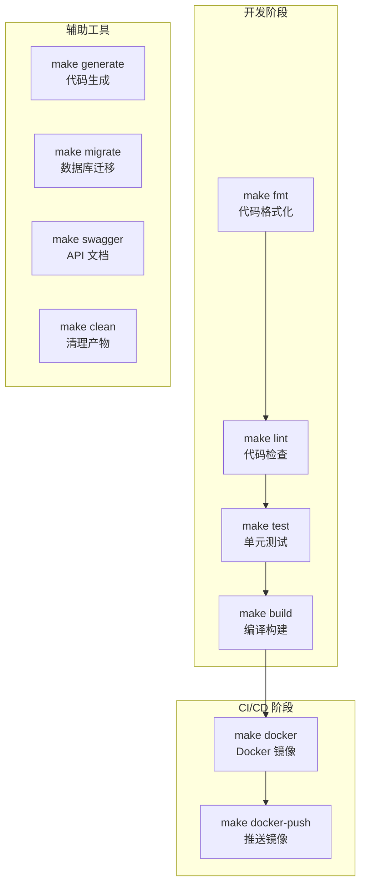

# Makefile

## 概念说明

Makefile 是 Go 项目构建自动化的事实标准。虽然 Go 有强大的内置工具链（`go build`、`go test`、`go vet`），但实际项目中的构建流程往往涉及多个步骤——代码检查、测试、编译、Docker 镜像构建、代码生成等。Makefile 将这些步骤封装为简洁的命令，统一开发者本地和 CI 环境的构建体验。

为什么 Go 项目偏爱 Makefile 而非 Shell 脚本？
- **声明式**：每个 target 是一个独立的任务，依赖关系清晰
- **幂等性**：Make 会检查文件时间戳，避免重复执行
- **跨平台**：Linux/macOS 原生支持，Windows 可通过 Git Bash 或 WSL 使用
- **社区惯例**：Kubernetes、Docker、etcd 等知名 Go 项目都使用 Makefile

## 核心原理

### Makefile 基本语法

```makefile
# 变量定义
APP_NAME := myapp
VERSION := $(shell git describe --tags --always)

# target: 依赖
#     命令（必须用 Tab 缩进）
build: lint test
	go build -o bin/$(APP_NAME) ./cmd/server

# .PHONY 声明伪目标（不对应实际文件）
.PHONY: build test lint
```

### Go 项目常用 Target 结构



### 常用 Target 说明

| Target | 作用 | 典型命令 |
|--------|------|----------|
| `build` | 编译 Go 二进制 | `go build -ldflags="-s -w" -o bin/app ./cmd/server` |
| `test` | 运行单元测试 | `go test -v -race -cover ./...` |
| `lint` | 代码静态检查 | `golangci-lint run ./...` |
| `fmt` | 代码格式化 | `gofmt -s -w .` |
| `vet` | Go 内置静态分析 | `go vet ./...` |
| `generate` | 代码生成 | `go generate ./...` |
| `docker` | 构建 Docker 镜像 | `docker build -t app:latest .` |
| `docker-push` | 推送 Docker 镜像 | `docker push app:latest` |
| `clean` | 清理构建产物 | `rm -rf bin/ dist/` |
| `tidy` | 整理依赖 | `go mod tidy` |
| `swagger` | 生成 Swagger 文档 | `swag init -g cmd/server/main.go` |
| `migrate-up` | 数据库迁移 | `migrate -path migrations -database $DB_URL up` |
| `help` | 显示帮助信息 | 解析 Makefile 注释自动生成 |

## 标准库方案

### 完整 Makefile 模板

```makefile
# Go 项目 Makefile 模板
# 使用方法：make help 查看所有可用命令

# ============================================================================
# 变量定义
# ============================================================================
APP_NAME    := myapp
VERSION     := $(shell git describe --tags --always --dirty)
COMMIT      := $(shell git rev-parse --short HEAD)
BUILD_DATE  := $(shell date -u '+%Y-%m-%dT%H:%M:%SZ')
GO_VERSION  := $(shell go version | awk '{print $$3}')
LDFLAGS     := -s -w \
               -X main.version=$(VERSION) \
               -X main.commit=$(COMMIT) \
               -X main.date=$(BUILD_DATE)

# ============================================================================
# 构建
# ============================================================================

.PHONY: build
build: ## 编译 Go 二进制文件
	CGO_ENABLED=0 go build -ldflags="$(LDFLAGS)" -o bin/$(APP_NAME) ./cmd/server

.PHONY: build-all
build-all: ## 交叉编译多平台二进制
	GOOS=linux   GOARCH=amd64 go build -ldflags="$(LDFLAGS)" -o bin/$(APP_NAME)-linux-amd64 ./cmd/server
	GOOS=darwin  GOARCH=arm64 go build -ldflags="$(LDFLAGS)" -o bin/$(APP_NAME)-darwin-arm64 ./cmd/server
	GOOS=windows GOARCH=amd64 go build -ldflags="$(LDFLAGS)" -o bin/$(APP_NAME)-windows-amd64.exe ./cmd/server

# ============================================================================
# 测试
# ============================================================================

.PHONY: test
test: ## 运行单元测试
	go test -v -race -coverprofile=coverage.out ./...

.PHONY: test-short
test-short: ## 运行短测试（跳过集成测试）
	go test -v -short ./...

.PHONY: coverage
coverage: test ## 查看测试覆盖率报告
	go tool cover -html=coverage.out -o coverage.html

# ============================================================================
# 代码质量
# ============================================================================

.PHONY: lint
lint: ## 运行 golangci-lint 代码检查
	golangci-lint run ./...

.PHONY: fmt
fmt: ## 格式化代码
	gofmt -s -w .
	goimports -w .

.PHONY: vet
vet: ## 运行 go vet 静态分析
	go vet ./...

# ============================================================================
# 帮助
# ============================================================================

.PHONY: help
help: ## 显示帮助信息
	@grep -E '^[a-zA-Z_-]+:.*?## .*$$' $(MAKEFILE_LIST) | \
		awk 'BEGIN {FS = ":.*?## "}; {printf "\033[36m%-20s\033[0m %s\n", $$1, $$2}'

.DEFAULT_GOAL := help
```

## 代码示例

> 💻 完整配置文件：[code-examples/05-devops/cicd/Makefile](https://github.com/skyhe58/guide-go/tree/main/code-examples/05-devops/cicd/Makefile)

## 常见面试题

### Q1: 为什么 Go 项目需要 Makefile？

**难度**：⭐⭐ | **频率**：🔥🔥

**标准答案**：

虽然 Go 有强大的内置工具链，但实际项目的构建流程涉及多个步骤：
1. **统一命令入口**：`make build` 比记忆一长串 `go build -ldflags=...` 参数简单
2. **CI/CD 一致性**：本地 `make test` 和 CI 中执行的命令完全一致
3. **任务编排**：通过依赖关系确保执行顺序（如 build 依赖 lint 和 test）
4. **版本注入**：通过变量和 Shell 命令自动获取 Git 版本信息注入二进制
5. **社区惯例**：Kubernetes、Docker 等知名项目都使用 Makefile

### Q2: Makefile 中 `.PHONY` 的作用是什么？

**难度**：⭐⭐ | **频率**：🔥

**标准答案**：

`.PHONY` 声明伪目标——即这个 target 不对应实际的文件。如果不声明 `.PHONY`，当目录下存在与 target 同名的文件时（如 `build` 目录），Make 会认为目标已经是最新的而跳过执行。声明 `.PHONY` 后，Make 每次都会执行该 target 的命令。

## 常见陷阱

1. **Tab vs 空格**：Makefile 中命令行必须用 Tab 缩进，空格会导致语法错误。这是最常见的新手问题
2. **Shell 变量**：Makefile 中引用 Shell 变量需要 `$$`（双美元符），单 `$` 是 Make 变量
3. **多行命令**：Makefile 中每行命令在独立的 Shell 中执行，如需跨行需用 `\` 续行或 `;` 连接
4. **Windows 兼容**：部分 Shell 命令（如 `rm -rf`）在 Windows 原生环境不可用，建议使用 Git Bash 或 WSL

## 参考资料

- [GNU Make 手册](https://www.gnu.org/software/make/manual/)
- [Kubernetes Makefile](https://github.com/kubernetes/kubernetes/blob/master/Makefile)
- [Go 项目 Makefile 最佳实践](https://go.dev/doc/modules/managing-dependencies)
