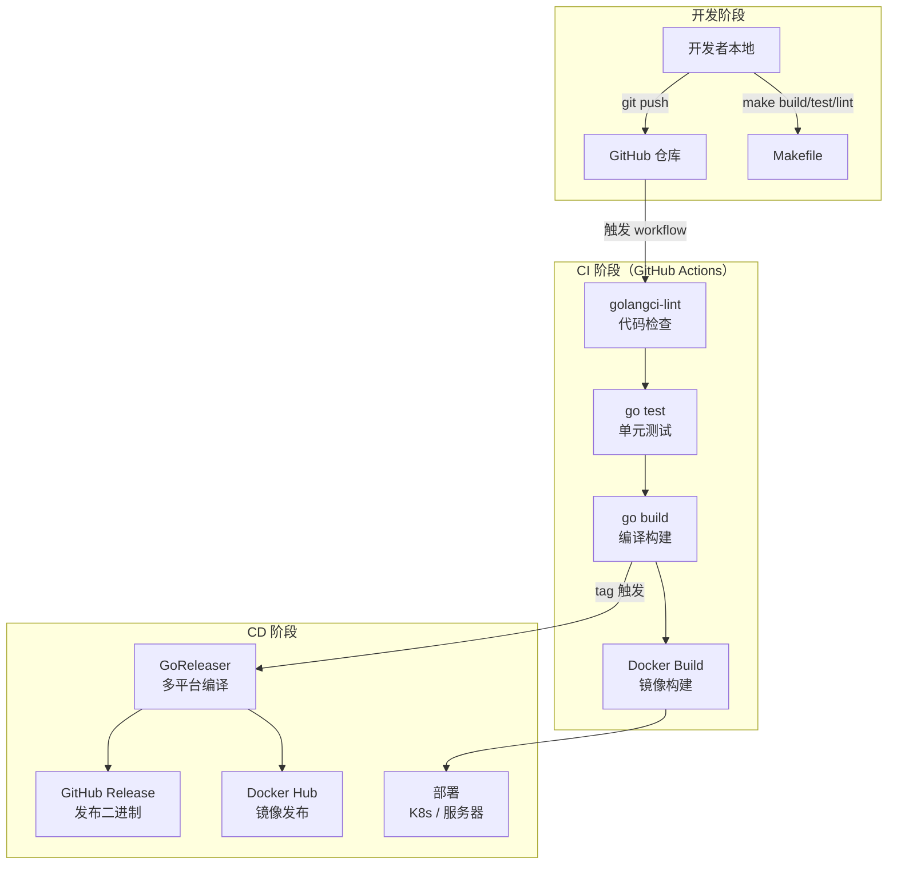

# CI/CD 与 DevOps

> **前置依赖：** [Go 基础语法](/1-go-core/1.1-go-basics/) | 此模块贯穿全程，可在任意阶段学习

## 模块概述

CI/CD（持续集成/持续部署）是现代软件工程的基石，它将代码从提交到上线的全流程自动化，消除人工操作带来的风险和低效。对于 Go 项目而言，CI/CD 的价值尤为突出——Go 编译为单一静态二进制文件、交叉编译原生支持、构建速度快，这些特性使得 Go 项目的 CI/CD 流水线天然简洁高效。

本模块系统讲解 Go 项目 CI/CD 的三大核心工具：

- **GitHub Actions**：业界最流行的 CI/CD 平台，Go 项目的标准 CI 配置
- **GoReleaser**：Go 生态专属的发布工具，一键完成多平台编译、Changelog 生成、Docker 镜像发布
- **Makefile**：Go 项目构建自动化的事实标准，统一开发者本地和 CI 环境的构建命令

## 知识点索引

### CI/CD 工具链

| 序号 | 知识点 | 难度 | 面试频率 | 预计时间 |
|------|--------|------|---------|---------|
| 01 | [GitHub Actions](./01-github-actions.md) | ⭐⭐ | 🔥🔥 | 45min |
| 02 | [GoReleaser](./02-goreleaser.md) | ⭐⭐ | 🔥 | 40min |
| 03 | [Makefile](./03-makefile.md) | ⭐⭐ | 🔥🔥 | 35min |

### 面试指南

| 📝 | [面试指南](./interview.md) | - | 🔥🔥 | 30min |
|------|--------|------|---------|---------|

## 代码示例

> 💻 完整配置文件：[code-examples/05-devops/cicd/](https://github.com/skyhe58/guide-go/tree/main/code-examples/05-devops/cicd/)

| 配置文件 | 对应知识点 | 说明 |
|---------|-----------|------|
| `.github/workflows/ci.yml` | GitHub Actions | 完整 CI/CD 配置（lint + test + build + deploy） |
| `Makefile` | Makefile | Go 项目 Makefile 示例 |
| `.goreleaser.yml` | GoReleaser | GoReleaser 配置示例 |

## 学习路径建议

1. **先学 Makefile**：统一本地开发命令，是 CI/CD 的基础
2. **再学 GitHub Actions**：将 Makefile 中的命令搬到 CI 流水线
3. **最后学 GoReleaser**：自动化发布流程，多平台交叉编译

## Go CI/CD 全景图

## 参考资料

- [GitHub Actions 官方文档](https://docs.github.com/en/actions)
- [GoReleaser 官方文档](https://goreleaser.com/)
- [GNU Make 手册](https://www.gnu.org/software/make/manual/)
