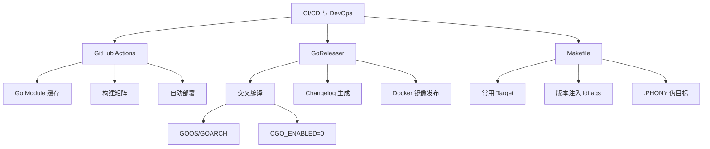

# CI/CD 与 DevOps 面试指南

> 本指南汇总 CI/CD 与 DevOps 模块的高频面试题，按考察频率排序。CI/CD 在面试中通常作为工程化能力的考察点，不会深入底层原理，但能体现候选人的工程素养。

## 🔥🔥 高频题

### Q1: 描述一下你们 Go 项目的 CI/CD 流程

**难度**：⭐⭐ | **频率**：🔥🔥 | **关联**：[GitHub Actions](./01-github-actions.md)

**答题思路**：

1. 描述触发条件（push/PR/Tag）
2. 说明 CI 阶段的步骤
3. 说明 CD 阶段的步骤
4. 提及关键优化点

**标准答案**：

我们使用 GitHub Actions 作为 CI/CD 平台，流程如下：

**CI 阶段**（每次 push 和 PR 触发）：
1. **代码检查**：`golangci-lint` 静态分析，检查代码规范和潜在 bug
2. **单元测试**：`go test -race -cover ./...`，开启竞态检测和覆盖率统计
3. **编译构建**：`CGO_ENABLED=0 go build`，确保代码可编译

**CD 阶段**（Tag 触发）：
1. **GoReleaser**：自动多平台交叉编译，生成 Changelog
2. **Docker 镜像**：构建并推送到 GHCR/Docker Hub
3. **部署**：通过 K8s Rolling Update 或直接部署到服务器

**优化点**：
- Go Module 缓存加速依赖下载
- 构建矩阵并行测试多 Go 版本
- `make` 统一本地和 CI 的构建命令

---

### Q2: Go 项目如何实现交叉编译？

**难度**：⭐⭐ | **频率**：🔥🔥 | **关联**：[GoReleaser](./02-goreleaser.md)

**标准答案**：

Go 编译器原生支持交叉编译，通过环境变量指定目标平台：

```bash
# 编译 Linux amd64
GOOS=linux GOARCH=amd64 CGO_ENABLED=0 go build -o app-linux

# 编译 macOS ARM（Apple Silicon）
GOOS=darwin GOARCH=arm64 CGO_ENABLED=0 go build -o app-mac

# 编译 Windows
GOOS=windows GOARCH=amd64 CGO_ENABLED=0 go build -o app.exe
```

关键点：
- `CGO_ENABLED=0` 禁用 CGO，生成纯静态二进制，无外部依赖
- Go 编译器内置所有目标平台的代码生成器，无需安装交叉编译工具链
- 生产环境推荐使用 GoReleaser 自动化多平台编译和发布

**深入追问**：
- 如果项目依赖 CGO（如 SQLite），如何交叉编译？（需要目标平台的 C 编译器，或使用 Docker 多阶段构建）
- `go build -ldflags="-s -w"` 中 `-s` 和 `-w` 分别是什么？（`-s` 去掉符号表，`-w` 去掉 DWARF 调试信息，减小二进制体积约 30%）

---

### Q3: Go 项目的 Makefile 通常包含哪些 target？

**难度**：⭐⭐ | **频率**：🔥🔥 | **关联**：[Makefile](./03-makefile.md)

**标准答案**：

一个标准的 Go 项目 Makefile 通常包含：

| Target | 作用 |
|--------|------|
| `build` | 编译二进制，注入版本信息 |
| `test` | 运行单元测试（`-race -cover`） |
| `lint` | golangci-lint 代码检查 |
| `fmt` | gofmt + goimports 格式化 |
| `vet` | go vet 静态分析 |
| `generate` | go generate 代码生成 |
| `docker` | 构建 Docker 镜像 |
| `clean` | 清理构建产物 |
| `help` | 显示帮助信息 |

核心价值：统一开发者本地和 CI 环境的构建命令，`make test` 在任何环境下行为一致。

---

## 🔥 中频题

### Q4: GitHub Actions 中如何优化 Go 项目的 CI 速度？

**难度**：⭐⭐ | **频率**：🔥

**标准答案**：

1. **Go Module 缓存**：`actions/setup-go` 的 `cache: true` 自动缓存依赖
2. **并行 Job**：lint、test、build 无依赖时可并行执行
3. **构建矩阵**：多版本/多平台测试并行运行
4. **条件执行**：使用 `paths` 过滤，只在相关文件变更时触发
5. **增量测试**：使用 `go test -short` 跳过耗时的集成测试

---

### Q5: 什么是 GoReleaser？它解决了什么问题？

**难度**：⭐⭐ | **频率**：🔥

**标准答案**：

GoReleaser 是 Go 生态的发布自动化工具，解决了：
1. 多平台交叉编译的自动化
2. Changelog 基于 Git Commit 自动生成
3. GitHub Release 创建和二进制上传
4. Docker 镜像构建和推送
5. 通过 ldflags 注入版本信息

典型工作流：开发者打 Tag（`git tag v1.0.0`）→ GitHub Actions 触发 → GoReleaser 自动完成编译、打包、发布全流程。

---

### Q6: Go 二进制文件如何注入版本信息？

**难度**：⭐⭐⭐ | **频率**：🔥

**标准答案**：

通过 `go build -ldflags` 在编译时注入：

```go
// 代码中定义变量
var (
    version = "dev"
    commit  = "none"
    date    = "unknown"
)
```

```bash
# 编译时注入
go build -ldflags="-X main.version=v1.0.0 -X main.commit=$(git rev-parse --short HEAD) -X main.date=$(date -u +%Y-%m-%dT%H:%M:%SZ)"
```

原理：`-X` 标志在链接阶段修改包级别字符串变量的值，不影响编译阶段。GoReleaser 和 Makefile 都利用这个机制自动注入版本信息。

## 面试知识图谱



## 参考资料

- [GitHub Actions 官方文档](https://docs.github.com/en/actions)
- [GoReleaser 官方文档](https://goreleaser.com/)
- [GNU Make 手册](https://www.gnu.org/software/make/manual/)
