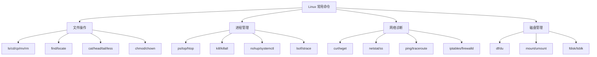

# Linux 常用命令

## 概念说明

Linux 命令行是后端开发者的基本功。无论是日常开发、服务部署还是线上排查，都离不开 Linux 命令。本节按使用场景分类，覆盖文件操作、进程管理、网络诊断、磁盘管理四大类常用命令。

## 核心原理

### 命令分类速查



## 文件操作

### 基础文件命令

```bash
# 列出文件（含隐藏文件、详细信息、人类可读大小）
ls -lah

# 查找文件
find /var/log -name "*.log" -mtime -7    # 最近 7 天修改的 .log 文件
find . -name "*.go" -exec wc -l {} +     # 统计 Go 代码行数

# 文件内容查看
cat config.yaml                           # 查看完整文件
head -n 20 app.log                        # 查看前 20 行
tail -f app.log                           # 实时跟踪日志输出（最常用）
tail -n 100 app.log | grep "ERROR"        # 查看最后 100 行中的错误

# 文件权限
chmod 755 deploy.sh                       # 设置可执行权限
chown www-data:www-data /var/www -R       # 递归修改文件所有者

# 文件压缩与解压
tar -czf backup.tar.gz /data/             # 压缩
tar -xzf backup.tar.gz                    # 解压
```

### 文本处理三剑客

```bash
# grep：文本搜索
grep -rn "panic" ./logs/                  # 递归搜索，显示行号
grep -c "ERROR" app.log                   # 统计错误行数
grep -E "ERROR|WARN" app.log              # 正则匹配多个关键词

# awk：列处理
awk '{print $1, $4}' access.log           # 提取第 1 和第 4 列
awk -F: '{print $1}' /etc/passwd          # 指定分隔符

# sed：流编辑
sed -i 's/old/new/g' config.yaml          # 全局替换
sed -n '10,20p' app.log                   # 打印第 10-20 行
```

## 进程管理

```bash
# 查看进程
ps aux | grep myapp                       # 查找特定进程
ps -ef --forest                           # 树形显示进程关系

# 实时监控
top -p $(pgrep myapp)                     # 监控特定进程
htop                                      # 交互式进程监控（推荐）

# 进程信号
kill -15 <PID>                            # 优雅终止（SIGTERM）
kill -9 <PID>                             # 强制终止（SIGKILL，最后手段）
kill -USR1 <PID>                          # 发送自定义信号（Go 中常用于日志轮转）

# 后台运行
nohup ./myapp &                           # 后台运行，输出到 nohup.out
nohup ./myapp > app.log 2>&1 &            # 后台运行，重定向输出

# 查看端口占用
lsof -i :8080                             # 查看 8080 端口被哪个进程占用
ss -tlnp | grep 8080                      # 同上，更快
```

## 网络诊断

```bash
# 网络连接
curl -v http://localhost:8080/health      # 测试 HTTP 接口
curl -X POST -H "Content-Type: application/json" -d '{"key":"value"}' http://localhost:8080/api

# 网络状态
ss -tlnp                                  # 查看所有 TCP 监听端口
ss -s                                     # 网络连接统计摘要
netstat -ant | awk '{print $6}' | sort | uniq -c | sort -rn  # 统计连接状态

# 网络诊断
ping -c 4 google.com                      # 测试网络连通性
traceroute google.com                     # 追踪路由路径
dig example.com                           # DNS 查询
```

## 磁盘管理

```bash
# 磁盘空间
df -h                                     # 查看磁盘使用情况
du -sh /var/log/*                         # 查看各目录大小
du -sh * | sort -rh | head -10            # 找出最大的 10 个文件/目录

# 磁盘 I/O
iostat -x 1                               # 每秒刷新磁盘 I/O 统计
iotop                                     # 实时查看进程 I/O（需 root）
```

## 常见面试题

### Q1: 如何查看一个 Go 服务占用了哪个端口？

**难度**：⭐ | **频率**：🔥🔥

**标准答案**：

```bash
# 方法 1：通过进程名查找
ss -tlnp | grep myapp

# 方法 2：通过 PID 查找
lsof -p <PID> -i

# 方法 3：通过端口反查进程
lsof -i :8080
```

### Q2: 如何实时查看 Go 服务的日志输出？

**难度**：⭐ | **频率**：🔥🔥

**标准答案**：

```bash
# 直接输出到文件的日志
tail -f /var/log/myapp/app.log

# systemd 管理的服务
journalctl -u myapp -f

# 同时过滤错误日志
tail -f app.log | grep --line-buffered "ERROR"
```

## 常见陷阱

1. **`rm -rf` 的危险性**：永远不要在生产环境执行 `rm -rf /` 或 `rm -rf *`，建议使用 `trash-cli` 替代
2. **`kill -9` 的滥用**：优先使用 `kill -15`（SIGTERM）让进程优雅退出，Go 服务可以在 SIGTERM 中完成请求处理和资源清理
3. **`nohup` 的局限**：生产环境应使用 systemd 管理服务，而非 nohup
4. **`tail -f` vs `tail -F`**：`-F` 会在文件被轮转（rename）后继续跟踪新文件，更适合日志监控

## 参考资料

- [Linux 命令大全](https://man7.org/linux/man-pages/)
- [The Linux Command Line（中文版）](https://billie66.github.io/TLCL/)
