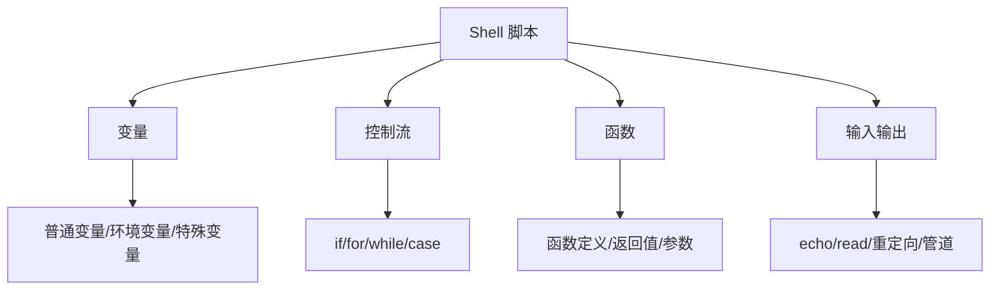

# Shell 脚本基础

## 概念说明

Shell 脚本是 Linux 系统管理和自动化的基础工具。对于 Go 后端开发者，Shell 脚本常用于：服务部署脚本、日志清理脚本、健康检查脚本、CI/CD 中的辅助脚本等。虽然复杂的构建逻辑推荐使用 Makefile，但简单的运维自动化任务用 Shell 脚本更直接。

## 核心原理

### Shell 脚本基本结构

```bash
#!/bin/bash
# 脚本说明：Go 服务部署脚本
# 用法：./deploy.sh [环境] [版本]

set -euo pipefail  # 严格模式：出错即退出、未定义变量报错、管道错误传播

# 变量定义
APP_NAME="myapp"
DEPLOY_DIR="/opt/${APP_NAME}"
LOG_DIR="/var/log/${APP_NAME}"

# 函数定义
log() {
    echo "[$(date '+%Y-%m-%d %H:%M:%S')] $*"
}

# 主逻辑
main() {
    log "开始部署 ${APP_NAME}..."
    # 部署步骤...
    log "部署完成"
}

main "$@"
```

### 常用语法速查



## 标准库方案

### 变量与字符串

```bash
# 变量赋值（等号两边不能有空格）
NAME="myapp"
VERSION=$(git describe --tags --always)  # 命令替换
PORT=${PORT:-8080}                        # 默认值：如果 PORT 未设置则使用 8080

# 字符串操作
echo "${NAME}-${VERSION}"                 # 字符串拼接
echo "${NAME^^}"                          # 转大写
echo "${NAME:0:3}"                        # 子串截取

# 特殊变量
echo "$0"    # 脚本名
echo "$1"    # 第一个参数
echo "$#"    # 参数个数
echo "$?"    # 上一条命令的退出码
echo "$$"    # 当前进程 PID
echo "$@"    # 所有参数（推荐用这个）
```

### 控制流

```bash
# if 条件判断
if [ -f "/opt/myapp/myapp" ]; then
    echo "二进制文件存在"
elif [ -d "/opt/myapp" ]; then
    echo "目录存在但二进制不存在"
else
    echo "目录不存在"
fi

# for 循环
for server in web01 web02 web03; do
    echo "部署到 ${server}..."
done

# while 循环（常用于等待服务启动）
MAX_RETRIES=30
RETRY=0
while ! curl -sf http://localhost:8080/health > /dev/null 2>&1; do
    RETRY=$((RETRY + 1))
    if [ $RETRY -ge $MAX_RETRIES ]; then
        echo "服务启动超时"
        exit 1
    fi
    echo "等待服务启动... (${RETRY}/${MAX_RETRIES})"
    sleep 1
done
echo "服务已启动"

# case 分支
case "$1" in
    start)   start_service ;;
    stop)    stop_service ;;
    restart) stop_service && start_service ;;
    *)       echo "用法: $0 {start|stop|restart}" ;;
esac
```

### 函数

```bash
# 函数定义
check_dependency() {
    local cmd="$1"  # local 声明局部变量
    if ! command -v "$cmd" &> /dev/null; then
        echo "错误: 未安装 ${cmd}"
        return 1
    fi
}

# 函数调用
check_dependency "go" || exit 1
check_dependency "docker" || exit 1
```

### 实用脚本示例：Go 服务部署

```bash
#!/bin/bash
set -euo pipefail

# Go 服务部署脚本
APP_NAME="myapp"
DEPLOY_DIR="/opt/${APP_NAME}"
BACKUP_DIR="/opt/${APP_NAME}/backup"
SERVICE_NAME="${APP_NAME}.service"

log() { echo "[$(date '+%Y-%m-%d %H:%M:%S')] $*"; }

# 备份旧版本
backup() {
    if [ -f "${DEPLOY_DIR}/${APP_NAME}" ]; then
        mkdir -p "${BACKUP_DIR}"
        cp "${DEPLOY_DIR}/${APP_NAME}" "${BACKUP_DIR}/${APP_NAME}.$(date +%Y%m%d%H%M%S)"
        log "旧版本已备份"
    fi
}

# 部署新版本
deploy() {
    local binary="$1"
    cp "${binary}" "${DEPLOY_DIR}/${APP_NAME}"
    chmod +x "${DEPLOY_DIR}/${APP_NAME}"
    log "新版本已部署"
}

# 重启服务
restart() {
    systemctl restart "${SERVICE_NAME}"
    log "服务已重启"
}

# 健康检查
health_check() {
    local max_retries=30
    local retry=0
    while ! curl -sf http://localhost:8080/health > /dev/null 2>&1; do
        retry=$((retry + 1))
        if [ $retry -ge $max_retries ]; then
            log "错误: 健康检查超时"
            return 1
        fi
        sleep 1
    done
    log "健康检查通过"
}

main() {
    local binary="${1:?用法: $0 <二进制文件路径>}"
    
    log "开始部署 ${APP_NAME}..."
    backup
    deploy "${binary}"
    restart
    health_check
    log "部署完成"
}

main "$@"
```

## 常见面试题

### Q1: `set -euo pipefail` 各参数的含义？

**难度**：⭐⭐ | **频率**：🔥

**标准答案**：

- `-e`：任何命令返回非零退出码时立即退出脚本
- `-u`：引用未定义的变量时报错退出（而非当作空字符串）
- `-o pipefail`：管道中任何命令失败时，整个管道返回失败（默认只看最后一个命令的退出码）

这三个选项组合是 Shell 脚本的"严格模式"，能有效避免静默错误。

## 常见陷阱

1. **变量未加引号**：`rm -rf $DIR/` 如果 `$DIR` 为空，会变成 `rm -rf /`，务必写成 `"${DIR}"`
2. **等号两边有空格**：`NAME = "app"` 是错误的，Shell 会把 `NAME` 当作命令执行
3. **`[` vs `[[`**：`[[` 是 Bash 扩展，支持正则和更安全的字符串比较，推荐使用
4. **忘记 `set -e`**：不加 `-e` 时，命令失败后脚本会继续执行，可能导致灾难性后果

## 参考资料

- [Bash 脚本教程（阮一峰）](https://wangdoc.com/bash/)
- [ShellCheck — Shell 脚本静态分析工具](https://www.shellcheck.net/)
- [Google Shell Style Guide](https://google.github.io/styleguide/shellguide.html)
