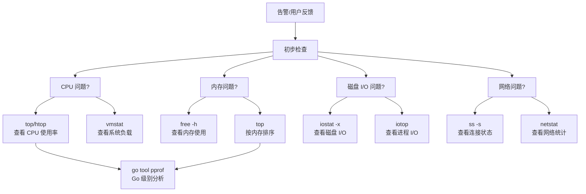

# 性能排查工具

## 概念说明

当线上 Go 服务出现性能问题（CPU 飙高、内存暴涨、响应变慢）时，第一步是使用 Linux 系统级工具定位问题方向，然后再用 Go 专属工具（pprof）深入分析。本节介绍 Linux 环境下最常用的性能排查工具：top、vmstat、iostat、ss、strace。

## 核心原理

### 性能排查思路



### 工具速查表

| 工具 | 用途 | 关键指标 |
|------|------|----------|
| `top` / `htop` | CPU 和内存实时监控 | %CPU、%MEM、load average |
| `vmstat` | 系统整体状态 | CPU、内存、I/O、上下文切换 |
| `iostat` | 磁盘 I/O 统计 | %util、await、r/s、w/s |
| `ss` / `netstat` | 网络连接状态 | ESTABLISHED、TIME_WAIT 数量 |
| `strace` | 系统调用追踪 | 慢系统调用、阻塞点 |
| `free` | 内存使用概览 | total、used、available |
| `sar` | 历史性能数据 | CPU、内存、网络历史趋势 |

## 标准库方案

### top / htop

```bash
# top 基本用法
top                          # 实时监控所有进程
top -p $(pgrep myapp)        # 只监控特定进程
top -H -p <PID>              # 查看进程的线程级别 CPU 使用

# top 交互命令
# P - 按 CPU 排序
# M - 按内存排序
# H - 显示线程
# 1 - 显示每个 CPU 核心的使用率
# q - 退出

# htop（推荐，更直观）
htop                         # 交互式进程监控
htop -p <PID>                # 监控特定进程
```

**关键指标解读**：

| 指标 | 含义 | 告警阈值 |
|------|------|----------|
| `load average` | 1/5/15 分钟平均负载 | > CPU 核心数的 70% |
| `%CPU` | 进程 CPU 使用率 | 单进程持续 > 100% |
| `%MEM` | 进程内存使用率 | 持续增长（可能泄漏） |
| `RES` | 进程实际物理内存 | 超过预期值 |
| `VIRT` | 进程虚拟内存 | Go 进程通常较大，不必过于担心 |

### vmstat

```bash
# 每秒刷新一次，共 10 次
vmstat 1 10

# 输出示例：
# procs -----------memory---------- ---swap-- -----io---- -system-- ------cpu-----
#  r  b   swpd   free   buff  cache   si   so    bi    bo   in   cs us sy id wa st
#  1  0      0 2048000  64000 512000    0    0     0     0  100  200  5  2 93  0  0
```

**关键列解读**：

| 列 | 含义 | 关注点 |
|----|------|--------|
| `r` | 运行队列中的进程数 | > CPU 核心数说明 CPU 不够用 |
| `b` | 不可中断睡眠的进程数 | > 0 通常是 I/O 等待 |
| `si/so` | swap 换入/换出 | > 0 说明物理内存不足 |
| `bi/bo` | 块设备读/写 | 过高说明磁盘 I/O 繁忙 |
| `cs` | 上下文切换次数 | 过高说明线程/goroutine 过多 |
| `us` | 用户态 CPU | Go 业务逻辑消耗 |
| `sy` | 内核态 CPU | 系统调用消耗 |
| `wa` | I/O 等待 | > 20% 说明磁盘是瓶颈 |

### iostat

```bash
# 查看磁盘 I/O 详细统计，每秒刷新
iostat -x 1

# 输出关键列：
# Device  r/s    w/s   rkB/s  wkB/s  await  %util
# sda     50.00  100.00 200.00 400.00  2.50  45.00
```

**关键指标**：

| 指标 | 含义 | 告警阈值 |
|------|------|----------|
| `%util` | 磁盘利用率 | > 80% 说明磁盘接近饱和 |
| `await` | I/O 平均等待时间（ms） | > 10ms 需要关注 |
| `r/s` / `w/s` | 每秒读/写次数 | 结合业务判断 |

### ss（替代 netstat）

```bash
# 查看所有 TCP 连接统计
ss -s

# 查看所有监听端口
ss -tlnp

# 查看特定端口的连接
ss -tn state established '( dport = :8080 or sport = :8080 )'

# 统计各状态的连接数
ss -ant | awk '{print $1}' | sort | uniq -c | sort -rn

# 查看 TIME_WAIT 连接数（过多说明短连接太多）
ss -ant | grep TIME-WAIT | wc -l
```

### strace

```bash
# 追踪进程的系统调用
strace -p <PID>

# 只追踪网络相关的系统调用
strace -e trace=network -p <PID>

# 统计系统调用耗时
strace -c -p <PID>
# 输出：
# % time     seconds  usecs/call     calls    errors syscall
# ------ ----------- ----------- --------- --------- ----------------
#  45.00    0.045000          45      1000           write
#  30.00    0.030000          30      1000           read
#  25.00    0.025000          25      1000           futex

# 追踪文件操作
strace -e trace=file -p <PID>
```

**注意**：strace 会显著降低目标进程性能，生产环境慎用，建议短时间采样。

## 常见面试题

### Q1: 线上服务 CPU 飙高，你的排查步骤是什么？

**难度**：⭐⭐⭐ | **频率**：🔥🔥🔥

**标准答案**：

1. `top` 确认是哪个进程 CPU 高
2. `top -H -p <PID>` 查看是哪个线程 CPU 高
3. 如果是 Go 服务，通过 `pprof` 采集 CPU Profile：`go tool pprof http://localhost:6060/debug/pprof/profile?seconds=30`
4. 分析火焰图，定位热点函数
5. 检查是否有死循环、频繁 GC、锁竞争等问题

### Q2: 如何判断服务器是 CPU 瓶颈还是 I/O 瓶颈？

**难度**：⭐⭐⭐ | **频率**：🔥🔥

**标准答案**：

使用 `vmstat 1` 观察：
- **CPU 瓶颈**：`us` + `sy` 接近 100%，`wa` 很低，`r` > CPU 核心数
- **I/O 瓶颈**：`wa` > 20%，`b` > 0，`bi/bo` 很高
- 进一步用 `iostat -x 1` 确认磁盘 `%util` 是否接近 100%

## 常见陷阱

1. **Go 进程 VIRT 很大**：Go 运行时会预留大量虚拟内存（mmap），VIRT 值很大是正常的，应关注 RES（实际物理内存）
2. **load average 误读**：load average 包含 I/O 等待的进程，不能简单等同于 CPU 使用率
3. **strace 性能影响**：strace 使用 ptrace 系统调用，会让目标进程变慢 10-100 倍，生产环境建议用 `perf` 或 `bpftrace` 替代

## 参考资料

- [Linux Performance Analysis in 60 Seconds](https://netflixtechblog.com/linux-performance-analysis-in-60-000-milliseconds-accc10403c55)
- [Brendan Gregg 的 Linux 性能工具图](https://www.brendangregg.com/linuxperf.html)
