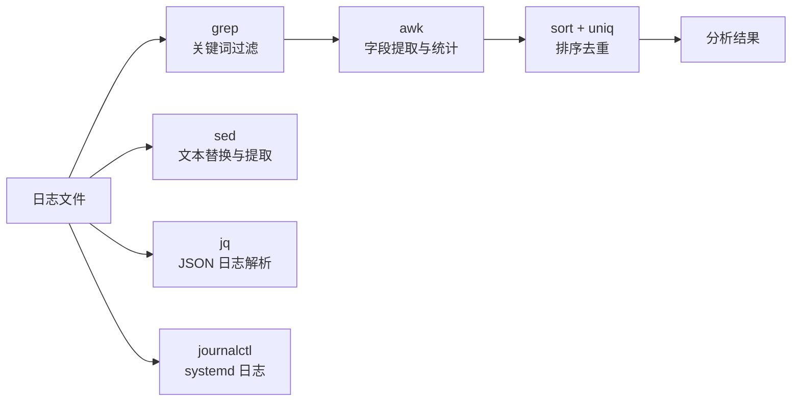

# 日志分析

## 概念说明

日志是线上问题排查的第一手资料。Go 服务通常输出结构化 JSON 日志（zerolog/zap/slog），Linux 系统服务使用 journalctl 管理日志。掌握 grep、awk、sed 等文本处理工具，能快速从海量日志中提取关键信息，定位问题根因。

## 核心原理

### 日志分析工具链



## 标准库方案

### grep 日志过滤

```bash
# 基础搜索
grep "ERROR" app.log                      # 搜索包含 ERROR 的行
grep -i "error" app.log                   # 忽略大小写
grep -c "ERROR" app.log                   # 统计错误行数
grep -n "panic" app.log                   # 显示行号

# 上下文搜索
grep -A 5 "panic" app.log                 # 显示匹配行及后 5 行
grep -B 3 "ERROR" app.log                 # 显示匹配行及前 3 行
grep -C 3 "timeout" app.log               # 显示匹配行及前后 3 行

# 正则搜索
grep -E "ERROR|FATAL" app.log             # 匹配多个关键词
grep -E "status\":\s*5\d{2}" app.log      # 匹配 5xx 状态码
grep -P "\d{4}-\d{2}-\d{2}T10:" app.log   # 匹配 10 点的日志（Perl 正则）

# 排除搜索
grep -v "health" app.log                  # 排除健康检查日志
grep "ERROR" app.log | grep -v "expected" # 排除预期内的错误

# 实时过滤
tail -f app.log | grep --line-buffered "ERROR"  # 实时过滤错误日志
```

### awk 字段提取与统计

```bash
# 假设 JSON 日志格式：{"time":"2024-01-01T10:00:00Z","level":"error","msg":"timeout","status":500,"latency":1.5}

# 提取特定字段（配合 jq）
cat app.log | jq -r '.msg' | sort | uniq -c | sort -rn | head -20
# 统计出现最多的错误消息 Top 20

# 统计每小时的错误数
grep "ERROR" app.log | awk -F'T' '{print $1"T"substr($2,1,2)}' | sort | uniq -c

# 统计接口响应时间分布
awk '{print $NF}' access.log | awk '{
    if ($1 < 0.1) bucket="<100ms"
    else if ($1 < 0.5) bucket="100-500ms"
    else if ($1 < 1.0) bucket="500ms-1s"
    else bucket=">1s"
    print bucket
}' | sort | uniq -c | sort -rn

# 统计 HTTP 状态码分布
awk '{print $9}' access.log | sort | uniq -c | sort -rn
# 输出：
#   5000 200
#    300 304
#     50 500
#     10 404

# 找出最慢的 10 个请求
awk '{print $NF, $7}' access.log | sort -rn | head -10
```

### sed 文本处理

```bash
# 提取时间范围内的日志
sed -n '/2024-01-01T10:00/,/2024-01-01T11:00/p' app.log

# 替换敏感信息（脱敏）
sed 's/password":"[^"]*"/password":"***"/g' app.log

# 删除空行
sed '/^$/d' app.log

# 提取两个标记之间的内容
sed -n '/BEGIN STACK/,/END STACK/p' app.log
```

### jq 处理 JSON 日志

```bash
# Go 结构化日志通常是 JSON 格式，jq 是最佳解析工具

# 格式化输出
cat app.log | jq '.'

# 过滤错误日志
cat app.log | jq 'select(.level == "error")'

# 提取特定字段
cat app.log | jq -r '[.time, .level, .msg] | @tsv'

# 统计错误类型
cat app.log | jq -r 'select(.level == "error") | .msg' | sort | uniq -c | sort -rn

# 过滤慢请求（延迟 > 1 秒）
cat app.log | jq 'select(.latency > 1.0) | {time, path, latency}'
```

### journalctl（systemd 日志）

```bash
# 查看特定服务的日志
journalctl -u myapp                       # 查看 myapp 服务的所有日志
journalctl -u myapp -f                    # 实时跟踪日志
journalctl -u myapp --since "1 hour ago"  # 最近 1 小时的日志
journalctl -u myapp --since "2024-01-01" --until "2024-01-02"  # 时间范围

# 按优先级过滤
journalctl -u myapp -p err                # 只看错误级别以上的日志

# 输出为 JSON 格式（便于后续处理）
journalctl -u myapp -o json | jq '.MESSAGE'

# 查看内核日志（排查系统级问题）
journalctl -k                             # 内核日志
journalctl -k | grep "Out of memory"      # 查看 OOM Kill 记录

# 磁盘空间管理
journalctl --disk-usage                   # 查看日志占用空间
journalctl --vacuum-size=500M             # 限制日志总大小为 500MB
```

## 常见面试题

### Q1: 如何从 GB 级别的日志文件中快速定位错误？

**难度**：⭐⭐ | **频率**：🔥🔥

**标准答案**：

1. 先用 `grep -c "ERROR" app.log` 统计错误总数，了解规模
2. 用 `grep "ERROR" app.log | tail -100` 查看最近的错误
3. 用 `grep "ERROR" app.log | awk '{print $NF}' | sort | uniq -c | sort -rn` 统计错误类型分布
4. 针对高频错误，用 `grep -A 5 "具体错误信息" app.log` 查看上下文
5. 如果是 JSON 日志，用 `jq` 进行结构化分析

**关键技巧**：避免 `cat` 大文件，直接用 `grep` 流式处理；使用 `zgrep` 搜索压缩日志。

## 常见陷阱

1. **`cat` 大文件**：不要 `cat huge.log | grep "ERROR"`，直接 `grep "ERROR" huge.log` 更高效
2. **忘记 `--line-buffered`**：`tail -f | grep` 时不加 `--line-buffered` 会导致输出延迟
3. **时区问题**：日志时间可能是 UTC，排查时注意与本地时间的转换
4. **日志轮转**：错误可能在已轮转的日志文件中（如 `app.log.1`、`app.log.gz`），需要用 `zgrep` 搜索压缩文件

## 参考资料

- [jq 官方手册](https://stedolan.github.io/jq/manual/)
- [AWK 编程语言](https://www.gnu.org/software/gawk/manual/)
- [journalctl 手册](https://www.freedesktop.org/software/systemd/man/journalctl.html)
