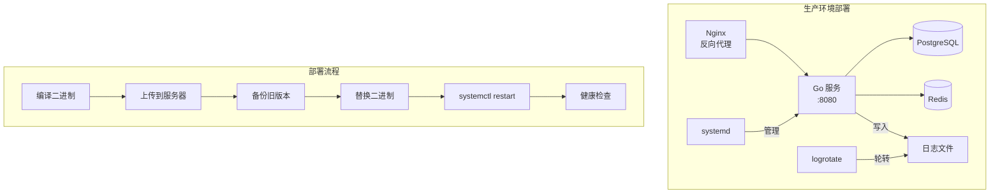
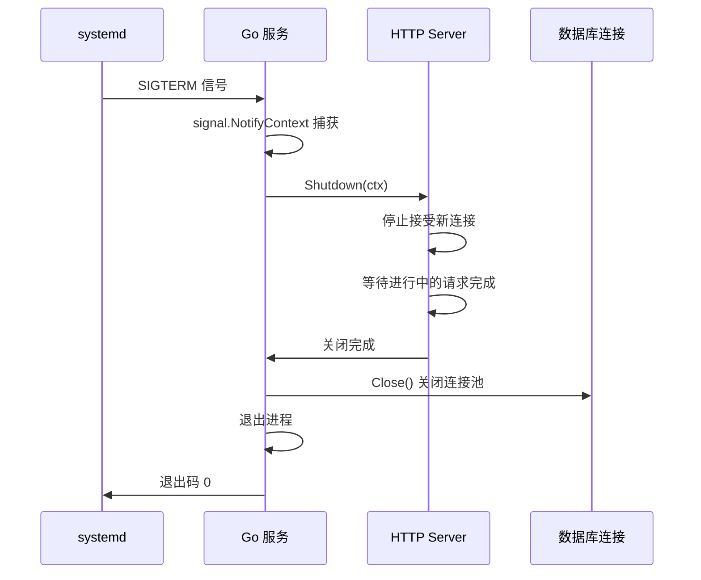

# Go 服务部署最佳实践

## 概念说明

Go 编译为单一静态二进制文件，部署极其简洁——不需要 JVM、不需要 Python 解释器、不需要 Node.js 运行时，只需要一个二进制文件和一个配置文件。这是 Go 相比其他语言的天然部署优势。

生产环境中，Go 服务通常通过以下方式部署：
- **systemd**：Linux 原生服务管理器，最传统也最稳定的方式
- **Docker + K8s**：容器化部署，适合微服务架构
- **直接运行**：开发/测试环境，`nohup` 或 `screen`

本节聚焦 systemd 部署方式，Docker/K8s 部署参见容器化模块。

## 核心原理

### Go 服务部署架构



### 优雅关闭流程



## 标准库方案

### systemd 服务配置

```ini
# /etc/systemd/system/myapp.service
[Unit]
Description=MyApp Go Service
Documentation=https://github.com/your-org/myapp
After=network.target postgresql.service redis.service
Wants=postgresql.service redis.service

[Service]
Type=simple
User=www-data
Group=www-data
WorkingDirectory=/opt/myapp
ExecStart=/opt/myapp/myapp -config /opt/myapp/config.yaml
ExecReload=/bin/kill -USR1 $MAINPID

# 优雅关闭：发送 SIGTERM，等待 30 秒
KillSignal=SIGTERM
TimeoutStopSec=30

# 自动重启策略
Restart=on-failure
RestartSec=5
StartLimitInterval=60
StartLimitBurst=3

# 资源限制
LimitNOFILE=65535
LimitNPROC=65535

# 环境变量
Environment=GIN_MODE=release
Environment=GOMAXPROCS=4
EnvironmentFile=-/opt/myapp/.env

# 日志输出到 journald
StandardOutput=journal
StandardError=journal
SyslogIdentifier=myapp

# 安全加固
NoNewPrivileges=true
ProtectSystem=strict
ProtectHome=true
ReadWritePaths=/opt/myapp/data /var/log/myapp

[Install]
WantedBy=multi-user.target
```

### systemd 常用命令

```bash
# 服务管理
systemctl start myapp          # 启动服务
systemctl stop myapp           # 停止服务（发送 SIGTERM）
systemctl restart myapp        # 重启服务
systemctl reload myapp         # 重载配置（发送 USR1 信号）
systemctl status myapp         # 查看服务状态

# 开机自启
systemctl enable myapp         # 设置开机自启
systemctl disable myapp        # 取消开机自启

# 配置变更后重载 systemd
systemctl daemon-reload        # 修改 .service 文件后必须执行

# 查看日志
journalctl -u myapp -f         # 实时查看日志
journalctl -u myapp --since "1 hour ago"  # 最近 1 小时日志
```

### Go 优雅关闭实现

```go
package main

import (
    "context"
    "log"
    "net/http"
    "os"
    "os/signal"
    "syscall"
    "time"
)

func main() {
    // 创建 HTTP 服务器
    srv := &http.Server{
        Addr:         ":8080",
        ReadTimeout:  10 * time.Second,
        WriteTimeout: 30 * time.Second,
        IdleTimeout:  60 * time.Second,
    }

    // 在 goroutine 中启动服务器
    go func() {
        log.Printf("服务启动，监听 %s", srv.Addr)
        if err := srv.ListenAndServe(); err != nil && err != http.ErrServerClosed {
            log.Fatalf("服务启动失败: %v", err)
        }
    }()

    // 等待中断信号
    quit := make(chan os.Signal, 1)
    signal.Notify(quit, syscall.SIGINT, syscall.SIGTERM)
    sig := <-quit
    log.Printf("收到信号 %v，开始优雅关闭...", sig)

    // 设置关闭超时
    ctx, cancel := context.WithTimeout(context.Background(), 30*time.Second)
    defer cancel()

    // 优雅关闭 HTTP 服务器
    if err := srv.Shutdown(ctx); err != nil {
        log.Printf("服务关闭异常: %v", err)
    }

    // 关闭其他资源（数据库连接、Redis 连接等）
    // db.Close()
    // rdb.Close()

    log.Println("服务已关闭")
}
```

### 日志管理（logrotate）

```bash
# /etc/logrotate.d/myapp
/var/log/myapp/*.log {
    daily              # 每天轮转
    rotate 30          # 保留 30 天
    compress           # 压缩旧日志
    delaycompress      # 延迟一天压缩（便于排查）
    missingok          # 日志文件不存在时不报错
    notifempty         # 空文件不轮转
    create 0644 www-data www-data  # 创建新文件的权限
    postrotate
        # 通知 Go 服务重新打开日志文件
        systemctl reload myapp 2>/dev/null || true
    endscript
}
```

## 常见面试题

### Q1: Go 服务如何实现优雅关闭？

**难度**：⭐⭐⭐ | **频率**：🔥🔥

**标准答案**：

1. 使用 `signal.Notify` 监听 `SIGTERM` 和 `SIGINT` 信号
2. 收到信号后调用 `http.Server.Shutdown(ctx)` 优雅关闭 HTTP 服务器
3. `Shutdown` 会停止接受新连接，等待进行中的请求完成
4. 设置超时 context 防止无限等待
5. 关闭数据库连接、Redis 连接等资源
6. systemd 配置 `TimeoutStopSec=30` 与代码中的超时保持一致

### Q2: systemd 中 `Restart=on-failure` 和 `Restart=always` 的区别？

**难度**：⭐⭐ | **频率**：🔥

**标准答案**：

- `on-failure`：只在进程异常退出（非零退出码）时重启，正常退出（exit 0）不重启
- `always`：无论退出码是什么都重启，包括正常退出
- 推荐使用 `on-failure`，配合 `RestartSec=5` 和 `StartLimitBurst=3` 防止频繁重启

## 常见陷阱

1. **忘记 `daemon-reload`**：修改 `.service` 文件后必须执行 `systemctl daemon-reload`，否则不生效
2. **SIGKILL vs SIGTERM**：`kill -9` 发送 SIGKILL，进程无法捕获，无法优雅关闭。应使用 `kill -15`（SIGTERM）
3. **文件描述符限制**：默认 `ulimit -n` 为 1024，高并发服务需要在 systemd 中设置 `LimitNOFILE=65535`
4. **日志写满磁盘**：务必配置 logrotate 或使用 journald 的日志大小限制

## 参考资料

- [systemd 服务配置手册](https://www.freedesktop.org/software/systemd/man/systemd.service.html)
- [Go net/http Server Shutdown](https://pkg.go.dev/net/http#Server.Shutdown)
- [logrotate 手册](https://linux.die.net/man/8/logrotate)
