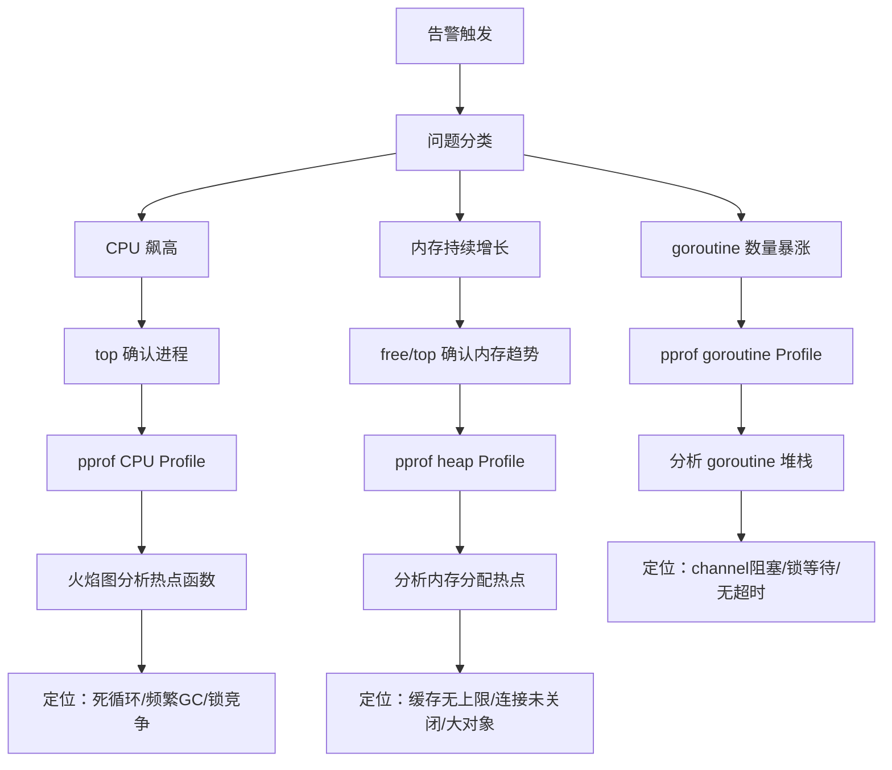

# 线上问题排查流程

## 概念说明

线上 Go 服务出现性能问题是面试中的高频考点，也是实际工作中的核心技能。本节系统讲解三大类线上问题的排查流程：CPU 飙高、内存泄漏、goroutine 泄漏，以及如何在生产环境安全地采集 pprof 数据。

## 核心原理

### 排查总体流程



### pprof 端点说明

| 端点 | 用途 | 采集方式 |
|------|------|----------|
| `/debug/pprof/profile` | CPU Profile | 采样 30 秒 |
| `/debug/pprof/heap` | 内存分配 Profile | 即时快照 |
| `/debug/pprof/goroutine` | goroutine 堆栈 | 即时快照 |
| `/debug/pprof/block` | 阻塞 Profile | 需开启 `runtime.SetBlockProfileRate` |
| `/debug/pprof/mutex` | 锁竞争 Profile | 需开启 `runtime.SetMutexProfileFraction` |
| `/debug/pprof/trace` | 执行追踪 | 采样指定时间 |

## 场景一：CPU 飙高排查

### 排查步骤

```bash
# 1. 确认是哪个进程 CPU 高
top -c

# 2. 确认是哪个线程（Go 中对应 M）
top -H -p <PID>

# 3. 采集 CPU Profile（30 秒）
go tool pprof http://localhost:6060/debug/pprof/profile?seconds=30

# 4. 在 pprof 交互式界面分析
(pprof) top 20          # 查看 CPU 占用最高的 20 个函数
(pprof) web             # 生成调用图（需要 graphviz）
(pprof) list funcName   # 查看特定函数的逐行 CPU 消耗

# 5. 生成火焰图（推荐）
go tool pprof -http=:8081 http://localhost:6060/debug/pprof/profile?seconds=30
# 浏览器打开 http://localhost:8081/ui/flamegraph
```

### 常见原因

| 原因 | 特征 | 解决方案 |
|------|------|----------|
| 死循环 / 忙等待 | 单个函数 CPU 占比极高 | 修复循环逻辑，使用 channel/timer |
| 频繁 GC | `runtime.gcBgMarkWorker` 占比高 | 减少内存分配，调整 GOGC |
| 锁竞争 | `sync.(*Mutex).Lock` 占比高 | 减小锁粒度，使用 RWMutex |
| JSON 序列化 | `encoding/json` 相关函数占比高 | 使用 sonic/jsoniter 替代 |
| 正则表达式 | `regexp` 相关函数占比高 | 预编译正则，避免循环内编译 |

## 场景二：内存泄漏排查

### 排查步骤

```bash
# 1. 确认内存趋势（持续增长 = 泄漏）
# 观察 top 中 RES 列是否持续增长

# 2. 采集 heap Profile
go tool pprof http://localhost:6060/debug/pprof/heap

# 3. 分析内存分配
(pprof) top 20 -cum     # 按累计分配排序
(pprof) list funcName   # 查看特定函数的内存分配

# 4. 对比两次 heap Profile（间隔几分钟）
go tool pprof -base heap1.pb.gz heap2.pb.gz
(pprof) top             # 查看增量分配最多的函数

# 5. 查看 inuse（当前使用）vs alloc（累计分配）
go tool pprof -inuse_space http://localhost:6060/debug/pprof/heap   # 当前占用
go tool pprof -alloc_space http://localhost:6060/debug/pprof/heap   # 累计分配
```

### 常见原因

| 原因 | 特征 | 解决方案 |
|------|------|----------|
| 缓存无上限 | map 持续增长 | 设置缓存上限，使用 LRU |
| 连接未关闭 | `net.Conn` 相关分配多 | 确保 `defer conn.Close()` |
| `[]byte` 未释放 | `bytes.Buffer` 分配多 | 使用 `sync.Pool` 复用 |
| HTTP Body 未关闭 | `io.ReadAll` 分配多 | 确保 `defer resp.Body.Close()` |
| 全局 slice append | slice 持续增长 | 定期清理或设置上限 |

## 场景三：goroutine 泄漏排查

### 排查步骤

```bash
# 1. 查看 goroutine 数量
curl http://localhost:6060/debug/pprof/goroutine?debug=1 | head -1
# goroutine profile: total 10234  ← 如果持续增长，说明泄漏

# 2. 查看 goroutine 堆栈分布
curl http://localhost:6060/debug/pprof/goroutine?debug=2 > goroutine.txt
# 分析哪些 goroutine 最多

# 3. 使用 pprof 分析
go tool pprof http://localhost:6060/debug/pprof/goroutine
(pprof) top 20          # 查看 goroutine 最多的调用栈
(pprof) traces           # 查看所有 goroutine 的堆栈

# 4. 统计 goroutine 分布
curl -s http://localhost:6060/debug/pprof/goroutine?debug=1 | \
    grep -E "^[0-9]+ @" | awk '{print $1}' | sort -rn | head -10
```

### 常见原因

| 原因 | 特征 | 解决方案 |
|------|------|----------|
| channel 阻塞 | goroutine 卡在 `chan send/recv` | 确保 channel 有消费者，使用 select + context |
| 无超时的网络请求 | goroutine 卡在 `net.(*conn).Read` | 设置 `context.WithTimeout` |
| 无限循环的 goroutine | 大量相同堆栈的 goroutine | 使用 context 控制生命周期 |
| 锁等待 | goroutine 卡在 `sync.(*Mutex).Lock` | 减小锁粒度，检查死锁 |

### goroutine 泄漏预防

```go
// ❌ 错误：goroutine 泄漏
func bad() {
    ch := make(chan int)
    go func() {
        result := doWork()
        ch <- result  // 如果没人读 ch，这个 goroutine 永远阻塞
    }()
    // 忘记读 ch，goroutine 泄漏
}

// ✅ 正确：使用 context 控制 goroutine 生命周期
func good(ctx context.Context) {
    ch := make(chan int, 1)  // 带缓冲，防止发送阻塞
    go func() {
        result := doWork()
        select {
        case ch <- result:
        case <-ctx.Done():
            return  // context 取消时退出
        }
    }()
}
```

## pprof 线上采集最佳实践

```go
import _ "net/http/pprof"

func main() {
    // 在独立端口暴露 pprof（不要暴露在业务端口上）
    go func() {
        log.Println(http.ListenAndServe("localhost:6060", nil))
    }()
    
    // 开启 block 和 mutex profiling
    runtime.SetBlockProfileRate(1)
    runtime.SetMutexProfileFraction(1)
    
    // 业务服务器
    // ...
}
```

**安全注意事项**：
- pprof 端口只监听 `localhost`，不要暴露到公网
- 生产环境通过 SSH 隧道访问：`ssh -L 6060:localhost:6060 user@server`
- CPU Profile 采集会增加约 5% 的 CPU 开销，不要长时间采集

## 常见面试题

### Q1: 线上 Go 服务内存持续增长，如何排查？

**难度**：⭐⭐⭐ | **频率**：🔥🔥🔥

**答题思路**：

1. `top` 确认 RES 持续增长
2. 采集两次 heap Profile（间隔 5 分钟）
3. `go tool pprof -base` 对比增量
4. 定位内存分配热点函数
5. 检查常见原因：缓存无上限、连接未关闭、slice 无限增长

### Q2: 如何检测 goroutine 泄漏？

**难度**：⭐⭐⭐ | **频率**：🔥🔥🔥

**标准答案**：

1. **监控 goroutine 数量**：通过 Prometheus 暴露 `runtime.NumGoroutine()` 指标
2. **pprof 分析**：`/debug/pprof/goroutine?debug=1` 查看 goroutine 总数和堆栈分布
3. **测试中检测**：使用 `go.uber.org/goleak` 在单元测试中检测 goroutine 泄漏
4. **预防措施**：所有 goroutine 都应有退出机制（context、done channel、超时）

## 常见陷阱

1. **VIRT 不等于泄漏**：Go 运行时会预留大量虚拟内存，VIRT 很大是正常的，应关注 RES
2. **GC 后内存不降**：Go 的 `madvise` 策略可能不会立即归还内存给 OS，使用 `GODEBUG=madvdontneed=1` 可以更积极地归还
3. **pprof 采集时机**：CPU Profile 需要在问题发生时采集，事后采集无意义
4. **goroutine 数量不为零**：Go 运行时本身会创建一些 goroutine（GC、scavenger 等），几十个是正常的

## 参考资料

- [Go pprof 官方文档](https://pkg.go.dev/net/http/pprof)
- [Go 内存管理与优化](https://go.dev/doc/gc-guide)
- [goleak — goroutine 泄漏检测](https://github.com/uber-go/goleak)
