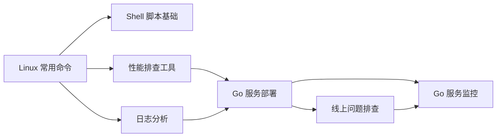

# Linux 运维与线上排查

> **前置依赖：** [Go 基础语法](/1-go-core/1.1-go-basics/) | 此模块贯穿全程，可在任意阶段学习

## 模块概述

作为 Go 后端开发者，Linux 运维能力是必备技能。Go 服务绝大多数部署在 Linux 环境上，从日常的服务部署、日志分析，到线上问题的紧急排查（CPU 飙高、内存泄漏、goroutine 泄漏），都需要扎实的 Linux 基础和 Go 运行时诊断能力。

本模块分为两大部分：
- **Linux 基础运维**：常用命令、Shell 脚本、性能排查工具、日志分析
- **Go 服务运维**：部署最佳实践、线上问题排查流程、Prometheus 监控

## 知识点索引

### Linux 基础运维

| 序号 | 知识点 | 难度 | 面试频率 | 预计时间 |
|------|--------|------|---------|---------|
| 01 | [常用命令](./01-commands.md) | ⭐ | 🔥🔥 | 40min |
| 02 | [Shell 脚本基础](./02-shell.md) | ⭐⭐ | 🔥 | 35min |
| 03 | [性能排查工具](./03-performance.md) | ⭐⭐⭐ | 🔥🔥🔥 | 45min |
| 04 | [日志分析](./04-log-analysis.md) | ⭐⭐ | 🔥🔥 | 35min |

### Go 服务运维

| 序号 | 知识点 | 难度 | 面试频率 | 预计时间 |
|------|--------|------|---------|---------|
| 05 | [Go 服务部署最佳实践](./05-go-deploy.md) | ⭐⭐ | 🔥🔥 | 40min |
| 06 | [线上问题排查流程](./06-go-troubleshooting.md) | ⭐⭐⭐ | 🔥🔥🔥 | 50min |
| 07 | [Go 服务监控](./07-go-monitoring.md) | ⭐⭐ | 🔥🔥 | 40min |

### 面试指南

| 📝 | [面试指南](./interview.md) | - | 🔥🔥🔥 | 30min |
|------|--------|------|---------|---------|

## 学习路径建议

1. **先掌握 Linux 基础**：常用命令是一切运维操作的基础
2. **学习性能排查工具**：top/vmstat/iostat 等是定位问题的第一步
3. **掌握 Go 服务部署**：systemd 配置、优雅重启是生产环境必备
4. **深入线上排查**：CPU/内存/goroutine 泄漏排查是面试高频考点

## 参考资料

- [Linux 命令大全](https://man7.org/linux/man-pages/)
- [Go pprof 官方文档](https://pkg.go.dev/net/http/pprof)
- [Prometheus 官方文档](https://prometheus.io/docs/)
