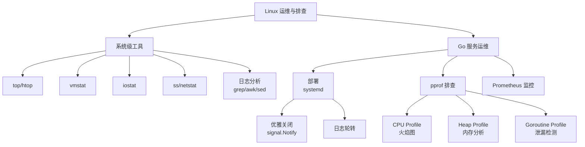

# Linux 运维与线上排查面试指南

> 本指南汇总 Linux 运维与线上排查模块的高频面试题。线上排查能力是 Go 后端面试的重点考察方向，尤其是 CPU 飙高、内存泄漏、goroutine 泄漏的排查流程。

## 🔥🔥🔥 最高频（几乎必考）

### Q1: 线上 Go 服务 CPU 飙高，你的排查步骤是什么？

**难度**：⭐⭐⭐ | **频率**：🔥🔥🔥 | **关联**：[线上问题排查](./06-go-troubleshooting.md)

**标准答案**：

1. **系统级定位**：`top` 确认是哪个进程 CPU 高
2. **线程级定位**：`top -H -p <PID>` 查看线程级 CPU 使用
3. **Go 级分析**：`go tool pprof http://localhost:6060/debug/pprof/profile?seconds=30` 采集 CPU Profile
4. **火焰图分析**：`go tool pprof -http=:8081` 生成火焰图，定位热点函数
5. **根因分析**：常见原因包括死循环、频繁 GC、锁竞争、JSON 序列化

**深入追问**：
- 如果 `runtime.gcBgMarkWorker` 占比很高怎么办？（GC 压力大，减少内存分配，调整 GOGC）
- 如果 `sync.(*Mutex).Lock` 占比高怎么办？（锁竞争，减小锁粒度，考虑 RWMutex 或无锁方案）

---

### Q2: 如何排查 Go 服务的内存泄漏？

**难度**：⭐⭐⭐ | **频率**：🔥🔥🔥 | **关联**：[线上问题排查](./06-go-troubleshooting.md)

**标准答案**：

1. **确认趋势**：通过 Prometheus 监控或 `top` 观察 RES 是否持续增长
2. **采集 heap Profile**：间隔 5 分钟采集两次 `go tool pprof http://localhost:6060/debug/pprof/heap`
3. **对比分析**：`go tool pprof -base heap1.pb.gz heap2.pb.gz`，查看增量分配最多的函数
4. **区分 inuse vs alloc**：`-inuse_space` 看当前占用，`-alloc_space` 看累计分配
5. **常见原因**：缓存无上限（map 持续增长）、HTTP Body 未关闭、连接未释放、全局 slice 无限 append

**深入追问**：
- Go 的 VIRT 很大是内存泄漏吗？（不是，Go 运行时预留虚拟内存，关注 RES）
- GC 后内存为什么不降？（Go 的 madvise 策略可能不立即归还 OS，可用 `GODEBUG=madvdontneed=1`）

---

### Q3: 如何检测和预防 goroutine 泄漏？

**难度**：⭐⭐⭐ | **频率**：🔥🔥🔥 | **关联**：[线上问题排查](./06-go-troubleshooting.md)

**标准答案**：

**检测方法**：
1. 监控 `runtime.NumGoroutine()` 指标，持续增长即泄漏
2. `curl http://localhost:6060/debug/pprof/goroutine?debug=1` 查看 goroutine 堆栈分布
3. 单元测试中使用 `go.uber.org/goleak` 检测

**预防措施**：
1. 所有 goroutine 都应有退出机制（context、done channel）
2. 网络请求必须设置超时（`context.WithTimeout`）
3. channel 操作使用 `select` + `context.Done()`
4. 使用带缓冲的 channel 防止发送阻塞

---

## 🔥🔥 高频题

### Q4: Go 服务如何实现优雅关闭？

**难度**：⭐⭐⭐ | **频率**：🔥🔥 | **关联**：[Go 服务部署](./05-go-deploy.md)

**标准答案**：

```go
// 1. 监听信号
quit := make(chan os.Signal, 1)
signal.Notify(quit, syscall.SIGINT, syscall.SIGTERM)
<-quit

// 2. 优雅关闭 HTTP 服务器
ctx, cancel := context.WithTimeout(context.Background(), 30*time.Second)
defer cancel()
srv.Shutdown(ctx)  // 停止接受新连接，等待进行中的请求完成

// 3. 关闭其他资源
db.Close()
rdb.Close()
```

关键点：`Shutdown` 不会中断正在处理的请求，而是等待它们完成。systemd 的 `TimeoutStopSec` 应与代码中的超时一致。

---

### Q5: 如何判断服务器是 CPU 瓶颈还是 I/O 瓶颈？

**难度**：⭐⭐⭐ | **频率**：🔥🔥 | **关联**：[性能排查工具](./03-performance.md)

**标准答案**：

使用 `vmstat 1` 观察：
- **CPU 瓶颈**：`us` + `sy` 接近 100%，`wa` 很低，`r` > CPU 核心数
- **I/O 瓶颈**：`wa` > 20%，`b` > 0，`bi/bo` 很高

进一步确认：
- CPU 瓶颈：`top` 查看具体进程，`pprof` 分析热点函数
- I/O 瓶颈：`iostat -x 1` 查看磁盘 `%util`，`iotop` 查看进程 I/O

---

### Q6: pprof 在生产环境使用有什么注意事项？

**难度**：⭐⭐ | **频率**：🔥🔥

**标准答案**：

1. **安全性**：pprof 端口只监听 `localhost`，通过 SSH 隧道访问
2. **性能影响**：CPU Profile 采集约增加 5% CPU 开销，不要长时间采集
3. **独立端口**：pprof 使用独立端口（如 6060），不要暴露在业务端口上
4. **按需开启**：block 和 mutex profiling 有性能开销，默认关闭，排查时临时开启

---

## 🔥 中频题

### Q7: Linux 中 `kill -9` 和 `kill -15` 的区别？

**难度**：⭐⭐ | **频率**：🔥

**标准答案**：

- `kill -15`（SIGTERM）：请求进程优雅终止，进程可以捕获并处理（清理资源、完成请求）
- `kill -9`（SIGKILL）：强制终止进程，进程无法捕获，立即被内核杀死

Go 服务应优先使用 `kill -15`，让 `signal.Notify` 捕获信号后执行优雅关闭。`kill -9` 是最后手段。

### Q8: 如何查看 Linux 系统的 TCP 连接状态分布？

**难度**：⭐⭐ | **频率**：🔥

**标准答案**：

```bash
ss -ant | awk '{print $1}' | sort | uniq -c | sort -rn
```

关注点：
- `TIME_WAIT` 过多：短连接太多，考虑使用连接池或调整内核参数
- `CLOSE_WAIT` 过多：服务端未正确关闭连接，检查代码中的 `Close()` 调用
- `ESTABLISHED` 过多：并发连接数高，检查是否正常

## 面试知识图谱



## 参考资料

- [Go pprof 官方文档](https://pkg.go.dev/net/http/pprof)
- [Linux Performance Analysis in 60 Seconds](https://netflixtechblog.com/linux-performance-analysis-in-60-000-milliseconds-accc10403c55)
- [Prometheus 官方文档](https://prometheus.io/docs/)
