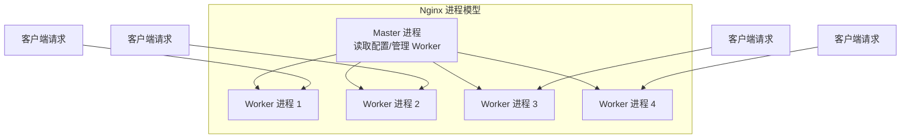
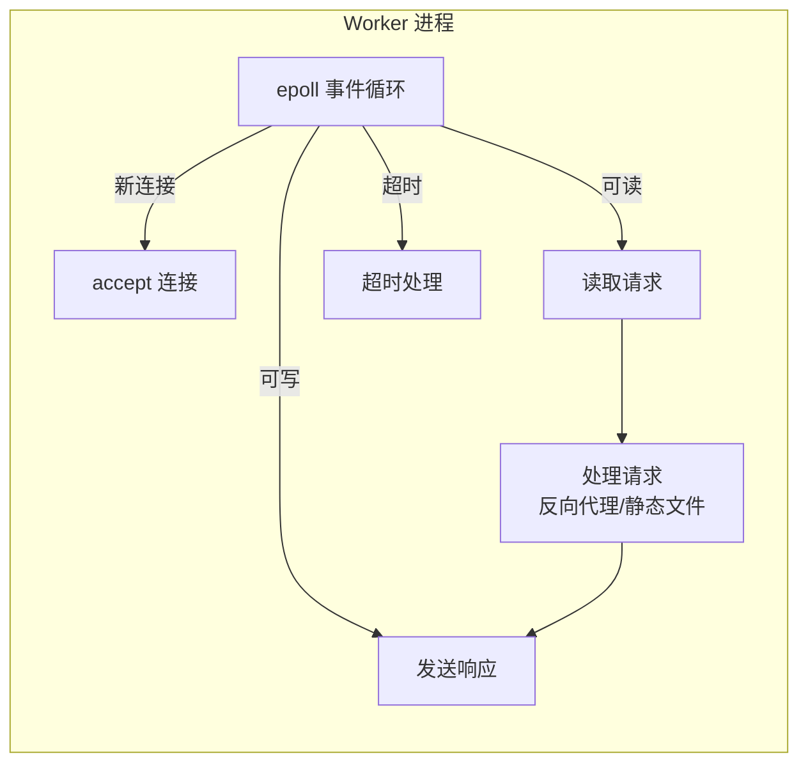

# Nginx 架构与工作原理

## 概念说明

Nginx（发音 "engine-x"）是一个高性能的 HTTP 服务器和反向代理服务器，由 Igor Sysoev 于 2004 年发布。它以事件驱动、异步非阻塞的架构著称，能够以极低的内存消耗处理数万并发连接。

## 核心原理

### Master-Worker 进程模型



| 进程 | 职责 | 数量 |
|------|------|------|
| **Master** | 读取配置、管理 Worker、热重载、平滑升级 | 1 个 |
| **Worker** | 处理客户端请求、反向代理、负载均衡 | 通常等于 CPU 核心数 |

### 事件驱动模型

Nginx 使用事件驱动（Event-Driven）+ 异步非阻塞 I/O 模型：



- 每个 Worker 进程运行一个事件循环（Linux 上使用 epoll）
- 单个 Worker 可以同时处理数千个连接
- 不需要为每个连接创建线程，内存消耗极低

### Nginx vs Apache

| 维度 | Nginx | Apache |
|------|-------|--------|
| 架构 | 事件驱动，异步非阻塞 | 进程/线程模型（prefork/worker） |
| 并发能力 | 数万并发连接 | 数千并发连接 |
| 内存消耗 | 极低（每连接约 2.5KB） | 较高（每连接一个线程） |
| 静态文件 | 极快（sendfile 零拷贝） | 较快 |
| 动态内容 | 需要反向代理到后端 | 内置模块支持（mod_php） |
| 配置热重载 | 支持（`nginx -s reload`） | 需要重启 |

### 配置文件结构

```nginx
# Nginx 配置文件层次结构
main                    # 全局配置
├── events { }          # 事件模型配置
├── http { }            # HTTP 服务配置
│   ├── upstream { }    # 上游服务器组（负载均衡）
│   ├── server { }      # 虚拟主机配置
│   │   ├── location { } # URL 路由匹配
│   │   └── location { }
│   └── server { }
└── stream { }          # TCP/UDP 代理（可选）
```

## 常见面试题

### Q1: Nginx 为什么能支持高并发？

**难度**：⭐⭐⭐ | **频率**：🔥🔥

**标准答案**：

1. **事件驱动架构**：使用 epoll（Linux）事件模型，单个 Worker 进程可处理数千连接
2. **异步非阻塞 I/O**：不为每个连接创建线程，避免线程切换开销
3. **Master-Worker 模型**：Worker 数量等于 CPU 核心数，充分利用多核
4. **内存高效**：每个连接仅消耗约 2.5KB 内存
5. **sendfile 零拷贝**：静态文件直接从内核缓冲区发送，不经过用户空间

## 常见陷阱

1. **Worker 数量设置**：`worker_processes auto` 自动设置为 CPU 核心数，不要手动设置过大
2. **配置语法错误**：修改配置后先 `nginx -t` 测试语法，再 `nginx -s reload` 热重载
3. **权限问题**：Nginx 默认以 `www-data` 或 `nginx` 用户运行，确保有权限访问配置文件和日志目录

## 参考资料

- [Nginx 官方文档](https://nginx.org/en/docs/)
- [Nginx 架构详解](https://www.aosabook.org/en/nginx.html)
