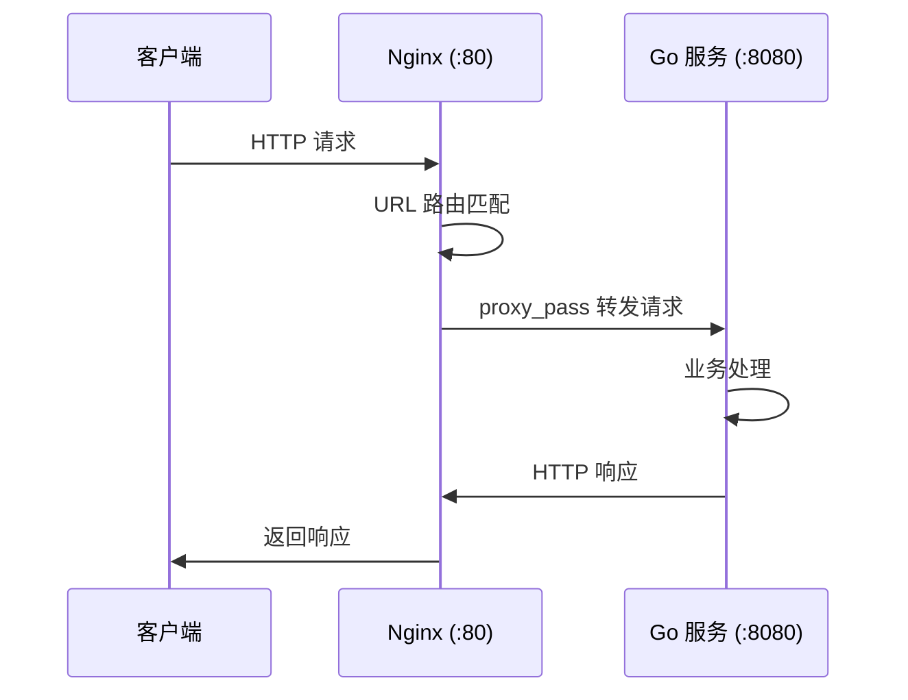

# 反向代理 Go 服务配置

## 概念说明

反向代理（Reverse Proxy）是 Nginx 最核心的功能。客户端请求先到达 Nginx，Nginx 再将请求转发给后端的 Go 服务，Go 服务的响应通过 Nginx 返回给客户端。客户端感知不到后端 Go 服务的存在。

为什么 Go 服务需要 Nginx 反向代理？
- **SSL 终止**：Nginx 处理 HTTPS，Go 服务只需处理 HTTP
- **静态文件服务**：Nginx 直接返回静态文件，不经过 Go 服务
- **负载均衡**：Nginx 将请求分发到多个 Go 实例
- **限流防刷**：Nginx 层面拦截恶意请求，保护 Go 服务
- **缓存**：Nginx 缓存 Go 服务的响应，减少后端压力

## 核心原理

### 反向代理流程



### 关键配置指令

| 指令 | 作用 | 示例 |
|------|------|------|
| `proxy_pass` | 指定后端服务地址 | `proxy_pass http://127.0.0.1:8080` |
| `proxy_set_header` | 设置转发请求头 | `proxy_set_header Host $host` |
| `proxy_connect_timeout` | 连接后端超时 | `proxy_connect_timeout 5s` |
| `proxy_read_timeout` | 读取后端响应超时 | `proxy_read_timeout 60s` |
| `proxy_send_timeout` | 发送请求到后端超时 | `proxy_send_timeout 30s` |
| `proxy_buffering` | 是否缓冲后端响应 | `proxy_buffering on` |

## 标准配置方案

### 基础反向代理配置

```nginx
server {
    listen 80;
    server_name api.example.com;

    # 所有 API 请求转发到 Go 服务
    location / {
        proxy_pass http://127.0.0.1:8080;
        
        # 传递客户端真实信息
        proxy_set_header Host $host;
        proxy_set_header X-Real-IP $remote_addr;
        proxy_set_header X-Forwarded-For $proxy_add_x_forwarded_for;
        proxy_set_header X-Forwarded-Proto $scheme;
        
        # 超时配置
        proxy_connect_timeout 5s;
        proxy_read_timeout 60s;
        proxy_send_timeout 30s;
    }

    # 健康检查端点
    location /health {
        proxy_pass http://127.0.0.1:8080/health;
        access_log off;  # 不记录健康检查日志
    }

    # 静态文件直接由 Nginx 返回
    location /static/ {
        alias /var/www/static/;
        expires 30d;
        add_header Cache-Control "public, immutable";
    }
}
```

### WebSocket 代理配置

```nginx
location /ws {
    proxy_pass http://127.0.0.1:8080;
    proxy_http_version 1.1;
    proxy_set_header Upgrade $http_upgrade;
    proxy_set_header Connection "upgrade";
    proxy_set_header Host $host;
    proxy_read_timeout 3600s;  # WebSocket 长连接超时
}
```

### Go 服务获取客户端真实 IP

```go
// Go 服务中获取客户端真实 IP
func getRealIP(r *http.Request) string {
    // 优先从 X-Real-IP 获取（Nginx 设置）
    if ip := r.Header.Get("X-Real-IP"); ip != "" {
        return ip
    }
    // 其次从 X-Forwarded-For 获取（第一个 IP 是客户端）
    if xff := r.Header.Get("X-Forwarded-For"); xff != "" {
        ips := strings.Split(xff, ",")
        return strings.TrimSpace(ips[0])
    }
    // 最后使用 RemoteAddr
    ip, _, _ := net.SplitHostPort(r.RemoteAddr)
    return ip
}
```

## 代码示例

> 💻 完整配置文件：[code-examples/05-devops/nginx/conf/go-service.conf](https://github.com/skyhe58/guide-go/tree/main/code-examples/05-devops/nginx/conf/go-service.conf)
> 🐳 Docker 启动：`docker compose -f docker/docker-compose.nginx.yml up -d`

## 常见面试题

### Q1: Nginx 反向代理和正向代理的区别？

**难度**：⭐⭐ | **频率**：🔥🔥🔥

**标准答案**：

- **正向代理**：代理客户端，客户端知道代理的存在（如 VPN、科学上网）。客户端 → 代理 → 目标服务器
- **反向代理**：代理服务端，客户端不知道代理的存在。客户端 → Nginx → 后端服务

关键区别：正向代理隐藏客户端，反向代理隐藏服务端。

### Q2: `proxy_set_header X-Real-IP` 的作用？

**难度**：⭐⭐ | **频率**：🔥🔥

**标准答案**：

经过 Nginx 反向代理后，Go 服务看到的 `RemoteAddr` 是 Nginx 的地址（127.0.0.1），而非客户端真实 IP。通过 `proxy_set_header X-Real-IP $remote_addr` 将客户端真实 IP 传递给后端，Go 服务从 `X-Real-IP` 请求头获取。

## 常见陷阱

1. **`proxy_pass` 末尾斜杠**：`proxy_pass http://backend/` 和 `proxy_pass http://backend` 行为不同，前者会替换 location 匹配的路径
2. **超时设置过短**：`proxy_read_timeout` 默认 60 秒，如果 Go 服务有长耗时接口需要调大
3. **忘记传递 Host**：不设置 `proxy_set_header Host $host`，后端收到的 Host 是 upstream 地址而非域名
4. **缓冲区过小**：大响应体可能导致 Nginx 写临时文件，影响性能，需调整 `proxy_buffer_size`

## 参考资料

- [Nginx proxy_pass 文档](https://nginx.org/en/docs/http/ngx_http_proxy_module.html)
- [Nginx 反向代理最佳实践](https://docs.nginx.com/nginx/admin-guide/web-server/reverse-proxy/)
