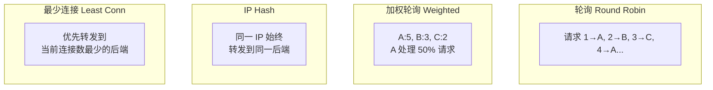

# 负载均衡策略

## 概念说明

当 Go 服务部署多个实例时，Nginx 负责将请求分发到不同实例，实现负载均衡。Nginx 内置多种负载均衡策略，选择合适的策略对服务的性能和可用性至关重要。

## 核心原理

### 四种负载均衡策略对比



| 策略 | 指令 | 适用场景 | 优缺点 |
|------|------|----------|--------|
| **轮询** | 默认 | 后端性能相近 | 简单均匀，不考虑服务器负载 |
| **加权轮询** | `weight=N` | 后端性能不同 | 高性能服务器处理更多请求 |
| **IP Hash** | `ip_hash` | 需要会话保持 | 同一客户端固定到同一后端，但分布可能不均 |
| **最少连接** | `least_conn` | 请求处理时间差异大 | 动态均衡，避免慢请求堆积 |

## 标准配置方案

### 轮询（默认）

```nginx
upstream go_backend {
    server 127.0.0.1:8080;
    server 127.0.0.1:8081;
    server 127.0.0.1:8082;
}

server {
    listen 80;
    location / {
        proxy_pass http://go_backend;
    }
}
```

### 加权轮询

```nginx
upstream go_backend {
    server 127.0.0.1:8080 weight=5;  # 处理 50% 请求
    server 127.0.0.1:8081 weight=3;  # 处理 30% 请求
    server 127.0.0.1:8082 weight=2;  # 处理 20% 请求
}
```

### IP Hash

```nginx
upstream go_backend {
    ip_hash;  # 同一客户端 IP 始终转发到同一后端
    server 127.0.0.1:8080;
    server 127.0.0.1:8081;
    server 127.0.0.1:8082;
}
```

### 最少连接

```nginx
upstream go_backend {
    least_conn;  # 优先转发到当前连接数最少的后端
    server 127.0.0.1:8080;
    server 127.0.0.1:8081;
    server 127.0.0.1:8082;
}
```

### 健康检查与故障转移

```nginx
upstream go_backend {
    server 127.0.0.1:8080 max_fails=3 fail_timeout=30s;
    server 127.0.0.1:8081 max_fails=3 fail_timeout=30s;
    server 127.0.0.1:8082 backup;  # 备用服务器，仅在主服务器全部不可用时启用
}
```

| 参数 | 含义 | 默认值 |
|------|------|--------|
| `max_fails` | 最大失败次数，超过后标记为不可用 | 1 |
| `fail_timeout` | 失败计数的时间窗口 + 标记不可用的持续时间 | 10s |
| `backup` | 备用服务器 | - |
| `down` | 标记为永久不可用 | - |

## 常见面试题

### Q1: Nginx 有哪些负载均衡策略？各自适用什么场景？

**难度**：⭐⭐⭐ | **频率**：🔥🔥🔥

**标准答案**：

1. **轮询**（默认）：请求依次分发，适合后端性能相近的场景
2. **加权轮询**：按权重分发，适合后端性能不同的场景（如 8 核机器权重 5，4 核机器权重 2）
3. **IP Hash**：同一客户端 IP 固定到同一后端，适合需要会话保持的场景（但 Go 服务通常用 JWT 无状态认证，不需要 IP Hash）
4. **最少连接**：优先分发到连接数最少的后端，适合请求处理时间差异大的场景

**深入追问**：
- Go 服务用 JWT 认证，还需要 IP Hash 吗？（不需要，JWT 是无状态的，任何实例都能处理）
- 如何实现更精细的负载均衡？（使用一致性哈希 `hash $request_uri consistent`）

### Q2: Nginx 如何实现故障转移？

**难度**：⭐⭐ | **频率**：🔥🔥

**标准答案**：

通过 `max_fails` 和 `fail_timeout` 实现被动健康检查：
- 在 `fail_timeout` 时间窗口内，如果后端失败次数达到 `max_fails`，Nginx 将该后端标记为不可用
- 不可用持续 `fail_timeout` 时间后，Nginx 会重新尝试转发请求到该后端
- 可配置 `backup` 服务器作为兜底

## 常见陷阱

1. **IP Hash + CDN**：如果客户端通过 CDN 访问，所有请求的源 IP 都是 CDN 节点 IP，IP Hash 会失效
2. **权重设置不当**：权重应与服务器实际性能匹配，设置不当会导致部分服务器过载
3. **健康检查不够灵敏**：默认 `max_fails=1` 可能导致偶发错误就摘除后端，建议设置为 3

## 代码示例

> 💻 完整配置文件：[code-examples/05-devops/nginx/conf/load-balance.conf](https://github.com/your-repo/code-examples/05-devops/nginx/conf/load-balance.conf)

## 参考资料

- [Nginx upstream 文档](https://nginx.org/en/docs/http/ngx_http_upstream_module.html)
- [Nginx 负载均衡指南](https://docs.nginx.com/nginx/admin-guide/load-balancer/http-load-balancer/)
