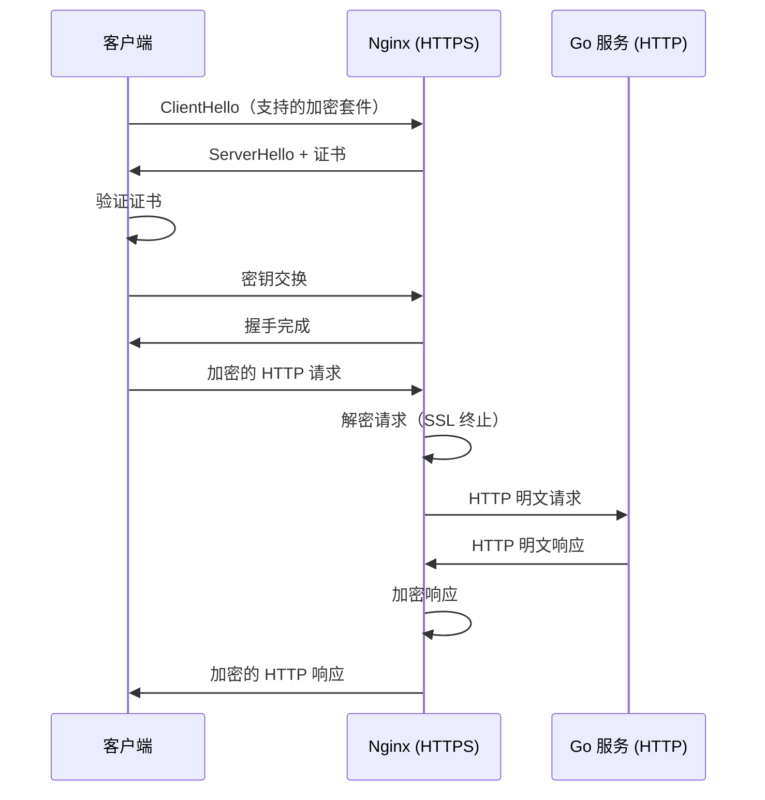

# HTTPS 配置与证书管理

## 概念说明

HTTPS 是 HTTP 的安全版本，通过 SSL/TLS 协议加密通信内容。在 Nginx + Go 的架构中，通常由 Nginx 负责 SSL 终止（SSL Termination）——Nginx 处理 HTTPS 加解密，与后端 Go 服务之间使用 HTTP 明文通信，这样 Go 服务不需要处理证书和加密逻辑。

## 核心原理

### HTTPS 握手流程



### 证书获取方式

| 方式 | 费用 | 适用场景 | 有效期 |
|------|------|----------|--------|
| **Let's Encrypt** | 免费 | 个人/小型项目 | 90 天（自动续期） |
| **商业 CA** | 付费 | 企业/金融 | 1-2 年 |
| **自签名证书** | 免费 | 开发/测试环境 | 自定义 |

## 标准配置方案

### 基础 HTTPS 配置

```nginx
server {
    listen 443 ssl http2;
    server_name api.example.com;

    # 证书文件
    ssl_certificate     /etc/nginx/ssl/fullchain.pem;
    ssl_certificate_key /etc/nginx/ssl/privkey.pem;

    # SSL 协议版本（只启用 TLS 1.2 和 1.3）
    ssl_protocols TLSv1.2 TLSv1.3;

    # 加密套件（优先使用服务端配置）
    ssl_prefer_server_ciphers on;
    ssl_ciphers 'ECDHE-ECDSA-AES128-GCM-SHA256:ECDHE-RSA-AES128-GCM-SHA256:ECDHE-ECDSA-AES256-GCM-SHA384:ECDHE-RSA-AES256-GCM-SHA384';

    # SSL 会话缓存（减少握手开销）
    ssl_session_cache shared:SSL:10m;
    ssl_session_timeout 1d;
    ssl_session_tickets off;

    # HSTS（强制 HTTPS）
    add_header Strict-Transport-Security "max-age=63072000; includeSubDomains" always;

    # 反向代理到 Go 服务
    location / {
        proxy_pass http://127.0.0.1:8080;
        proxy_set_header Host $host;
        proxy_set_header X-Real-IP $remote_addr;
        proxy_set_header X-Forwarded-For $proxy_add_x_forwarded_for;
        proxy_set_header X-Forwarded-Proto $scheme;
    }
}

# HTTP 自动跳转 HTTPS
server {
    listen 80;
    server_name api.example.com;
    return 301 https://$host$request_uri;
}
```

### Let's Encrypt 自动证书

```bash
# 安装 certbot
apt install certbot python3-certbot-nginx

# 自动获取证书并配置 Nginx
certbot --nginx -d api.example.com

# 自动续期（certbot 会自动添加 cron 任务）
certbot renew --dry-run
```

## 常见面试题

### Q1: HTTPS 的工作原理？

**难度**：⭐⭐⭐ | **频率**：🔥🔥

**标准答案**：

HTTPS = HTTP + SSL/TLS。核心流程：
1. **TCP 三次握手**
2. **TLS 握手**：客户端发送支持的加密套件 → 服务端返回证书 → 客户端验证证书 → 密钥交换
3. **对称加密通信**：握手完成后使用协商的对称密钥加密 HTTP 数据

关键点：TLS 握手使用非对称加密交换密钥，后续通信使用对称加密（性能更好）。

### Q2: 什么是 SSL 终止？为什么在 Nginx 层做？

**难度**：⭐⭐ | **频率**：🔥🔥

**标准答案**：

SSL 终止是指在 Nginx 层解密 HTTPS 请求，然后以 HTTP 明文转发给后端 Go 服务。优势：
1. Go 服务不需要处理证书和加密逻辑，代码更简洁
2. Nginx 的 SSL 处理经过高度优化，性能更好
3. 证书管理集中在 Nginx，更新证书不需要重启 Go 服务
4. 内网通信使用 HTTP 明文，减少加解密开销

## 常见陷阱

1. **忘记 HTTP 跳转 HTTPS**：需要配置 80 端口自动 301 跳转到 443
2. **证书过期**：Let's Encrypt 证书 90 天过期，务必配置自动续期
3. **混合内容**：页面通过 HTTPS 加载，但引用了 HTTP 资源，浏览器会阻止
4. **HSTS 设置过长**：首次配置建议 `max-age` 设短一些（如 1 天），确认无误后再调长

## 代码示例

> 💻 完整配置文件：[code-examples/05-devops/nginx/conf/https.conf](https://github.com/skyhe58/guide-go/tree/main/code-examples/05-devops/nginx/conf/https.conf)

## 参考资料

- [Mozilla SSL 配置生成器](https://ssl-config.mozilla.org/)
- [Let's Encrypt 官方文档](https://letsencrypt.org/docs/)
- [Nginx SSL 配置文档](https://nginx.org/en/docs/http/ngx_http_ssl_module.html)
