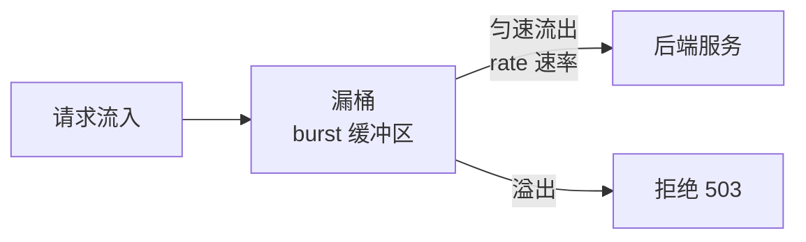

# 限流与防刷

## 概念说明

限流是保护后端服务的第一道防线。Nginx 提供两种限流机制：`limit_req`（请求速率限制）和 `limit_conn`（并发连接数限制）。在 Nginx 层做限流可以在请求到达 Go 服务之前就拦截恶意流量，减轻后端压力。

## 核心原理

### 两种限流机制对比

| 机制 | 指令 | 限制维度 | 算法 | 适用场景 |
|------|------|----------|------|----------|
| `limit_req` | 请求速率 | 每秒请求数 | 漏桶算法 | API 接口限流 |
| `limit_conn` | 并发连接 | 同时连接数 | 计数器 | 下载/长连接限流 |

### 漏桶算法（limit_req）



## 标准配置方案

### limit_req 请求速率限制

```nginx
# 在 http 块中定义限流区域
http {
    # 定义限流区域：按客户端 IP 限流，每秒 10 个请求
    # zone=api:10m 表示使用 10MB 共享内存存储状态（约 16 万个 IP）
    limit_req_zone $binary_remote_addr zone=api:10m rate=10r/s;

    # 登录接口更严格的限流
    limit_req_zone $binary_remote_addr zone=login:10m rate=1r/s;

    server {
        # API 接口限流
        location /api/ {
            limit_req zone=api burst=20 nodelay;
            # burst=20：允许突发 20 个请求
            # nodelay：突发请求立即处理，不排队等待
            proxy_pass http://127.0.0.1:8080;
        }

        # 登录接口严格限流
        location /api/login {
            limit_req zone=login burst=5 nodelay;
            proxy_pass http://127.0.0.1:8080;
        }
    }
}
```

### limit_conn 并发连接限制

```nginx
http {
    # 按客户端 IP 限制并发连接数
    limit_conn_zone $binary_remote_addr zone=conn:10m;

    server {
        # 每个 IP 最多 50 个并发连接
        limit_conn conn 50;

        # 文件下载接口限制更严格
        location /download/ {
            limit_conn conn 5;       # 每个 IP 最多 5 个并发下载
            limit_rate 1m;           # 每个连接限速 1MB/s
            proxy_pass http://127.0.0.1:8080;
        }
    }
}
```

### 自定义限流响应

```nginx
# 自定义 503 错误页面
limit_req_status 429;  # 返回 429 Too Many Requests（更语义化）

error_page 429 /429.json;
location = /429.json {
    default_type application/json;
    return 429 '{"code":429,"message":"请求过于频繁，请稍后重试"}';
}
```

## 常见面试题

### Q1: Nginx 的 limit_req 和 limit_conn 有什么区别？

**难度**：⭐⭐ | **频率**：🔥🔥

**标准答案**：

- `limit_req`：限制请求速率（每秒请求数），基于漏桶算法，适合 API 接口限流
- `limit_conn`：限制并发连接数，适合下载、长连接等场景

两者可以组合使用：`limit_req` 控制请求频率，`limit_conn` 控制同时连接数。

### Q2: `burst` 和 `nodelay` 参数的作用？

**难度**：⭐⭐⭐ | **频率**：🔥🔥

**标准答案**：

- `burst=20`：允许突发 20 个请求进入缓冲区，超过 burst 的请求直接拒绝
- 不加 `nodelay`：突发请求按 rate 速率排队处理（有延迟）
- 加 `nodelay`：突发请求立即处理，不排队（推荐，用户体验更好）

## 常见陷阱

1. **`$binary_remote_addr` vs `$remote_addr`**：前者占 4 字节（IPv4），后者占 7-15 字节，使用 `$binary_remote_addr` 更节省内存
2. **CDN 场景**：如果使用 CDN，`$remote_addr` 是 CDN 节点 IP，需要改用 `$http_x_forwarded_for` 作为限流 Key
3. **burst 设置过小**：正常用户的浏览器会并发发送多个请求（CSS/JS/图片），burst 过小会误伤正常用户

## 参考资料

- [Nginx limit_req 文档](https://nginx.org/en/docs/http/ngx_http_limit_req_module.html)
- [Nginx limit_conn 文档](https://nginx.org/en/docs/http/ngx_http_limit_conn_module.html)
