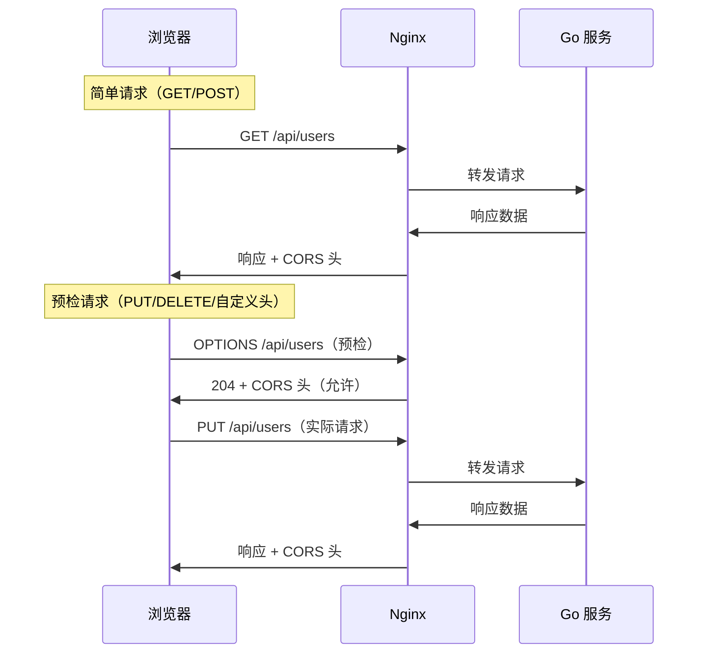

# 跨域配置

## 概念说明

CORS（Cross-Origin Resource Sharing，跨域资源共享）是浏览器的安全机制。当前端页面（如 `https://web.example.com`）请求后端 API（如 `https://api.example.com`）时，由于域名不同，浏览器会阻止请求。需要在服务端（Nginx 或 Go 服务）配置 CORS 响应头来允许跨域访问。

跨域配置可以在 Nginx 层或 Go 层做，推荐在 Nginx 层统一处理。

## 核心原理

### CORS 请求流程



### CORS 响应头说明

| 响应头 | 作用 | 示例值 |
|--------|------|--------|
| `Access-Control-Allow-Origin` | 允许的源 | `https://web.example.com` 或 `*` |
| `Access-Control-Allow-Methods` | 允许的 HTTP 方法 | `GET, POST, PUT, DELETE, OPTIONS` |
| `Access-Control-Allow-Headers` | 允许的请求头 | `Content-Type, Authorization` |
| `Access-Control-Allow-Credentials` | 是否允许携带 Cookie | `true` |
| `Access-Control-Max-Age` | 预检请求缓存时间（秒） | `86400` |

## 标准配置方案

### Nginx CORS 配置

```nginx
server {
    listen 80;
    server_name api.example.com;

    # CORS 配置
    # 注意：Access-Control-Allow-Origin 不能同时设置 * 和 Credentials
    set $cors_origin "";
    if ($http_origin ~* "^https?://(web\.example\.com|localhost:3000)$") {
        set $cors_origin $http_origin;
    }

    location /api/ {
        # 处理预检请求
        if ($request_method = 'OPTIONS') {
            add_header 'Access-Control-Allow-Origin' $cors_origin always;
            add_header 'Access-Control-Allow-Methods' 'GET, POST, PUT, DELETE, PATCH, OPTIONS' always;
            add_header 'Access-Control-Allow-Headers' 'Content-Type, Authorization, X-Request-ID' always;
            add_header 'Access-Control-Allow-Credentials' 'true' always;
            add_header 'Access-Control-Max-Age' 86400 always;
            add_header 'Content-Length' 0;
            return 204;
        }

        # 实际请求的 CORS 头
        add_header 'Access-Control-Allow-Origin' $cors_origin always;
        add_header 'Access-Control-Allow-Credentials' 'true' always;

        proxy_pass http://127.0.0.1:8080;
        proxy_set_header Host $host;
        proxy_set_header X-Real-IP $remote_addr;
    }
}
```

## 常见面试题

### Q1: 什么是 CORS 预检请求？什么时候会触发？

**难度**：⭐⭐ | **频率**：🔥🔥

**标准答案**：

预检请求（Preflight Request）是浏览器在发送"非简单请求"之前，先发送一个 OPTIONS 请求询问服务端是否允许。

触发条件（满足任一即触发）：
1. 使用 PUT、DELETE、PATCH 等方法
2. 请求头包含自定义头（如 `Authorization`、`X-Request-ID`）
3. `Content-Type` 不是 `application/x-www-form-urlencoded`、`multipart/form-data`、`text/plain`

## 常见陷阱

1. **`*` 与 Credentials 冲突**：`Access-Control-Allow-Origin: *` 不能与 `Access-Control-Allow-Credentials: true` 同时使用，必须指定具体域名
2. **`add_header` 在 error 响应中不生效**：需要加 `always` 参数，否则 4xx/5xx 响应不会包含 CORS 头
3. **Nginx 和 Go 重复设置**：如果 Nginx 和 Go 服务都设置了 CORS 头，会出现重复头，浏览器可能报错

## 参考资料

- [MDN CORS 文档](https://developer.mozilla.org/zh-CN/docs/Web/HTTP/CORS)
- [Nginx add_header 文档](https://nginx.org/en/docs/http/ngx_http_headers_module.html)
