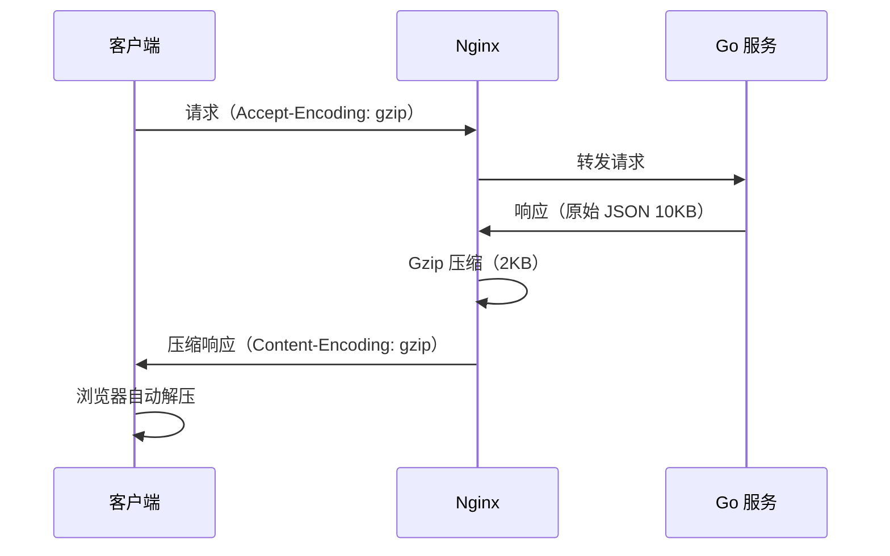

# Gzip 压缩

## 概念说明

Gzip 压缩是 Web 性能优化的基础手段。Nginx 在返回响应时对内容进行 Gzip 压缩，可以显著减少传输数据量（通常压缩 60-80%），加快页面加载速度，节省带宽。对于 Go API 服务，JSON 响应的压缩效果尤为明显。

## 核心原理

### Gzip 压缩流程



## 标准配置方案

```nginx
http {
    # 开启 Gzip 压缩
    gzip on;

    # 最小压缩文件大小（小于 1KB 的文件压缩收益不大）
    gzip_min_length 1k;

    # 压缩级别（1-9，推荐 4-6，平衡压缩率和 CPU 消耗）
    gzip_comp_level 5;

    # 压缩的 MIME 类型
    gzip_types
        text/plain
        text/css
        text/javascript
        application/json
        application/javascript
        application/xml
        application/xml+rss
        image/svg+xml;

    # 对代理请求也启用压缩
    gzip_proxied any;

    # 添加 Vary 头（告诉缓存服务器区分压缩和非压缩版本）
    gzip_vary on;

    # 禁用对 IE6 的压缩（兼容性，现在基本不需要）
    gzip_disable "msie6";
}
```

### 压缩级别对比

| 级别 | 压缩率 | CPU 消耗 | 适用场景 |
|------|--------|----------|----------|
| 1 | 低 | 低 | CPU 敏感的高并发场景 |
| 4-6 | 中 | 中 | **推荐**，平衡压缩率和性能 |
| 9 | 高 | 高 | 带宽敏感的场景 |

## 常见面试题

### Q1: Nginx Gzip 压缩的注意事项？

**难度**：⭐ | **频率**：🔥

**标准答案**：

1. 不要压缩图片（JPEG/PNG/GIF）和视频，它们已经是压缩格式
2. 小文件（< 1KB）不值得压缩，压缩后可能更大
3. 压缩级别推荐 4-6，级别 9 的 CPU 消耗远大于压缩率提升
4. 添加 `Vary: Accept-Encoding` 头，确保 CDN 正确缓存

## 常见陷阱

1. **压缩已压缩的内容**：图片、视频已经是压缩格式，再 Gzip 压缩不仅没效果还浪费 CPU
2. **忘记 `gzip_proxied`**：反向代理场景下需要设置 `gzip_proxied any`，否则代理响应不会被压缩
3. **与 Go 服务重复压缩**：如果 Go 服务已经做了 Gzip 压缩，Nginx 不应再压缩，否则会双重压缩

## 参考资料

- [Nginx gzip 模块文档](https://nginx.org/en/docs/http/ngx_http_gzip_module.html)
