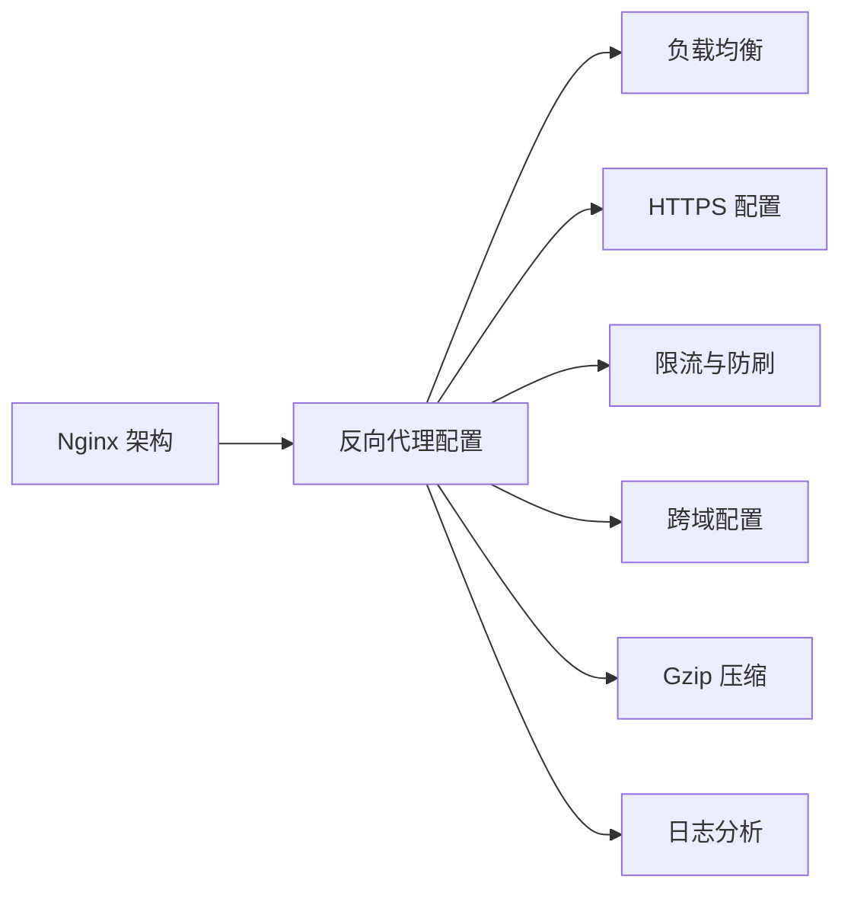
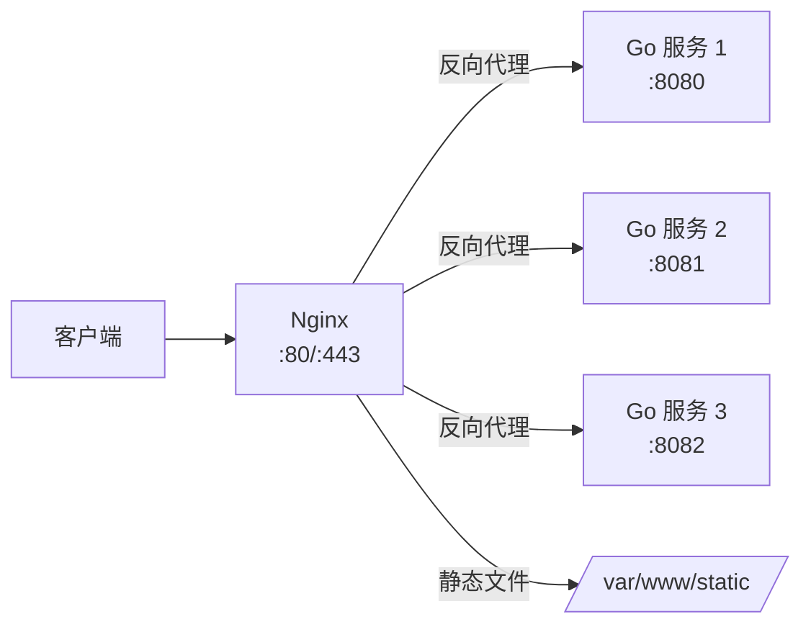

# Nginx 与反向代理

> **前置依赖：** [Go 基础语法](/1-go-core/1.1-go-basics/) | 此模块贯穿全程，可在任意阶段学习

## 模块概述

Nginx 是全球使用最广泛的 Web 服务器和反向代理服务器。在 Go 后端开发中，Nginx 通常作为 Go 服务的前置代理，负责 SSL 终止、负载均衡、静态文件服务、限流防刷、跨域处理等。虽然 Go 的 `net/http` 本身性能优秀，但生产环境中 Nginx + Go 的组合仍然是最佳实践。

本模块系统讲解 Nginx 的核心配置，聚焦于与 Go 服务配合使用的场景。

## 知识点索引

### Nginx 核心知识

| 序号 | 知识点 | 难度 | 面试频率 | 预计时间 |
|------|--------|------|---------|---------|
| 01 | [Nginx 架构与工作原理](./01-architecture.md) | ⭐⭐ | 🔥🔥 | 30min |
| 02 | [反向代理 Go 服务配置](./02-reverse-proxy.md) | ⭐⭐ | 🔥🔥🔥 | 35min |
| 03 | [负载均衡策略](./03-load-balance.md) | ⭐⭐⭐ | 🔥🔥🔥 | 35min |
| 04 | [HTTPS 配置与证书管理](./04-https.md) | ⭐⭐ | 🔥🔥 | 30min |
| 05 | [限流与防刷](./05-rate-limit.md) | ⭐⭐⭐ | 🔥🔥 | 30min |
| 06 | [跨域配置](./06-cors.md) | ⭐⭐ | 🔥🔥 | 25min |
| 07 | [Gzip 压缩](./07-gzip.md) | ⭐ | 🔥 | 20min |
| 08 | [日志分析](./08-log.md) | ⭐⭐ | 🔥 | 25min |

### 面试指南

| 📝 | [面试指南](./interview.md) | - | 🔥🔥🔥 | 30min |
|------|--------|------|---------|---------|

## 代码示例

> 💻 完整配置文件：[code-examples/05-devops/nginx/](https://github.com/skyhe58/guide-go/tree/main/code-examples/05-devops/nginx/)
> 🐳 Docker 启动：`docker compose -f docker/docker-compose.nginx.yml up -d`

| 配置文件 | 对应知识点 | 说明 |
|---------|-----------|------|
| `conf/nginx.conf` | 架构与工作原理 | Nginx 主配置 |
| `conf/go-service.conf` | 反向代理 | 反向代理 Go 服务配置 |
| `conf/load-balance.conf` | 负载均衡 | 负载均衡配置 |
| `conf/https.conf` | HTTPS | HTTPS 配置 |

## 学习路径建议

1. **先理解架构**：Master-Worker 进程模型是理解 Nginx 的基础
2. **掌握反向代理**：这是 Nginx 最核心的功能，Go 服务必备
3. **按需学习其他**：负载均衡、HTTPS、限流等根据项目需求选学

## Nginx + Go 服务架构

## 参考资料

- [Nginx 官方文档](https://nginx.org/en/docs/)
- [Nginx 中文文档](https://www.nginx.cn/doc/)
