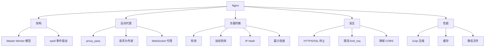

# Nginx 与反向代理面试指南

> 本指南汇总 Nginx 与反向代理模块的高频面试题。Nginx 是后端面试的常考知识点，尤其是反向代理原理、负载均衡策略、HTTPS 配置等。

## 🔥🔥🔥 最高频（几乎必考）

### Q1: 正向代理和反向代理的区别？

**难度**：⭐⭐ | **频率**：🔥🔥🔥 | **关联**：[反向代理](./02-reverse-proxy.md)

**标准答案**：

| 维度 | 正向代理 | 反向代理 |
|------|----------|----------|
| 代理对象 | 代理客户端 | 代理服务端 |
| 客户端感知 | 客户端知道代理存在 | 客户端不知道代理存在 |
| 典型场景 | VPN、科学上网 | Nginx 代理 Go 服务 |
| 隐藏对象 | 隐藏客户端 | 隐藏服务端 |

一句话总结：正向代理帮客户端访问服务器，反向代理帮服务器接收客户端请求。

---

### Q2: Nginx 有哪些负载均衡策略？

**难度**：⭐⭐⭐ | **频率**：🔥🔥🔥 | **关联**：[负载均衡](./03-load-balance.md)

**标准答案**：

1. **轮询**（默认）：请求依次分发到各后端，适合性能相近的服务器
2. **加权轮询**（`weight`）：按权重分发，高性能服务器处理更多请求
3. **IP Hash**（`ip_hash`）：同一 IP 固定到同一后端，适合需要会话保持的场景
4. **最少连接**（`least_conn`）：优先分发到连接数最少的后端，适合请求处理时间差异大的场景

**深入追问**：
- Go 服务用 JWT 认证，需要 IP Hash 吗？（不需要，JWT 无状态，任何实例都能处理）
- 如何实现更精细的负载均衡？（一致性哈希 `hash $request_uri consistent`）

---

### Q3: Nginx 为什么能支持高并发？

**难度**：⭐⭐⭐ | **频率**：🔥🔥🔥 | **关联**：[架构与工作原理](./01-architecture.md)

**标准答案**：

1. **事件驱动架构**：使用 epoll 事件模型，单个 Worker 可处理数千连接
2. **异步非阻塞 I/O**：不为每个连接创建线程，避免线程切换开销
3. **Master-Worker 模型**：Worker 数量等于 CPU 核心数，充分利用多核
4. **内存高效**：每个连接仅消耗约 2.5KB 内存
5. **sendfile 零拷贝**：静态文件直接从内核缓冲区发送

---

## 🔥🔥 高频题

### Q4: HTTPS 的工作原理？SSL 终止是什么？

**难度**：⭐⭐⭐ | **频率**：🔥🔥 | **关联**：[HTTPS 配置](./04-https.md)

**标准答案**：

**HTTPS 原理**：
1. TCP 三次握手
2. TLS 握手：客户端发送支持的加密套件 → 服务端返回证书 → 客户端验证证书 → 密钥交换
3. 使用协商的对称密钥加密 HTTP 通信

**SSL 终止**：在 Nginx 层解密 HTTPS，以 HTTP 明文转发给后端 Go 服务。优势：
- Go 服务不需要处理证书
- 证书更新不需要重启 Go 服务
- Nginx 的 SSL 处理经过高度优化

---

### Q5: Nginx 如何实现限流？

**难度**：⭐⭐ | **频率**：🔥🔥 | **关联**：[限流与防刷](./05-rate-limit.md)

**标准答案**：

两种限流机制：
1. **`limit_req`**：限制请求速率（漏桶算法），如每秒 10 个请求
2. **`limit_conn`**：限制并发连接数，如每个 IP 最多 50 个连接

```nginx
limit_req_zone $binary_remote_addr zone=api:10m rate=10r/s;
location /api/ {
    limit_req zone=api burst=20 nodelay;
}
```

`burst=20` 允许突发 20 个请求，`nodelay` 表示突发请求立即处理不排队。

---

### Q6: 什么是 CORS？如何在 Nginx 中配置？

**难度**：⭐⭐ | **频率**：🔥🔥 | **关联**：[跨域配置](./06-cors.md)

**标准答案**：

CORS 是浏览器的安全机制，阻止跨域请求。配置方式：

```nginx
location /api/ {
    add_header 'Access-Control-Allow-Origin' 'https://web.example.com' always;
    add_header 'Access-Control-Allow-Methods' 'GET, POST, PUT, DELETE, OPTIONS' always;
    add_header 'Access-Control-Allow-Headers' 'Content-Type, Authorization' always;
    
    if ($request_method = 'OPTIONS') {
        return 204;
    }
}
```

注意：`Access-Control-Allow-Origin: *` 不能与 `Credentials: true` 同时使用。

---

## 🔥 中频题

### Q7: Nginx 配置热重载的原理？

**难度**：⭐⭐ | **频率**：🔥

**标准答案**：

执行 `nginx -s reload` 时：
1. Master 进程读取新配置并验证语法
2. 创建新的 Worker 进程（使用新配置）
3. 旧 Worker 进程停止接受新连接
4. 旧 Worker 处理完当前请求后退出
5. 整个过程不中断服务，实现零停机更新

### Q8: `proxy_pass` 末尾加不加斜杠的区别？

**难度**：⭐⭐ | **频率**：🔥

**标准答案**：

```nginx
# 不加斜杠：请求 /api/users → 转发到 http://backend/api/users
location /api/ {
    proxy_pass http://backend;
}

# 加斜杠：请求 /api/users → 转发到 http://backend/users（去掉了 /api 前缀）
location /api/ {
    proxy_pass http://backend/;
}
```

加斜杠时，location 匹配的路径会被替换为 `proxy_pass` 中的路径。

## 面试知识图谱



## 参考资料

- [Nginx 官方文档](https://nginx.org/en/docs/)
- [Nginx 中文文档](https://www.nginx.cn/doc/)
- [Mozilla SSL 配置生成器](https://ssl-config.mozilla.org/)
