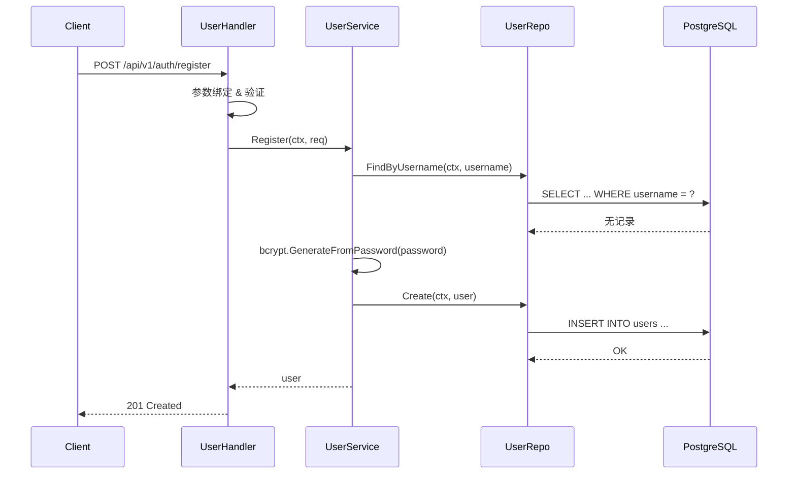

# 用户模块实现指南

## 概念说明

用户模块是 GoBlog 的核心模块，负责用户注册、登录、Token 管理和个人资料维护。涉及密码加密（bcrypt）、JWT 双令牌机制和 RBAC 角色权限。

## 核心原理

### 用户注册流程

### JWT 双令牌机制

| Token 类型 | 有效期 | 用途 |
|-----------|--------|------|
| Access Token | 15 分钟 | API 请求认证 |
| Refresh Token | 7 天 | 刷新 Access Token |
| Token 黑名单 | Token 剩余有效期 | 已注销 Token 拦截（Redis） |

### RBAC 角色权限

| 角色 | 说明 | 权限范围 |
|------|------|---------|
| admin | 管理员 | 所有操作 |
| author | 作者 | 创建/编辑文章、创建标签、评论 |
| reader | 读者 | 浏览、评论 |

## 实现要点

### 1. 数据模型（model/user.go）

User 模型使用 GORM 标签定义字段约束，`PasswordHash` 字段通过 `json:"-"` 标签在 JSON 序列化时隐藏。

### 2. 密码加密（auth/password.go）

使用 `golang.org/x/crypto/bcrypt` 进行密码哈希，默认 cost 为 10。

### 3. JWT 签发（auth/jwt.go）

- Access Token 包含 user_id、username、role
- Refresh Token 包含 user_id 和 token_type
- 使用 HMAC-SHA256 签名算法

### 4. Token 黑名单（Redis）

用户登出时将 Access Token 的 JTI 写入 Redis，TTL 设为 Token 剩余有效期。

## API 接口

| 方法 | 路径 | 说明 | 权限 |
|------|------|------|------|
| POST | `/api/v1/auth/register` | 用户注册 | 公开 |
| POST | `/api/v1/auth/login` | 用户登录 | 公开 |
| POST | `/api/v1/auth/refresh` | 刷新 Token | 公开 |
| POST | `/api/v1/auth/logout` | 用户登出 | 需登录 |
| GET | `/api/v1/users/me` | 获取当前用户 | 需登录 |
| PUT | `/api/v1/users/me` | 更新资料 | 需登录 |

## 代码示例

> 💻 完整可运行代码：[code-examples/06-fullstack-project/goblog/internal/handler/user_handler.go](https://github.com/)

## 常见面试题

### Q1: JWT 和 Session 的区别？

**难度**：⭐⭐ | **频率**：🔥🔥🔥

**答题思路**：从存储位置、扩展性、跨域支持三个维度对比。

### Q2: 为什么使用 bcrypt 而不是 MD5/SHA256？

**难度**：⭐⭐ | **频率**：🔥🔥

**答题思路**：bcrypt 内置盐值和可调节的计算成本，抵抗彩虹表和暴力破解。

## 参考资料

- [golang-jwt 文档](https://golang-jwt.github.io/jwt/)
- [bcrypt 算法说明](https://en.wikipedia.org/wiki/Bcrypt)
