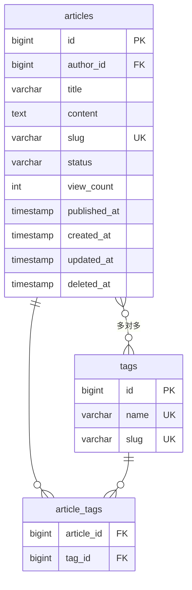
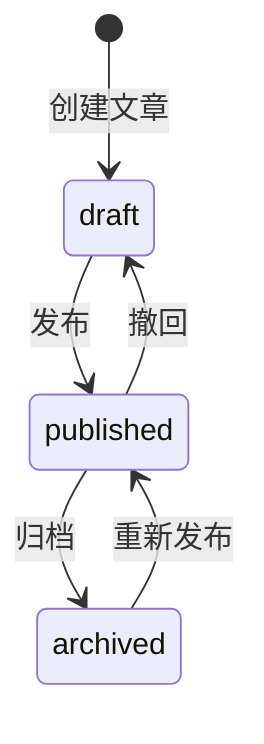

# 文章模块实现指南

## 概念说明

文章模块是 GoBlog 的核心业务模块，涵盖文章的 CRUD 操作、分页查询、标签关联、缓存策略和权限控制。

## 核心原理

### 文章数据模型

### 文章状态流转

## 实现要点

### 1. 分页查询

使用 `pkg/pagination` 包统一处理分页参数：
- 默认 page=1, page_size=20
- 最大 page_size=100
- 返回 total、page、page_size 元数据

### 2. 标签关联（多对多）

GORM 通过 `many2many:article_tags` 标签自动管理关联表。创建文章时可同时关联标签。

### 3. 文章缓存

- 文章详情缓存：`article:{id}`，TTL 30 分钟
- 写时删除策略（Cache-Aside）
- 空值缓存防止缓存穿透

### 4. 权限控制

- 创建文章：需要 author 或 admin 角色
- 编辑文章：仅文章作者或 admin
- 删除文章：仅文章作者或 admin（软删除）

## API 接口

| 方法 | 路径 | 说明 | 权限 |
|------|------|------|------|
| POST | `/api/v1/articles` | 创建文章 | author/admin |
| PUT | `/api/v1/articles/:id` | 更新文章 | 文章作者/admin |
| DELETE | `/api/v1/articles/:id` | 删除文章 | 文章作者/admin |
| GET | `/api/v1/articles/:id` | 文章详情（含缓存） | 公开 |
| GET | `/api/v1/articles` | 文章列表（分页） | 公开 |
| GET | `/api/v1/articles/search` | 文章搜索 | 公开 |

## 代码示例

> 💻 完整可运行代码：[code-examples/06-fullstack-project/goblog/internal/handler/article_handler.go](https://github.com/)

## 常见面试题

### Q1: GORM 多对多关联如何实现？

**难度**：⭐⭐ | **频率**：🔥🔥

**答题思路**：通过 `many2many` 标签指定关联表，GORM 自动管理中间表的增删。

### Q2: 分页查询如何优化？

**难度**：⭐⭐⭐ | **频率**：🔥🔥🔥

**答题思路**：避免 OFFSET 大偏移量，使用游标分页（基于 ID 或时间戳）；合理使用索引。

## 参考资料

- [GORM 多对多关联](https://gorm.io/docs/many_to_many.html)
- [GORM 分页](https://gorm.io/docs/scopes.html)
