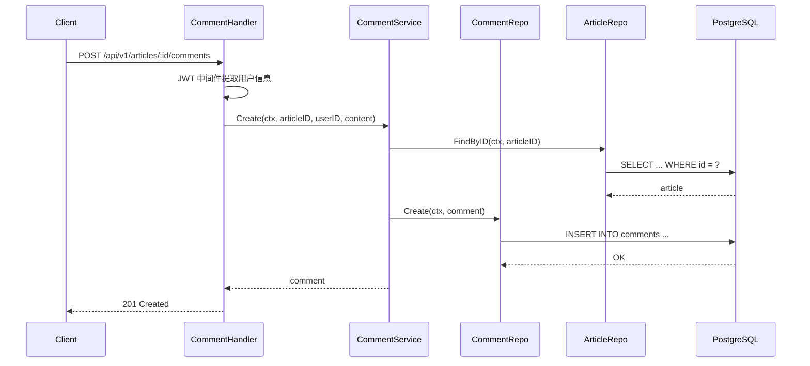

# 标签与评论模块实现指南

## 概念说明

标签模块和评论模块是 GoBlog 的辅助业务模块。标签用于文章分类和筛选，评论实现用户互动功能。

## 标签模块

### 数据模型

Tag 模型包含 name（标签名）和 slug（URL 友好标识），通过 `article_tags` 关联表与文章建立多对多关系。

### API 接口

| 方法 | 路径 | 说明 | 权限 |
|------|------|------|------|
| POST | `/api/v1/tags` | 创建标签 | author/admin |
| GET | `/api/v1/tags` | 标签列表 | 公开 |
| GET | `/api/v1/tags/:id/articles` | 标签下文章 | 公开 |

### 实现要点

- 标签名和 slug 均设置唯一索引
- 创建标签时自动生成 slug（将中文转为拼音或使用自定义规则）
- 查询标签下文章时使用 GORM Preload 预加载

## 评论模块

### 评论流程

### API 接口

| 方法 | 路径 | 说明 | 权限 |
|------|------|------|------|
| POST | `/api/v1/articles/:id/comments` | 发表评论 | 需登录 |
| GET | `/api/v1/articles/:id/comments` | 评论列表 | 公开 |
| DELETE | `/api/v1/comments/:id` | 删除评论 | 评论作者/admin |

### 实现要点

- 发表评论前验证文章是否存在
- 删除评论时校验权限（仅评论作者或管理员）
- 评论支持软删除
- 评论列表按创建时间排序，支持分页

## 管理模块

AdminService 提供管理员专属功能：

| 方法 | 路径 | 说明 |
|------|------|------|
| GET | `/api/v1/admin/users` | 用户列表 |
| PUT | `/api/v1/admin/users/:id/role` | 修改用户角色 |
| PUT | `/api/v1/admin/articles/:id/status` | 文章审核 |
| GET | `/api/v1/admin/stats` | 系统统计 |

## 代码示例

> 💻 完整可运行代码：
> - [code-examples/06-fullstack-project/goblog/internal/handler/tag_handler.go](https://github.com/)
> - [code-examples/06-fullstack-project/goblog/internal/handler/comment_handler.go](https://github.com/)

## 常见面试题

### Q1: 评论系统如何防止恶意刷评？

**难度**：⭐⭐ | **频率**：🔥🔥

**答题思路**：令牌桶限流（按用户 IP 或用户 ID）、评论内容审核、验证码机制。

## 参考资料

- [GORM 关联关系](https://gorm.io/docs/has_many.html)
- [GORM 软删除](https://gorm.io/docs/delete.html#Soft-Delete)
