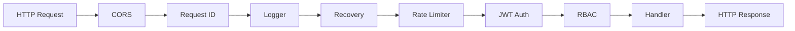
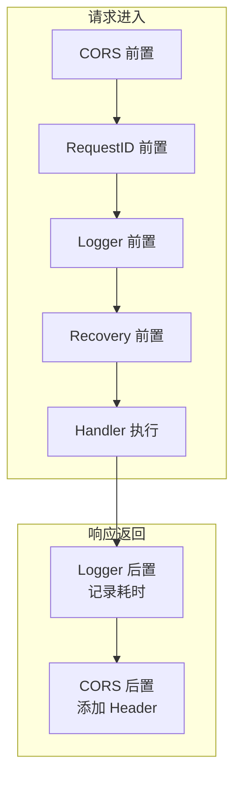

# 中间件链实现指南

## 概念说明

中间件（Middleware）是 Gin 框架的核心设计模式，通过洋葱模型实现请求的预处理和后处理。GoBlog 实现了 7 层中间件链，每层职责单一。

## 核心原理

### 中间件执行顺序



### 洋葱模型



## 各中间件详解

### 1. CORS 跨域中间件

配置允许的 Origin、Method、Header，支持预检请求（OPTIONS）。

### 2. Request ID 中间件

为每个请求生成唯一的 UUID，写入 `X-Request-ID` Header 和 Gin Context，用于链路追踪。

### 3. Logger 中间件

使用 zerolog 记录结构化请求日志：
- 请求方法、路径、状态码
- 请求耗时、客户端 IP
- Request ID（关联追踪）

### 4. Recovery 中间件

捕获 Handler 中的 panic，记录堆栈信息到日志，返回 500 错误响应，防止服务崩溃。

### 5. Rate Limiter 中间件

使用 `golang.org/x/time/rate` 实现令牌桶限流：
- 按客户端 IP 限流
- 可配置 QPS 和 burst
- 超限返回 429 Too Many Requests

### 6. JWT Auth 中间件

解析 Authorization Header 中的 Bearer Token：
- 验证 Token 签名和有效期
- 检查 Token 是否在黑名单中（Redis）
- 将用户信息写入 Gin Context

### 7. RBAC 中间件

从 Context 读取用户角色，校验是否有权访问当前路由：
- `RequireRole("author", "admin")` — 需要 author 或 admin 角色
- `RequireRole("admin")` — 仅管理员

## 中间件挂载策略

```go
// 全局中间件（所有路由）
r.Use(CORS(), RequestID(), Logger(), Recovery(), RateLimiter())

// 公开路由（无需认证）
v1.GET("/articles", handler.List)

// 认证路由
authenticated := v1.Group("")
authenticated.Use(JWTAuth())

// 写入路由（需要 author/admin 角色）
writer := v1.Group("")
writer.Use(JWTAuth(), RequireRole("author", "admin"))

// 管理路由（仅 admin）
admin := v1.Group("/admin")
admin.Use(JWTAuth(), RequireRole("admin"))
```

## 代码示例

> 💻 完整可运行代码：[code-examples/06-fullstack-project/goblog/internal/middleware/](https://github.com/)

## 常见面试题

### Q1: Gin 中间件的执行顺序是什么？

**难度**：⭐⭐ | **频率**：🔥🔥🔥

**答题思路**：洋葱模型，`c.Next()` 之前是前置逻辑，之后是后置逻辑。中间件按注册顺序执行。

### Q2: 令牌桶和漏桶算法的区别？

**难度**：⭐⭐⭐ | **频率**：🔥🔥🔥

**答题思路**：令牌桶允许突发流量（burst），漏桶以恒定速率处理请求。Go 标准库 `x/time/rate` 实现的是令牌桶。

## 参考资料

- [Gin 中间件文档](https://gin-gonic.com/docs/examples/custom-middleware/)
- [golang.org/x/time/rate](https://pkg.go.dev/golang.org/x/time/rate)
