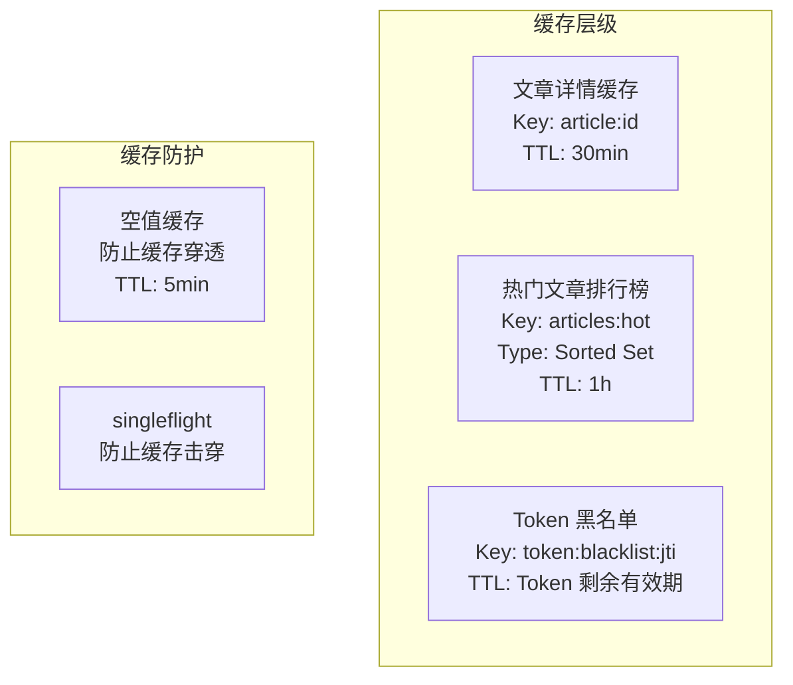
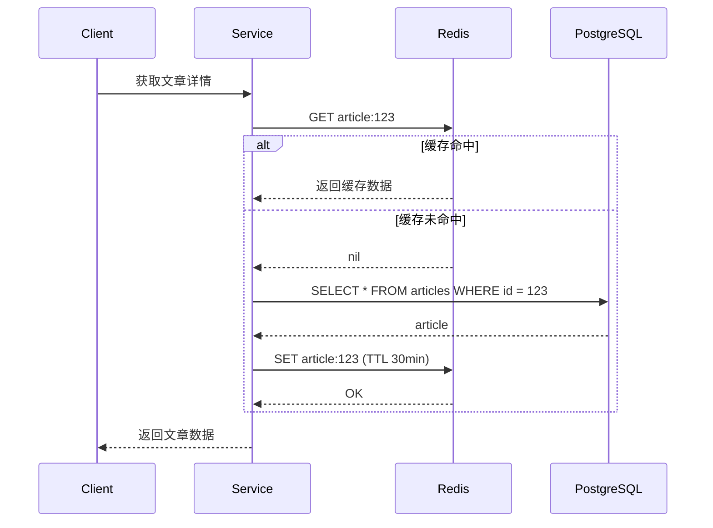

# 缓存策略实现指南

## 概念说明

GoBlog 使用 Redis 实现多层缓存策略，覆盖文章详情缓存、热门文章排行榜和 Token 黑名单三个场景。

## 核心原理

### 缓存架构



### Cache-Aside 模式

GoBlog 采用 Cache-Aside（旁路缓存）模式：



## 缓存键设计

| 缓存项 | Redis Key | 数据类型 | TTL | 更新策略 |
|--------|-----------|----------|-----|----------|
| 文章详情 | `article:{id}` | String (JSON) | 30 分钟 | 写时删除 |
| 热门文章 | `articles:hot` | Sorted Set | 1 小时 | 定时刷新 |
| Token 黑名单 | `token:blacklist:{jti}` | String | Token 剩余有效期 | 登出时写入 |
| 空值缓存 | `article:{id}:null` | String | 5 分钟 | 自动过期 |

### 缓存键生成规则

```go
const (
    PrefixArticle        = "article:"
    PrefixArticleNull    = "article:%d:null"
    KeyHotArticles       = "articles:hot"
    PrefixTokenBlacklist = "token:blacklist:"
)
```

## 缓存防护策略

### 缓存穿透

查询不存在的数据，请求直接打到数据库。

**解决方案**：空值缓存 — 查询数据库返回空时，缓存一个空值标记，TTL 设为 5 分钟。

### 缓存击穿

热点 Key 过期瞬间，大量请求同时打到数据库。

**解决方案**：使用 `golang.org/x/sync/singleflight`，同一 Key 只允许一个请求查询数据库，其他请求等待结果。

### 缓存雪崩

大量 Key 同时过期。

**解决方案**：在 TTL 基础上添加随机偏移量，避免集中过期。

## 代码示例

> 💻 完整可运行代码：
> - [code-examples/06-fullstack-project/goblog/internal/cache/](https://github.com/)
> - [code-examples/06-fullstack-project/goblog/internal/service/article_service.go](https://github.com/)

## 常见面试题

### Q1: 缓存穿透、击穿、雪崩的区别和解决方案？

**难度**：⭐⭐⭐ | **频率**：🔥🔥🔥

**答题思路**：分别解释三种问题的成因，给出对应的解决方案，结合 GoBlog 的实际实现说明。

### Q2: Cache-Aside 和 Write-Through 的区别？

**难度**：⭐⭐ | **频率**：🔥🔥

**答题思路**：Cache-Aside 由应用层管理缓存，Write-Through 由缓存层自动同步到数据库。

## 参考资料

- [go-redis 文档](https://redis.uptrace.dev/)
- [singleflight 包](https://pkg.go.dev/golang.org/x/sync/singleflight)
