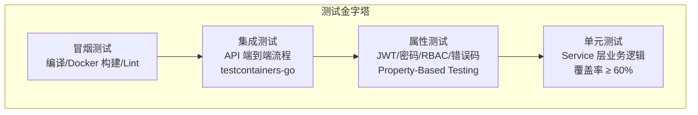

# 测试策略与实现

## 概念说明

GoBlog 采用分层测试策略，覆盖单元测试、属性测试和集成测试。测试是保证代码质量的关键环节。

## 测试分层



## 单元测试

### 工具选择

| 工具 | 用途 |
|------|------|
| testify | 断言库（assert/require） |
| gomock | Mock 生成（接口 Mock） |
| httptest | HTTP 测试（Gin 路由测试） |

### 测试范围

| 层级 | 测试内容 | Mock 对象 |
|------|---------|----------|
| Service | 业务逻辑 | Repository 接口 |
| Handler | HTTP 接口 | Service 接口 |
| Middleware | 中间件行为 | — |
| Auth | JWT/密码/RBAC | — |

### 表驱动测试风格

```go
func TestUserService_Register(t *testing.T) {
    tests := []struct {
        name    string
        req     RegisterRequest
        wantErr bool
    }{
        {
            name:    "正常注册",
            req:     RegisterRequest{Username: "test", Email: "test@test.com", Password: "123456"},
            wantErr: false,
        },
        {
            name:    "用户名已存在",
            req:     RegisterRequest{Username: "existing", Email: "new@test.com", Password: "123456"},
            wantErr: true,
        },
    }

    for _, tt := range tests {
        t.Run(tt.name, func(t *testing.T) {
            // 测试逻辑
        })
    }
}
```

## 属性测试（Property-Based Testing）

GoBlog 使用 gopter 库实现以下属性测试：

| Property | 测试内容 |
|----------|---------|
| Property 10 | JWT 签发验证 round-trip |
| Property 11 | 密码加密验证 round-trip |
| Property 12 | RBAC 权限校验一致性 |
| Property 13 | API 响应格式统一性 |
| Property 14 | 缓存键确定性 |
| Property 15 | 令牌桶限流正确性 |

## 集成测试

使用 `testcontainers-go` 启动真实的 PostgreSQL 和 Redis 容器进行端到端测试：

1. 用户注册 → 登录 → 获取 Token
2. 创建文章 → 查询文章 → 验证缓存
3. 发表评论 → 删除评论
4. 数据库迁移 up/down

## 运行测试

```bash
# 运行所有测试
make test

# 运行特定包的测试
go test -v ./internal/service/...

# 查看覆盖率
go test -cover ./internal/service/...

# 生成覆盖率报告
go test -coverprofile=coverage.out ./...
go tool cover -html=coverage.out
```

## 代码示例

> 💻 完整可运行代码：[code-examples/06-fullstack-project/goblog/](https://github.com/)

## 常见面试题

### Q1: Go 中如何做 Mock 测试？

**难度**：⭐⭐ | **频率**：🔥🔥

**答题思路**：通过接口抽象依赖，使用 gomock 或 testify/mock 生成 Mock 实现。

### Q2: 表驱动测试的优势？

**难度**：⭐ | **频率**：🔥🔥

**答题思路**：减少重复代码、易于添加新用例、测试意图清晰、与 t.Run 配合支持子测试。

## 参考资料

- [Go 测试官方文档](https://go.dev/doc/tutorial/add-a-test)
- [testify 文档](https://github.com/stretchr/testify)
- [gomock 文档](https://github.com/uber-go/mock)
